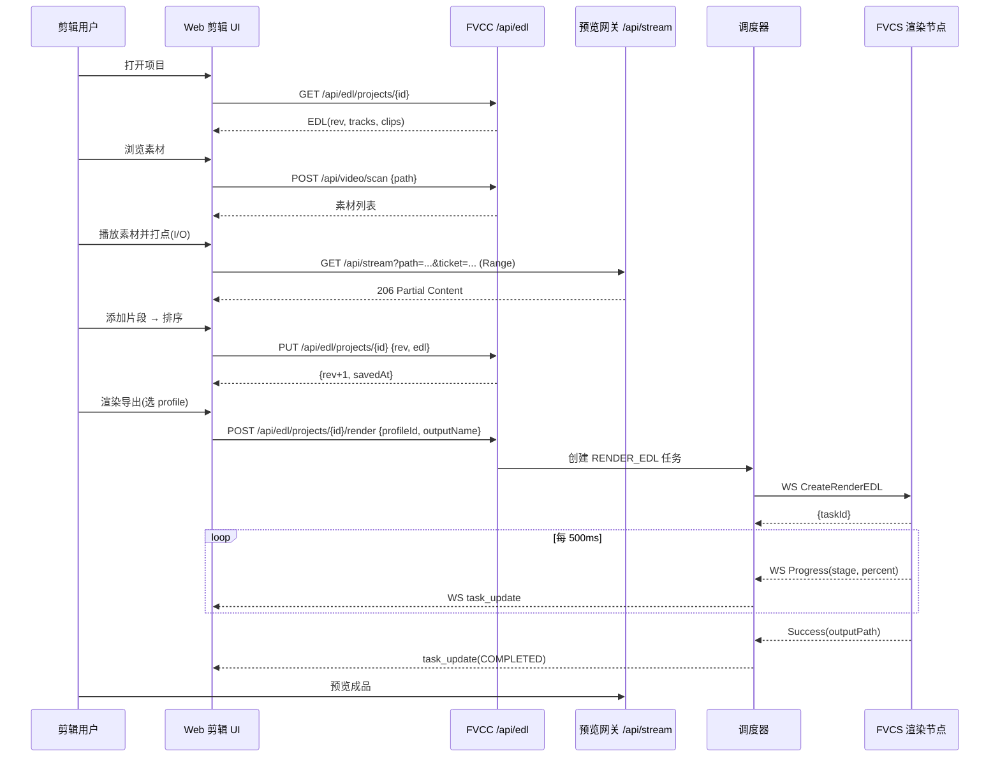
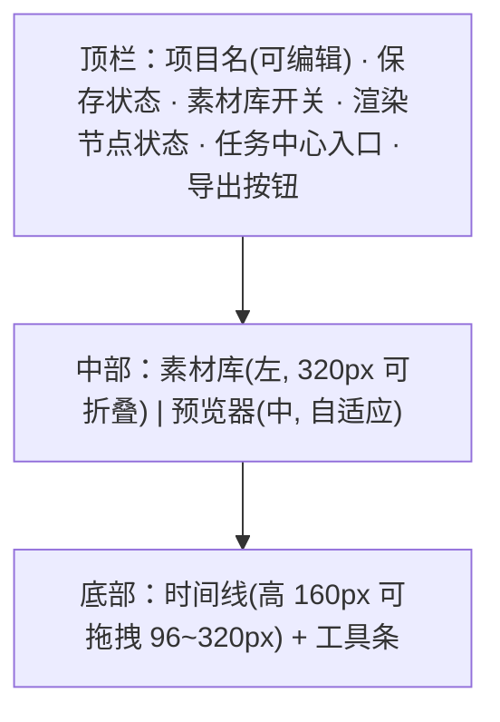
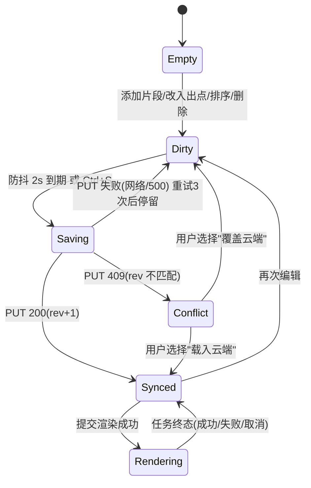
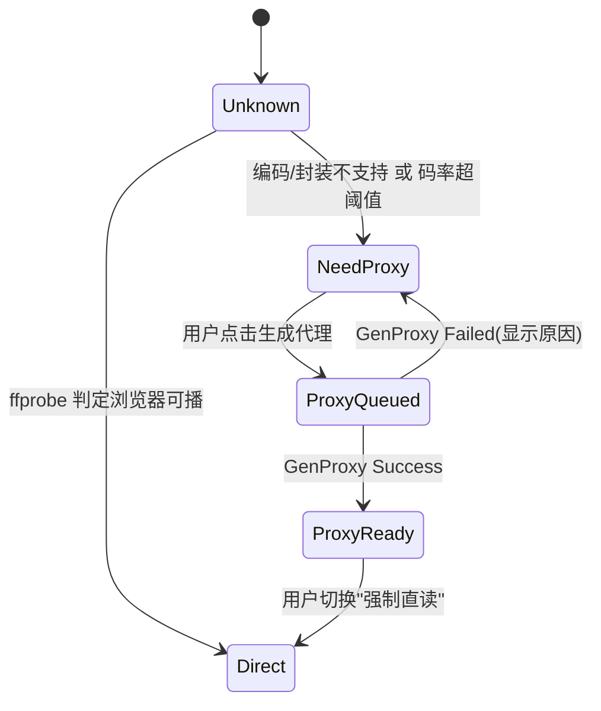

# 01 · 产品需求与交互规格

> 归属：上位方案 §4.1（Web 剪辑 UI）、§7 P0
> 对应源码：`FVCC/ui-src/src/pages/*.ts`（现有页面）、`FVCC/server/router.go`（路由前缀）、`FVCC/server/ws.go`（进度推送）

---

## 1. 范围与非目标

### 1.1 P0 范围（本文件定义的"必须做"）

| 编号 | 能力 | 说明 |
|---|---|---|
| F-01 | 素材浏览 | 目录扫描 + 列表 + 元数据（复用 `scanDirectory`/`probeVideo`） |
| F-02 | 素材预览 | 浏览器内播放，走 `/stream` Range 流；不可播素材提示"待生成代理" |
| F-03 | 打点 | 为单个素材设置入点/出点，支持快捷键与逐帧微调 |
| F-04 | 时间线 | 单视频轨，片段顺序拼接，可排序、删除、调整入出点 |
| F-05 | 项目持久化 | 编辑中的 EDL 存 NAS（`projects` 表），刷新/换机可恢复 |
| F-06 | 渲染下发 | 选择输出方案（profile）→ 提交 RenderEDL → 实时进度 |
| F-07 | 成品回看 | 渲染完成后在任务中心/历史中预览与下载成品 |

### 1.2 明确非目标（P0 不做，禁止在实现中"顺手加"）

- 多轨、画中画、字幕、音频混流、音量包络（上位方案 §1.2，P3 评估）；
- 帧级精确剪辑（P0 精度目标：关键帧对齐，≤0.5s，见 05 §4）；
- 转场/滤镜/变速（P2，EDL 仅预留字段，见 03 §2.5）；
- 跨公网访问、多用户协同编辑、权限分级（P0 视为可信局域网 + 单一 admin 语义，见 07 §5）；
- 素材去重、标签、收藏（P2）。

---

## 2. 与上位方案及源码的对应关系

| 本文件条款 | 上位方案 | 现有源码可复用点 | 需新增 |
|---|---|---|---|
| §3.2 素材浏览 | §3.1 素材扫描 | `handlers.go: scanDirectory / probeVideo / browseDirs`；前端 `pages/scanner.ts` | 素材树以内嵌面板形态复用 |
| §3.3 打点与时间线 | §4.1 页面结构 | 无 | 全部新增（`pages/editor/*`） |
| §3.4 渲染与进度 | §5.1 | `ws.ts`（WS 客户端）、`pages/tasks.ts`（任务列表）、`hub.BroadcastTaskUpdate` | 新增 `RenderEDL` 类型任务的展示分支 |
| §4.4 快捷键 | — | 无 | 新增 |
| §5 状态机 | §4.3 前端 EDL 状态 | `types.ts: TaskStatus` | 新增 `EditorState` 状态机 |

---

## 3. 用户角色与核心场景

### 3.1 角色

| 角色 | 描述 | P0 权限 |
|---|---|---|
| 剪辑用户 | 在 FNOS 页面完成粗剪并提交渲染 | 素材读、项目读写、任务提交/取消 |
| 渲染节点管理员 | 维护 Windows 渲染机的 FVCS 与凭据 | 复用现有"服务器管理"页；P0 不新增界面，仅新增节点健康展示 |

### 3.2 用户故事与验收口径

| ID | 用户故事 | 验收口径（可判定） |
|---|---|---|
| US-01 | 我要在浏览器里翻看 NAS 上的素材，并知道每个素材的分辨率/时长/编码 | 输入目录路径 → 5s 内出列表（≤200 个文件，含缓存命中）；每行显示文件名/时长的绝对格式化值；不可播素材显示角标"需代理" |
| US-02 | 我要在某段素材上打个入点出点，看到这段有多长 | 播放中按 `I`/`O` 打点；时间线片段条显示 `00:01:22.400 → 00:03:45.000 (142.600s)`；打点后 ≤100ms 内 UI 更新 |
| US-03 | 我要把 3 段素材按顺序拼起来，然后导出 | 添加 3 个片段后点击"渲染导出"，3s 内生成 RenderEDL 提交；任务中心出现带进度条的任务 |
| US-04 | 我要看到渲染进度，并且知道现在跑到第几段 | 进度条显示整体百分比 + 文案 `第 2/3 段 · 拼接中`；刷新页面后进度不丢失 |
| US-05 | 渲染机重启/断线后，我的任务不能凭空消失 | 渲染机离线 → 任务状态 `ERROR` 且 `errorMsg` 含 `连接服务器失败`，30s 冷却后自动重试，重试计数可见 |
| US-06 | 我刷新浏览器后，刚才的剪辑还在 | 项目自动保存（防抖 2s）；刷新后从 `GET /api/edl/projects/:id` 恢复出完全一致的片段顺序与入出点（毫秒级一致） |

### 3.3 主流程

---

## 4. 页面结构与交互规格

### 4.1 布局

- 布局沿用现有 Tailwind 设计令牌（`FVCC/ui-src/src/style.css`、`theme.ts`），不新引入 UI 组件库。
- 三段高度可拖拽，比例持久化到 `localStorage`（键名 `wve.layout.v1`）。

### 4.2 素材库面板（左）

| 元素 | 规格 |
|---|---|
| 路径栏 | 输入框 + "扫描"按钮 + 面包屑；默认值为 `Settings.accessiblePaths[0]` |
| 素材行 | 缩略图（40×24，懒加载）· 文件名（超长省略，hover 显示全名）· `HH:MM:SS` 时长 · 分辨率 · 编码 · `需代理` 角标 |
| 排序 | 名称 / 时长 / 修改时间（默认名称升序） |
| 搜索 | 前端本地按文件名过滤，输入即过滤（不发起请求） |
| 添加到时间线 | 双击素材行 = 添加整段；拖拽到时间线 = 添加整段（P0 拖拽仅支持整段，不支持拖选区间） |
| 不可播素材 | 行右侧显示"生成代理"按钮 → 触发 `POST /api/proxy`；生成中显示环形进度 |
| 空态 | "该目录下未找到视频文件" |
| 异常态 | 无权限："该目录不在授权访问范围内"（对应 `PathValidator` 拒绝） |

### 4.3 预览器（中）

| 元素 | 规格 |
|---|---|
| 视频区 | `<video>` 元素，`src` 指向 `/api/stream?path=<encodeURIComponent(相对路径)>&ticket=<一次性票据>`；`preload="auto"` |
| 播放控制 | 播放/暂停、±1 帧、±1s、±5s、进度条拖拽、音量（P0 静音开关即可） |
| 时码显示 | 右上角显示 `TC 00:01:22.400`（源素材时间轴）+ `帧 2467` |
| 打点按钮 | `[入点]` `[出点]` `[清除]` `[添加到时间线]` |
| 范围可视化 | 进度条上以半透明色块显示当前 in/out 区间 |
| 代理提示 | 走代理播放时右上角常驻角标 `PROXY`，并显示"代理时间轴与源一致"提示（依据 04 §4.3 的 P0 约束） |
| 素材切换 | 切换素材时保留播放位置（同一素材 3s 内回到同一时间点） |

**打点换算规则（前端实现约束）**：`inMs/outMs` 均以**源素材时间轴**为准。直读源文件时 `inMs = round(video.currentTime * 1000)`；走代理时按 04 §4.3 的 P0 约束 `t_src = t_proxy`，直接取当前 `currentTime`。

### 4.4 时间线（下）

| 元素 | 规格 |
|---|---|
| 轨道 | P0 单轨（`v1`）；Ruler 显示时间刻度，刻度间隔按总时长在 1s/5s/10s/30s/60s 中自动选择 |
| 片段块 | 宽度 ∝ 时长（线性，无缩放级别时最小 40px）；块内显示 `#序号 文件名前 12 字符`；hover 显示 `入点→出点 时长`；左/右边缘 6px 为可拖拽把手（调整 in/out） |
| 片段顺序 | 水平拖拽换位；插入位置以 2px 蓝色竖线提示 |
| 选中态 | 单选中（P0）；选中后预览器自动 seek 到片段入点 |
| 总时长 | 工具条右侧显示 `总时长 00:04:32.100 / 3 个片段` |
| 工具条 | `[+ 添加当前素材]` `[删除选中]` `[清空]` `[排序: 按添加/按素材名]` `[渲染方案 ▾]` `[渲染导出]` |
| 渲染方案下拉 | 数据源 `GET /api/profiles`（现有转码方案）；P0 额外过滤出 `outputSuffix` 为空或 `.mp4` 的方案，其余方案标注"可能不兼容拼接" |

### 4.5 任务中心与进度

| 元素 | 规格 |
|---|---|
| 入口 | 顶栏"任务中心"按钮 → 右侧抽屉；抽屉内复用 `pages/tasks.ts` 的任务卡片 |
| RENDER_EDL 卡片 | 显示 `第 k/N 段 · <stage 中文名>` + 整体百分比 + `已用时`；stage 文案映射见 06 §3.3 |
| 失败卡片 | 显示 `errorMsg` + `重试` 按钮（复用 `POST /api/tasks/:id/retry`） |
| 完成卡片 | 显示成品名 + `预览`（走 `/api/stream` 的是成品根）+ `复制路径` |
| 推送通道 | 复用 `ws.ts` 单例；消息 `{type:"task_update", taskId, status, progress, msg, stage, seg}` |

---

## 5. 交互状态机

### 5.1 编辑器状态

- `Saving` 期间顶栏显示"保存中…"，`Synced` 显示"已保存 hh:mm:ss"，`Conflict`/失败显示红色"未保存"并可点击重试。
- 并发编辑冲突（两个标签页）以 `rev` 乐观锁判定（03 §4.3）。

### 5.2 素材可见性状态

判定规则（P0）：

| 条件 | 结论 |
|---|---|
| `codec ∈ {h264, hevc}` 且 `format ∈ {mp4, mov, m4v}` 且 `bitrate ≤ 20 Mbps` | Direct |
| 其余（ProRes / RAW / MKV 中的 VC-1 / 码率 > 20 Mbps 等） | NeedProxy |
| `moov` 非前置（无法渐进播放） | NeedProxy（P0 不实现自动 remux，直接走代理） |

---

## 6. 快捷键

| 按键 | 行为 | 生效范围 |
|---|---|---|
| `Space` | 播放/暂停 | 全局（输入框聚焦时除外） |
| `I` | 打当前时间为入点 | 预览器聚焦 |
| `O` | 打当前时间为出点 | 预览器聚焦 |
| `←` / `→` | ∓1 帧 / ±1 帧 | 全局 |
| `Shift+←` / `Shift+→` | ∓1s / ±1s | 全局 |
| `,` / `.` | 入点 ∓1 帧 / 出点 ±1 帧 | 时间线选中片段时 |
| `Backspace` / `Delete` | 删除选中片段 | 时间线 |
| `Ctrl+S` | 立即保存 | 全局 |
| `Ctrl+Enter` | 渲染导出 | 全局 |
| `Ctrl+Z` / `Ctrl+Shift+Z` | 撤销/重做（P0 仅内存态，最多 50 步） | 时间线 |
| `Esc` | 取消当前拖拽/关闭抽屉 | 全局 |

> P0 撤销栈仅覆盖 EDL 变更（增删片段、改入出点、排序），不覆盖项目重命名与方案选择。

---

## 7. 非功能需求

| 类别 | 指标 | 判定方式 |
|---|---|---|
| 首屏 | 剪辑页首屏可交互 ≤ 2.5s（局域网，静态资源已缓存） | Lighthouse/手工计时 |
| 打点响应 | 按键到 UI 更新 ≤ 100ms | 手工计时 |
| 时间线重绘 | 50 个片段时拖拽帧率 ≥ 30fps | Chrome Performance |
| 进度延迟 | 渲染进度从 FVCS 产生到 UI 显示 ≤ 1.5s（含 500ms 轮询 + 1s 调度 tick + WS 推送） | 抓包/日志时间戳 |
| 项目保存 | 单项目 EDL JSON ≤ 256 KB（P0 上限 200 个片段） | 后端校验拦截 |
| 并发 | 单项目允许 2 个只读标签页 + 1 个写入者 | 见 §5.1 冲突处理 |

---

## 8. P0 用户级验收口径（与 08 的实施验收清单配套）

1. 从零新建项目，添加 3 段同源素材（同编码/分辨率/帧率），渲染导出后成品可播放、无花屏、无音画不同步；时长 = Σ(片段时长) ± 1s。
2. 打点后刷新浏览器，片段顺序与入出点毫秒级一致（误差 0ms）。
3. 渲染过程中杀掉 FVCS 进程并重启：任务不丢失，30s 冷却后自动重试，且**不产生重复渲染任务**（依据 06 §4.4 幂等键）。
4. 对一段 HEVC 高码率素材点击"生成代理"，代理生成完成后预览可流畅播放；打点仍记录在源时间轴（提交的 EDL 中 `in/out` 与代理上看到的时间一致）。
5. 提交包含 `../` 或非法时间格式的 EDL，后端返回 `E_EDL_INVALID` 且不产生任何渲染任务（依据 07 §3）。

---

## 9. 源码改动点索引

| 文件 | 改动 | 类型 |
|---|---|---|
| `FVCC/ui-src/src/pages/editor/index.ts` | 新增剪辑页入口（路由 `#/editor/:projectId`） | 新增 |
| `FVCC/ui-src/src/pages/editor/timeline.ts` | 时间线渲染与拖拽 | 新增 |
| `FVCC/ui-src/src/pages/editor/preview.ts` | 预览器与打点 | 新增 |
| `FVCC/ui-src/src/pages/editor/assets.ts` | 素材面板 | 新增 |
| `FVCC/ui-src/src/pages/editor/editorStore.ts` | 编辑器状态机与撤销栈 | 新增 |
| `FVCC/ui-src/src/pages/editor/shortcuts.ts` | 快捷键注册表 | 新增 |
| `FVCC/ui-src/src/ui.ts` | 顶栏增加"任务中心/剪辑页"入口 | 修改 |
| `FVCC/ui-src/src/store.ts` | 增加 `currentProject` 状态 | 修改 |
| `FVCC/ui-src/src/main.ts` | 注册 `#/editor` 路由分支 | 修改 |
| `FVCC/ui-src/src/types.ts` | 增加 EDL/Project/RenderTask 类型（见 03 §2） | 修改 |
| `FVCC/ui-src/src/api.ts` | 增加 `edl.*`、`stream.ticket()` 方法（见 03 §4） | 修改 |
| `FVCC/server/handlers.go` | 新增 `createEDLProject/getEDLProject/.../renderProject`（见 03 §4） | 修改 |
| `FVCC/server/router.go` | `api` 组内注册 `/edl/*`、`/stream`、`/proxy` 路由 | 修改 |
| `FVCC/server/models.go` | 新增 `Project`/`RenderTaskPayload`/`RenderNode` 模型 | 修改 |

