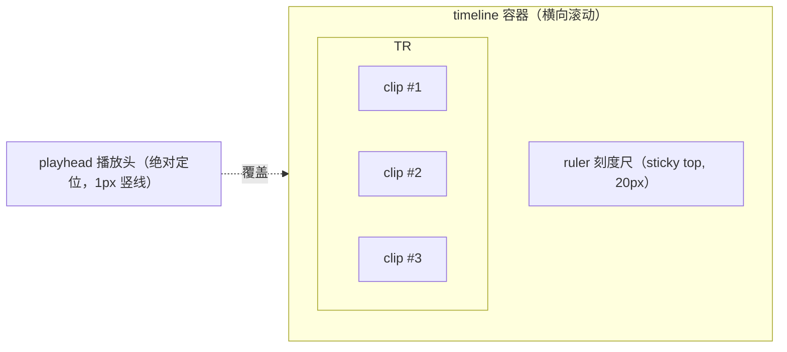

# 02 · 前端架构与时间线编辑器设计

> 归属：上位方案 §4.1（Web 剪辑 UI）
> 对应源码：`FVCC/ui-src/src/{main.ts,ui.ts,store.ts,api.ts,ws.ts,types.ts}`、`FVCC/ui-src/src/pages/*.ts`、`FVCC/ui-src/{vite.config.ts,tailwind.config.js,package.json}`

---

## 1. 范围与非目标

**范围**：剪辑页的前端工程结构、状态管理契约、时间线渲染与交互、预览器控制、网络层封装、构建落盘路径。

**非目标**：EDL 字段定义（见 03）、`/stream` 与服务端逻辑（见 04）、任务调度展示的后端逻辑（见 06）；本文件不重复定义。

---

## 2. 与源码及上位方案的对应关系

| 本文件条款 | 上位方案 | 现有源码 | 处理方式 |
|---|---|---|---|
| §3 技术栈 | §4.1 "推荐 Vue3/React" | `ui-src/package.json`（Vite + TS + Tailwind，无框架） | 见 §3 决策说明（对应 README A1） |
| §4 目录结构 | §4.1 页面结构 | `ui-src/src/pages/*.ts` 平铺式页面 | 新增 `pages/editor/` 子目录，不重构既有页面 |
| §5 状态管理 | §4.3.1 前端 EDL 状态模型 | `store.ts`（单例状态 + 订阅） | 沿用同一模式，新增独立 `editorStore` |
| §6 时间线 | §4.1 "片段缩略条" | 无 | 全部新增 |
| §7 预览器 | §4.2 分级预览 | 无（现有 `previewVideo` 接口形态不同） | 新增，视频源走 04 §2 的 `/stream` |
| §8 网络层 | §4.1 REST + WS | `api.ts`（fetch 封装）、`ws.ts`（自动重连 WS 客户端） | 扩展，不新起第二套 HTTP/WS 客户端 |

---

## 3. 技术栈决策

### 3.1 决策

**P0 沿用 `FVCC/ui-src` 现有技术栈**：Vite + TypeScript + Tailwind CSS + 自研轻量状态/渲染模式；**不引入 Vue/React 等框架**。

### 3.2 依据与取舍

| 维度 | 沿用现有栈（选定） | 引入 Vue3/React（未选） |
|---|---|---|
| 既有代码复用 | 100%，`store.ts`/`api.ts`/`ws.ts`/`ui.ts` 与 6 个页面零改动复用 | 需重写全部页面与状态层 |
| 交付周期 | 无需搭框架基建，直接写剪辑页 | 需引入框架、路由、响应式层，且与既有手写 DOM 页面并存 |
| 维护成本 | 单栈 | 双栈（旧页面手写 DOM + 新页面框架） |
| 时间线渲染控制 | 直接操作 DOM/Canvas，性能可预期 | 框架 diff 对大量动画块有额外开销，需再优化 |
| 风险 | 单文件可能变大，需靠模块划分约束 | 迁移面大，回归风险高 |

**结论**：P0 以"聚类模块 + 明确契约"换取零迁移成本；待 P2 若引入多轨/滤镜等复杂 UI，再评估框架化（上位方案 §4.1 的"推荐 Vue3/React"作为该阶段的候选方案保留）。

### 3.3 硬性约束

1. 禁止在剪辑页引入任何新的运行时依赖（含 UI 组件库、状态库、动画库）。
2. 允许新增 devDependencies（如 `vitest`），但必须保证 `npm run build` 产物体积增量 ≤ 150 KB（gzip）。
3. 样式一律使用既有 Tailwind 设计令牌（`theme.ts` 导出的色板类名），禁止硬编码色值。

---

## 4. 目录结构与模块边界

```
FVCC/ui-src/src/
├── api.ts                      # [修改] 新增 edl.* / stream.* / proxy.* 方法
├── ws.ts                       # [不改] WS 单例，事件由 editorStore 订阅
├── store.ts                    # [修改] 增加 currentProjectId
├── types.ts                    # [修改] 增加 EDL/Project/RenderTask 类型
├── ui.ts                       # [修改] 顶栏入口
├── main.ts                     # [修改] 路由分发 #/editor
└── pages/
    └── editor/
        ├── index.ts            # 页面装配：布局、生命周期、保存调度
        ├── editorStore.ts      # EDL 状态 + 撤销栈 + 保存状态机（§5）
        ├── assets.ts           # 素材面板（§4.2 规格）
        ├── preview.ts          # 预览器与打点（§7）
        ├── timeline.ts         # 时间线渲染与交互（§6）
        ├── shortcuts.ts        # 快捷键注册/注销
        ├── ruler.ts            # 刻度尺与刻度间隔算法
        ├── dialog.ts           # 方案选择/输出命名/冲突处理浮层
        └── format.ts           # ms ↔ HH:MM:SS.mmm ↔ 帧号 换算（与 03 §2.4 同源）
```

**模块边界（强制）**

| 模块 | 可以依赖 | 禁止依赖 |
|---|---|---|
| `editorStore.ts` | `types.ts`、`format.ts`、`api.ts`、`ws.ts` | 任何 DOM 模块（`timeline.ts`/`preview.ts`/`assets.ts`） |
| `timeline.ts` / `preview.ts` / `assets.ts` | `editorStore`（只读订阅 + 派发动作）、`format.ts` | 直接调用 `api.ts`（网络访问一律经 store） |
| `index.ts` | 全部 | — |

> 该边界保证"时间线/预览/素材面板"三者可独立重写，且状态变更全部经 store 单点，便于测试与撤销。

---

## 5. 状态管理设计

### 5.1 editorStore 契约

```ts
// pages/editor/editorStore.ts
import type { EDL, EDLClip, SaveState, Timeline } from '../../types'

export interface EditorState {
  projectId: string | null
  rev: number                      // 服务端版本号，乐观锁依据
  name: string
  timeline: Timeline               // {width,height,fps,audio}
  clips: EDLClip[]                 // P0：单轨，顺序即时间线顺序
  selectedClipId: string | null
  previewAsset: PreviewAsset | null// 当前预览素材（含代理映射，见 04 §4.3）
  inMs: number | null              // 预览器待添加片段的入点
  outMs: number | null             // 预览器待添加片段的出点
  save: SaveState                  // 'synced'|'dirty'|'saving'|'conflict'|'error'
  lastSavedAt: string | null
  rendering: { taskId: string; progress: number; stage: string } | null
}

export type EditorAction =
  | { type: 'load'; payload: { rev: number; name: string; timeline: Timeline; clips: EDLClip[] } }
  | { type: 'setName'; name: string }
  | { type: 'setPreviewAsset'; asset: PreviewAsset | null }
  | { type: 'setIn'; ms: number }
  | { type: 'setOut'; ms: number }
  | { type: 'clearMarks' }
  | { type: 'addClip'; clip: EDLClip; atIndex?: number }
  | { type: 'removeClip'; clipId: string }
  | { type: 'moveClip'; clipId: string; toIndex: number }
  | { type: 'trimClip'; clipId: string; edge: 'in' | 'out'; ms: number }
  | { type: 'select'; clipId: string | null }
  | { type: 'clear' }
  | { type: 'saveStart' } | { type: 'saveOk'; rev: number; at: string }
  | { type: 'saveFail'; conflict: boolean }
  | { type: 'setRendering'; payload: EditorState['rendering'] }
  | { type: 'undo' } | { type: 'redo' }

export interface EditorStore {
  getState(): Readonly<EditorState>
  dispatch(a: EditorAction): void
  subscribe(fn: (s: EditorState, changed: string[]) => void): () => void
  canUndo(): boolean
  canRedo(): boolean
  derive(): { totalMs: number; clipCount: number; dirty: boolean }   // 派生状态，见 §5.3
  flushSave(): Promise<void>                                        // Ctrl+S / 提交渲染前调用
}
export function createEditorStore(projectId: string): EditorStore
```

### 5.2 撤销栈

- 栈元素为 `{ clips, timeline, name }` 的浅快照（`clips` 为不可变数组，元素复用），上限 **50** 步；超出时丢弃最早一项。
- 仅 `addClip/removeClip/moveClip/trimClip/clear` 五个动作入栈；`select`/`save*`/`setRendering` 不入栈。
- `undo/redo` 后 `save` 置 `dirty`，不自动触发保存（由防抖统一处理）。

### 5.3 派生状态与重绘

`derive()` 计算 `totalMs = Σ(outMs - inMs)`、`clipCount`，并缓存；`subscribe` 的 `changed` 参数列出本次变动的切片名（`'clips' | 'name' | 'save' | 'rendering' | 'selection'`），各 UI 模块只订阅自己关心的切片，避免全量重绘。

### 5.4 保存调度

```ts
// index.ts 内的保存调度（伪代码）
const DEBOUNCE_MS = 2000
let timer: number | null = null
store.subscribe((s, changed) => {
  if (changed.includes('clips') || changed.includes('name')) {
    if (timer) clearTimeout(timer)
    timer = window.setTimeout(() => void save(store), DEBOUNCE_MS)
  }
})

async function save(store: EditorStore) {
  const s = store.getState()
  store.dispatch({ type: 'saveStart' })
  try {
    const r = await api.edl.updateProject(s.projectId!, { rev: s.rev, name: s.name, timeline: s.timeline, clips: s.clips })
    store.dispatch({ type: 'saveOk', rev: r.rev, at: r.savedAt })
  } catch (e) {
    const conflict = e instanceof ApiError && e.code === 'E_REV_CONFLICT'
    store.dispatch({ type: 'saveFail', conflict })
    if (conflict) showConflictDialog(store)   // 覆盖云端 / 载入云端
  }
}
```

- **失败重试**：网络类错误（非 4xx）自动退避重试 3 次（1s/3s/9s），仍失败停留 `error` 态并在顶栏高亮。
- **渲染前强制保存**：`Ctrl+Enter` 与"渲染导出"按钮先 `await flushSave()`；保存失败则阻止提交并提示。

---

## 6. 时间线编辑器设计

### 6.1 视觉模型



### 6.2 布局算法（线性、无缩放）

```
x(ms) = (ms - 0) / totalMs * trackWidth      // totalMs = Σ(片段时长)
width(clip) = max(MIN_PX, clip.durMs / totalMs * trackWidth)
```

| 常量 | 值 | 说明 |
|---|---|---|
| `MIN_PX` | 40 | 片段最小宽度，防止超短片段不可点选 |
| `HANDLE_PX` | 6 | 左右把手宽度 |
| `trackWidth` | `max(容器宽度 - 24, totalMs / 1000 * MIN_PX_PER_SEC)`，`MIN_PX_PER_SEC = 8` | 超出即横向滚动 |

- P0 **不做缩放（zoom）**：`totalMs` 恒定映射到可视宽度，片段变多时按 `MIN_PX_PER_SEC` 触发横向滚动。
- 刻度间隔从 `[1,5,10,30,60,300]` 秒中选取首个满足 `interval * pxPerSec ≥ 60` 的值（`pxPerSec = trackWidth / (totalMs/1000)`）。

### 6.3 DOM 策略与性能

| 策略 | 实现 |
|---|---|
| 片段块复用 | 维护 `Map<clipId, HTMLElement>`，`diff` 后仅更新变化块的 `style.width/left` 与文本，不整体重建 |
| 高频更新隔离 | 拖拽期间用 `transform: translateX()` + `will-change: transform`，只改被拖元素；松手后再提交状态并重算布局 |
| 播放头 | 独立绝对定位元素，`requestAnimationFrame` 驱动（仅在播放时），避免与片段布局重算耦合 |
| 缩略图 | 每片段首帧 1 张（`/api/thumb?path&t=` 见 04 §2.4），`loading="lazy"`；同一素材多片段共享同一 URL，靠浏览器缓存 |
| 事件委托 | 轨道容器统一监听 `pointerdown`（`pointerdown/move/up` 替代 mouse 事件，天然兼容触屏），按 `data-clip-id`/`data-role="handle-in|handle-out"` 分派 |

### 6.4 交互规格

| 交互 | 触发 | 行为 | 边界条件 |
|---|---|---|---|
| 选中片段 | 左键点击块体 | 选中 + 预览器 seek 到 `inMs` | 点击空白处取消选中 |
| 拖拽换位 | 按住块体拖动 > 4px | 显示插入位竖线；松手后 `moveClip` | 拖出轨道 → 取消操作 |
| 调整入点 | 拖左把手 | 实时预览 `inMs`；松手提交 `trimClip` | `inMs < 0` → 钳到 0；`inMs > outMs - 100ms` → 钳到 `outMs - 100ms` |
| 调整出点 | 拖右把手 | 同上 | `outMs > assetDurationMs` → 钳到素材时长；`outMs < inMs + 100ms` → 钳到 `inMs + 100ms` |
| 删除 | `Delete` / 工具条 | `removeClip` | 选中为空时禁用 |
| 排序 | 工具条 `按素材名` | 稳定排序并 `addClip` 重建 | 会并入一次撤销步 |
| 定位 | 拖动 ruler | 预览器 seek 到对应片段时间 | 片段边界处取右侧片段 |

> 最短片段 100ms 是 P0 的硬约束，前端钳制 + 后端校验（03 §5.2）双保险。

### 6.5 空态与错误态

| 状态 | 展示 |
|---|---|
| 无片段 | 轨道中央提示"双击左侧素材添加片段，或拖拽到此处" |
| 素材文件已被删除/移动 | 片段块显示红色斜纹 + 角标"素材不可用"；提交渲染时后端返回 `E_ASSET_MISSING`（05 §6）并高亮对应片段 |
| 素材时长与本地缓存不一致 | 片段块显示警告图标，hover 提示"素材已变更，请重新打点" |

---

## 7. 预览器设计

### 7.1 视频源装配

```ts
// 仅示意；真实 URL 生成见 03 §4.5 与 04 §2
const ticket = await api.stream.ticket(asset.relPath)          // 一次性票据，TTL 300s
video.src = `/app/fvcc/api/stream?path=${encodeURIComponent(asset.relPath)}&ticket=${ticket}`
```

| 决策 | 说明 |
|---|---|
| 为什么用票据而非直接 Bearer | `<video>` 无法自定义请求头；票据放在查询串可被服务端校验且可限时（04 §2.3） |
| 切换素材时是否保留票据 | 不保留，每次装配新 `src` 前重新申请；票据**绑定单一路径、限时 300s、非一次性**（同一素材播放期间的多次 Range 请求共用同一票据），详见 04 §2.3 |
| 断流处理 | `video.onerror` → 重新申请票据重试 1 次，仍失败提示"预览不可用，可尝试生成代理" |
| 票据申请频率 | 素材切换时才申请，禁止在 timeupdate/seek 中重复申请 |

### 7.2 帧步进与精度说明

- P0 不支持帧级精确 seek（关键帧对齐，上位方案 D1）。
- `±1 帧` 的实现为 `currentTime += 1/fps`，**仅改变预览时间**；由于浏览器的 seek 会对齐到关键帧，界面上以提示条注明"预览步进可能跳到最近关键帧，导出以关键帧对齐"。
- `fps` 取值优先级：项目 `timeline.fps`（用户设定）> 源素材 `rFrameRate`（ffprobe）。

### 7.3 打点坐标与代理切换

| 场景 | 预览源 | 打点基准 | 换算 |
|---|---|---|---|
| `Direct` | `/api/stream` 直读源文件 | 源时间轴 | 无 |
| `ProxyReady` | `/api/stream` 读代理文件 | 源时间轴 | `t_src = t_proxy`（P0 约束：同起点/同时长/同帧率，见 04 §4.3） |
| 代理时长与源不一致（异常） | 走代理 | — | 前端禁用打点并提示"代理与源时长不一致，请先重建代理"（防脏数据入库） |

---

## 8. 网络层设计

### 8.1 API 扩展（`api.ts`）

```ts
export class ApiError extends Error {
  constructor(public code: string, message: string, public detail?: unknown, public status?: number) { super(message) }
}

// 在 api 对象中新增
edl: {
  listProjects: () => request<{ projects: ProjectSummary[] }>('/edl/projects'),
  createProject: (body: { name: string; timeline?: Partial<Timeline> }) => request<Project>('/edl/projects', { method: 'POST', body: JSON.stringify(body) }),
  getProject: (id: string) => request<Project>(`/edl/projects/${id}`),
  updateProject: (id: string, body: ProjectUpdateRequest) => request<{ rev: number; savedAt: string }>(`/edl/projects/${id}`, { method: 'PUT', body: JSON.stringify(body) }),
  renderProject: (id: string, body: RenderRequest) => request<{ taskId: string }>(`/edl/projects/${id}/render`, { method: 'POST', body: JSON.stringify(body) }),
},
stream: {
  ticket: (relPath: string) => request<{ ticket: string; expiresAt: string }>('/stream/ticket', { method: 'POST', body: JSON.stringify({ path: relPath }) }),
  url: (relPath: string, ticket: string) => `/app/fvcc/api/stream?path=${encodeURIComponent(relPath)}&ticket=${ticket}`,
},
proxy: {
  request: (assetId: string) => request<{ taskId: string }>('/proxy', { method: 'POST', body: JSON.stringify({ assetId }) }),
},
thumbUrl: (relPath: string, tMs: number) => `/app/fvcc/api/thumb?path=${encodeURIComponent(relPath)}&t=${tMs}`,
```

> `request<T>` 需扩展：非 2xx 时解析 `{code,msg,detail}` 并抛 `ApiError`（现有实现只取 `body.error`，需兼容）。

### 8.2 WS 事件契约（`ws.ts` 订阅侧）

| 事件 | 负载 | 处理 |
|---|---|---|
| `task_update` | `{type, taskId, status, progress, msg, stage?, seg?}` | 若 `taskId === rendering.taskId` → 更新 `rendering`；同时刷新任务中心列表 |
| `proxy_ready` | `{type, assetId, proxyPath, durationMs}` | 更新素材可见性状态为 `ProxyReady`，若当前预览该素材则提示可切换 |
| `node_status` | `{type, serverId, online, health}` | 更新顶栏渲染节点状态点 |

> P0 由 FVCC `ws.go` 的 Hub 统一广播（`BroadcastTaskUpdate` 现有签名需扩展 `stage/seg` 字段，见 06 §6）。

### 8.3 错误提示口径（统一）

| 错误码 | 用户可见文案 | 是否可重试 |
|---|---|---|
| `E_EDL_INVALID` | 剪辑数据不合法，请检查片段入出点 | 否 |
| `E_ASSET_MISSING` | 素材已被移动或删除，请重新添加 | 否 |
| `E_ASSET_NOT_IN_ROOT` | 素材不在授权目录内 | 否 |
| `E_REV_CONFLICT` | 项目已在其他页面被修改 | 用户选择 |
| `E_NODE_OFFLINE` | 渲染节点离线，任务已进入冷却重试 | 自动 |
| `E_RENDER_FAILED` | 渲染失败：{detail} | 是 |
| `E_DISK_FULL` | 目标目录空间不足 | 否 |

---

## 9. 构建与产物落盘

| 项 | 规格 |
|---|---|
| 构建命令 | `cd FVCC/ui-src && npm run build` |
| 产物目录 | `FVCC/ui-src/dist` → 拷贝至 `FVCC/app/ui`（现有 `index.html` + `assets/` + `images/` 结构） |
| 路由形态 | Hash 路由（`#/editor/:projectId`），与现有"SPA 兜底返回 index.html"（`router.go` NoRoute）兼容，避免服务端新增 rewrite 规则 |
| 资源前缀 | 保持相对路径 `/app/fvcc/assets/...`（由 `vite.config.ts` 的 `base` 控制，需与 `serveUI` 的 `g.StaticFS("/assets", ...)` 对应） |
| 版本标识 | 构建时注入 `__APP_VERSION__`，与 `GET /api/info` 的 `version` 对账，便于排查缓存问题 |
| 缓存策略 | 生产环境静态资源由 `serveUI` 提供，文件名含 hash；`index.html` 不做长缓存（由 fnOS 网关行为决定，P0 不做额外配置） |

---

## 10. 源码改动点索引

| 文件 | 改动 | 类型 | 关联文档 |
|---|---|---|---|
| `ui-src/src/pages/editor/editorStore.ts` | 新增：状态机 + 撤销栈 + 保存调度 | 新增 | §5 |
| `ui-src/src/pages/editor/timeline.ts` | 新增：布局算法 + 拖拽 + 重绘优化 | 新增 | §6 |
| `ui-src/src/pages/editor/preview.ts` | 新增：预览器 + 打点 | 新增 | §7、04 §4.3 |
| `ui-src/src/pages/editor/assets.ts` | 新增：素材面板 + 代理入口 | 新增 | 01 §4.2、04 §3 |
| `ui-src/src/pages/editor/format.ts` | 新增：时间换算（与 Go 侧同源规则） | 新增 | 03 §2.4 |
| `ui-src/src/pages/editor/index.ts` | 新增：页面装配与生命周期 | 新增 | §4 |
| `ui-src/src/api.ts` | 修改：新增 `ApiError`、`edl/stream/proxy` 方法 | 修改 | §8.1 |
| `ui-src/src/types.ts` | 修改：新增 EDL 相关类型 | 修改 | 03 §2 |
| `ui-src/src/main.ts` | 修改：`#/editor` 路由分发 | 修改 | §9 |
| `ui-src/src/ui.ts` | 修改：顶栏入口 | 修改 | 01 §4.1 |
| `ui-src/src/store.ts` | 修改：`currentProjectId` | 修改 | §5 |
| `FVCC/server/router.go` | 修改：注册 `/edl/*`、`/stream`、`/thumb`、`/proxy` | 修改 | 03 §4、04 §2 |

