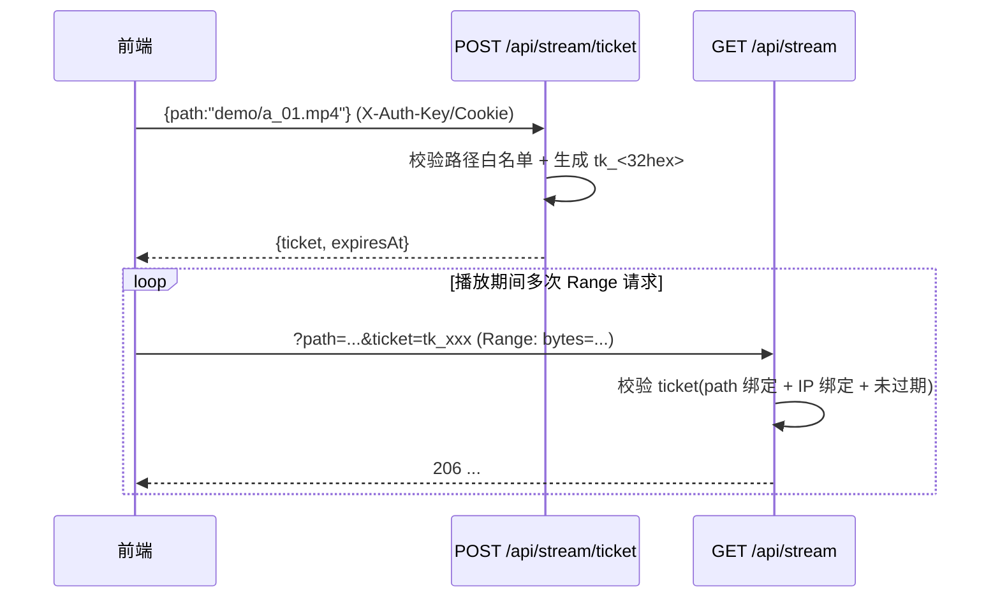
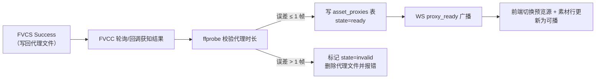
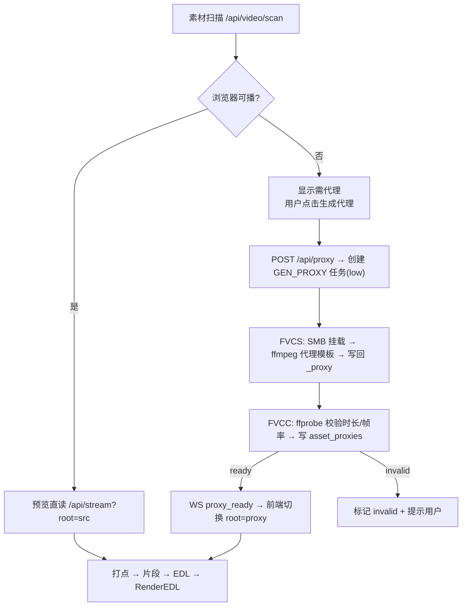

# 04 · 预览网关与代理工作流设计

> 归属：上位方案 §4.2（预览链路）、§5.2（GenProxy）
> 对应源码：`FVCS/pkg/server/server.go: handleRangeDownload(L824)`、`FVCC/server/security.go: PathValidator`、`FVCC/server/handlers.go: scanDirectory/probeVideo`、`FVCS/pkg/ffmpeg/ffmpeg.go`、`FVCS/pkg/smb/smb.go`

---

## 1. 范围与非目标

- **范围**：浏览器可播的 Range 流网关规格、票据鉴权、缩略图服务、代理生成任务（GenProxy）的参数与流程、源↔代理的时间轴对齐规则与映射表。
- **非目标**：NAS 侧任务调度与持久化（见 06）；ffmpeg 命令构造通则（见 05，本文件只给代理模板）；EDL 提交契约（见 03）。
- **关键约束（来自上位方案 D2/D3）**：网关**只做静态文件流，不转码**；一切转码/代理生成都在渲染队列。

---

## 2. 预览网关 `/stream`

### 2.1 改造基线

既有 `FVCS/pkg/server/server.go: handleRangeDownload`（L824）已实现 Range 语义（`206 Partial Content` + `Content-Range`），但归属 FVCS（Windows 侧）且以"任务产物下载"为语义。上位方案 §3.1 要求"改造为预览 `/stream`"，落地做法为：

| 方面 | 既有 `handleRangeDownload` | 新增 `/stream`（FVCC 侧） |
|---|---|---|
| 位置 | FVCS（渲染节点） | FVCC（NAS 侧），新文件 `FVCC/server/stream.go` |
| 语义 | 任务产物下载（按 taskId 定位） | 按相对路径读共享根内任意素材/代理/成品 |
| 鉴权 | `X-Auth-Key`（节点级） | 一次性票据（`<video>` 无法带头，见 §2.3） |
| 访问范围 | 该任务产物 | `SourceRoot`/`ProxyRoot`/`DestRoot` 三根白名单 |
| 代码复用方式 | — | **复制 Range 解析与 `io.CopyN` 分段写出逻辑**，不跨机复用（FVCC/FVCS 为独立二进制，无共享包） |

> 明确：不采用"浏览器 → FVCS 直连"方案，因为渲染节点可能不常开、且 NAS 侧统一网关才能做路径白名单与缓存；FVCS 的 `handleRangeDownload` 继续服务于其自身用途。

### 2.2 接口规格

```http
GET /app/fvcc/api/stream?path=<URL编码的相对路径>&ticket=<票据>
Range: bytes=0-1048575
```

| 项 | 规格 |
|---|---|
| 入参 | `path`：相对**当前根**的 POSIX 路径；根由 `root` 参数选择（`src`(默认) / `proxy` / `dest`），见 §2.6 |
| 成功（无 Range） | `200`，`Content-Length`、`Content-Type`（按扩展名映射，mp4→`video/mp4`）、`Accept-Ranges: bytes` |
| 成功（带 Range） | `206`，`Content-Range: bytes a-b/total`，`Content-Length: b-a+1` |
| Range 不可满足 | `416`，`Content-Range: bytes */total` |
| 票据无效/过期 | `403 {code:"E_TICKET_INVALID"}` |
| 路径越界 | `403 {code:"E_ASSET_NOT_IN_ROOT"}` |
| 文件不存在 | `404 {code:"E_ASSET_MISSING"}` |
| 并发上限 | 单文件 4 路并行 Range；全局 64 路（超出返回 `429 E_STREAM_BUSY`） |

要点：

1. **只读**：`GET`/`HEAD` 之外的方法一律 `405`。
2. **不缓存到内存**：直接 `os.Open` + `Seek` + `io.CopyN`，块大小 256 KB；禁止一次性 `ReadFile`。
3. **条件请求**：响应带 `ETag`（`size-mtime` 的 hash）与 `Last-Modified`；支持 `If-Range`，素材被替换时不返回脏数据。
4. **日志**：记录 `path(哈希后)/range/耗时/状态码`，不记录完整绝对路径。

### 2.3 票据机制



| 规则 | 取值 | 说明 |
|---|---|---|
| 票据形态 | `tk_<32hex>` | 服务端内存 LRU 保存，进程重启即失效（可接受：前端会自动重新申请） |
| 有效期 | 300s | 到期后前端重新申请；`<video>` 报错时触发一次重试（02 §7.1） |
| 绑定 | `path` + 来源 IP | **不是**一次性票据：`<video>` 播放同一文件会产生多次 Range 请求，一次性票据会导致播放中断（这是本文件对 02 §7.1 表述的澄清与修正） |
| 可复用范围 | 同一 ticket 仅对申请时的 `path` 与 `root` 有效 | 换素材必须重新申请 |
| 发放量限制 | 单 IP 每 60s 最多 60 个 | 防止票据刷取 |
| 失效时机 | 过期 / FVCC 重启 / 显式 `DELETE /api/stream/ticket`（页面卸载时可调用） | — |

### 2.4 缩略图 `/thumb`

```http
GET /app/fvcc/api/thumb?path=<相对路径>&t=<毫秒>&root=src|proxy|dest
```

| 项 | 规格 |
|---|---|
| 输出 | JPEG 320×180（等比缩放后居中裁剪），质量 80 |
| 生成方式 | 惰性：未命中缓存时调用 ffmpeg 抽帧（NAS 侧仅此一处使用 ffmpeg，且为非实时批量任务） |
| 缓存键 | `sha1(root|path|t|mtime|size).jpg` |
| 缓存目录 | `<CacheRoot>/thumbs/`（`CacheRoot` 默认 `<videoRoot>/_wve_cache`，可通过 `Settings.cacheRoot` 覆盖） |
| 并发与限流 | 单次抽帧耗时约 200~600ms；全局并发 2，超出进入队列；同一键并发请求合并（single-flight） |
| 失败兜底 | 抽帧失败返回 `200` + 1×1 透明 JPEG 占位（前端显示灰块），**禁止**返回 5xx 阻塞素材列表 |
| 前端调用 | 列表内素材：`t = min(1000, durationMs/10)`；时间线片段：取片段 `inMs` 对应帧 |

> **一致性约束**：素材扫描需过滤 `_` 前缀目录（`_proxy`、`_wve_cache`、`_exports`），避免缓存目录被当作素材库内容展示。既有 `scanDirectory` 的隐藏/临时文件过滤逻辑（`FVCC/server/handlers.go`）按同一规则扩展。

### 2.5 性能预算

| 场景 | 目标 |
|---|---|
| 首字节（局域网，1080p mp4） | ≤ 150ms |
| 1080p 20 Mbps 播放带宽占用 | ≈ 20 Mbps（无转码、无二次封装） |
| 缩略图列表（200 项，全未缓存） | 首屏 ≤ 15 张并发 2 生成；其余按需加载，整体不阻塞列表渲染 |
| 网关 CPU 占用 | 单路播放 ≤ 3%（纯 `io.CopyN`） |

### 2.6 根目录（root）白名单

| `root` | 解析根 | 用途 |
|---|---|---|
| `src`（默认） | `Settings.videoRoot` | 源素材预览 |
| `proxy` | `Settings.proxyRoot`（默认 `<videoRoot>/_proxy`） | 代理预览 |
| `dest` | `Settings.exportRoot`（默认 `<videoRoot>/_exports`） | 成品回看 |

校验顺序：**URL 解码一次 → 拒绝含 NUL/控制字符 → `path.Clean` → 拒绝 `..` 越界 → 拒绝绝对路径 → 拼接根 → `EvalSymlinks` → 前缀校验**（复用 `FVCC/server/security.go: PathValidator` 的四层思路）。

---

## 3. 代理工作流（GenProxy）

### 3.1 触发条件

| 触发源 | 条件 | 行为 |
|---|---|---|
| 自动 | 素材扫描时按 01 §5.2 判定为 `NeedProxy` | 列表显示"需代理"角标，**不自动下发**（避免大目录批量生成占满队列） |
| 手动 | 用户点击"生成代理" | 下发 GenProxy 任务 |
| 预览失败兜底 | `<video>` 报错且已确认素材为 `NeedProxy` | 提示用户一键生成代理 |

> 决策说明：上位方案 §4.2.3 描述"素材入库即下发"，本文件收敛为**用户显式触发**（自动批量会与渲染任务争抢队列，且大批量入库时不可控）。若后续需要自动模式，通过 `Settings.autoProxy=true` 开关启用（P1+）。

### 3.2 接口与载荷

```http
POST /app/fvcc/api/proxy
{ "assetId": "a_0000000a", "file": "demo/a_01.mp4" }
```
```json
200 OK { "taskId": "t_1757980100_cd34ef", "status": "QUEUE", "proxyFile": "demo/a_01.proxy.mp4" }
```

下发给 FVCS 的命令：

```json
{
  "cmd": "CreateGenProxy",
  "key": "<X-Auth-Key>",
  "taskId": "t_1757980100_cd34ef",
  "taskType": "GEN_PROXY",
  "priority": "low",
  "smbPath": "\\\\NAS\\media\\videos",
  "smbOutputPath": "\\\\NAS\\media\\videos\\_proxy",
  "credentialId": "nas-media-default",
  "payload": {
    "type": "GenProxy",
    "assetId": "a_0000000a",
    "srcFile": "demo/a_01.mp4",
    "proxyFile": "demo/a_01.proxy.mp4",
    "template": {
      "presetKey": "proxy_720p_h264",
      "height": 720,
      "fpsFollowSource": true,
      "crf": 23,
      "preset": "veryfast",
      "audioBitrate": "128k",
      "gopSeconds": 2
    }
  }
}
```

### 3.3 FVCS 执行（代理参数模板）

```bash
ffmpeg -hide_banner -nostdin -y \
  -i "<src UNC>" \
  -fps_mode cfr -vf "scale=-2:720,setsar=1" \
  -c:v libx264 -preset veryfast -crf 23 -pix_fmt yuv420p \
  -g <fps*2> -keyint_min <fps*2> -sc_threshold 0 \
  -c:a aac -b:a 128k -ac 2 -ar 48000 \
  -movflags +faststart \
  -progress pipe:1 \
  "<proxy UNC>"
```

| 参数 | 取值 | 理由 |
|---|---|---|
| 分辨率 | 高度固定 720，宽度 `-2` 自适应 | 保持源宽高比且宽为偶数 |
| 帧率 | 强制 `-fps_mode cfr`，且**不改变帧率**（不加 `-r`） | 满足 §4.1 的"同帧率"约束 |
| 编码 | `libx264` 软编（代理为低优先级后台任务，不抢占硬编资源给正式渲染） | 可通过 `optimizeForHardware` 复用逻辑在"空闲时"升级为 NVENC（`presetKey=proxy_720p_nvenc`） |
| GOP | 2s（`-g fps*2`，固定关键帧间隔） | 兼顾体积极限与后续 P2 精修 seek 的粒度需求 |
| 起始时间 | **不裁剪**，完整时长 | 满足"同起点、同时长"约束 |
| faststart | 开启 | 浏览器可渐进播放 |
| 进度 | `-progress pipe:1` | 代理任务进度解析与 05 §6 统一；同时保留 stderr `time=` 解析兼容 |

> 与上位方案 §4.2.3 的"仅抽关键帧流"关系：该优化会破坏"同时长/同帧率"约束，列为 **P1+ 可选**（`template.keyframeOnly=true`），且必须在代理映射表中记录 `mode:"keyframe_only"` 并禁止在对应素材上打点（前端禁用 + 后端拒绝）。

### 3.4 完成后回填与通知



- 校验项：`duration`（与源差 ≤ 1 帧）、`fps`（相等）、`width/height`（≤720）、`hasAudio`（源有音频则代理也须有）。
- 校验失败处理：不在"自动重试"范围内直接重试（避免死循环），标记 `invalid` 并提示用户，重试上限 2 次。

### 3.5 并发与优先级

| 项 | 规则 |
|---|---|
| 队列优先级 | `low`（低于 RenderEDL 的 `normal`/`high`），沿用既有优先级插队逻辑（`task.go: tryStartNext`） |
| 同节点并发 | 代理任务最多占用 `maxConcurrent - 1` 个槽位（为正式渲染留 1 槽） |
| 同素材去重 | 同一 `file` 已有 `QUEUE`/`RUNNING` 代理任务时，再次请求直接返回既有 `taskId`（不重复创建） |
| 失败重试 | 2 次，指数退避 30s/120s |

### 3.6 清理与容量

| 项 | 规则 |
|---|---|
| 代理总量上限 | `Settings.proxyQuotaBytes`（默认 200 GB）；超限时按 `last_access_at` 最久未访问的 10% 清理 |
| 失效清理 | 源文件 mtime/size 变更 → 代理标记 `stale`，下次预览前重建 |
| 清理维度 | 仅清理 `_proxy` 目录内、且已登记在 `asset_proxies` 表中的文件；**禁止**按扩展名扫描删除 |

---

## 4. 时间轴对齐

### 4.1 P0 硬约束（对齐上位方案 §4.4）

> 代理生成固定为 **同起点、同帧率、完整时长**，因此 `t_src = t_proxy`，无需换算表。

| 约束 | 校验方式 | 违反后果 |
|---|---|---|
| 同起点 | 不裁剪（无 `-ss`），`start_time` 偏差 ≤ 1 帧 | 标 `invalid` |
| 同时长 | `|dur_proxy - dur_src| ≤ 1 帧` | 标 `invalid` |
| 同帧率 | `r_frame_rate` 字符串相等（如 `30000/1001`） | 标 `invalid` |
| 同音轨存在性 | `hasAudio` 一致 | 标 `invalid` |

### 4.2 映射表

```sql
-- FVCC SQLite
CREATE TABLE IF NOT EXISTS asset_proxies (
  asset_key        TEXT PRIMARY KEY,   -- 相对 SourceRoot 的 POSIX 路径（含文件名）
  proxy_rel        TEXT NOT NULL,      -- 相对 ProxyRoot 的路径
  src_duration_ms  INTEGER NOT NULL,
  proxy_duration_ms INTEGER NOT NULL,
  src_fps          TEXT NOT NULL,      -- 原始分数形式，如 '30000/1001'
  proxy_fps        TEXT NOT NULL,
  mode             TEXT NOT NULL DEFAULT 'full',  -- 'full' | 'keyframe_only'
  state            TEXT NOT NULL,      -- 'ready' | 'invalid' | 'stale'
  task_id          TEXT,
  generated_at     TEXT NOT NULL,
  last_access_at   TEXT,
  size_bytes       INTEGER NOT NULL DEFAULT 0
);
CREATE INDEX IF NOT EXISTS idx_asset_proxies_state ON asset_proxies(state);
```

### 4.3 前端取值规则

```ts
// 素材可播路径选择（02 §7.3 的实现依据）
function pickPreviewSource(asset: AssetRef): { root: 'src' | 'proxy'; path: string } {
  if (asset.proxyFile && asset.visibility === 'proxy_ready') return { root: 'proxy', path: asset.proxyFile }
  return { root: 'src', path: asset.file }
}
```

- `mode === 'keyframe_only'` 的代理：允许播放预览，但**禁用打点**（01 §4.3 与 02 §7.3 的对应限制）。
- 代理 `stale`/`invalid`：前端回退到 `src` 直读并提示"代理已失效，正在重建"。

---

## 5. 端到端流程图



---

## 6. 错误码（本文件相关）

| 错误码 | 触发 | 处理 |
|---|---|---|
| `E_TICKET_INVALID` | 票据缺失/过期/被改绑 | 前端重新申请并重试 1 次 |
| `E_STREAM_BUSY` | 全局 64 路占满 | 前端退避 1s 重试，最多 3 次 |
| `E_ROOT_UNKNOWN` | `root` 参数非法 | 前端固定传值，属编码缺陷；服务端记 ERROR 日志 |
| `E_PROXY_ALREADY_QUEUED` | 重复提交同一素材代理 | 返回既有 `taskId`（HTTP 200，非错误） |
| `E_PROXY_VERIFY_FAILED` | 代理时长/帧率校验不通过 | 标记 `invalid`，提示用户 |
| `E_PROXY_QUOTA_EXCEEDED` | 代理配额超限且无法清理 | 阻止新代理任务，提示清理 |

---

## 7. 源码改动点索引

| 文件 | 改动 | 关联 |
|---|---|---|
| `FVCC/server/stream.go` | **新增**：`handleStream` / `handleStreamTicket` / `handleThumb`，Range 解析逻辑参照 `FVCS/pkg/server/server.go: handleRangeDownload`(L824) | §2 |
| `FVCC/server/security.go` | 复用 `PathValidator`，新增 `ResolveRoot(root string) (string, error)` 支持 `src/proxy/dest` 三根 | §2.6 |
| `FVCC/server/router.go` | 注册 `/stream`、`/stream/ticket`、`/thumb` | §2.2、§2.4 |
| `FVCC/server/handlers.go` | `scanDirectory` 过滤 `_` 前缀目录；新增 `handleProxyRequest`（创建 GenProxy 任务） | §2.4、§3.2 |
| `FVCC/server/store.go` | 新增 `asset_proxies` 表与读写方法 | §4.2 |
| `FVCC/server/scheduler.go` | 任务分流：`taskType=GEN_PROXY` 走低优先级通道；成功后触发代理校验回调 | §3.5 |
| `FVCC/server/ws.go` | 新增 `proxy_ready` 广播 | §3.4、03 §6 |
| `FVCS/pkg/server/server.go` | `handleWebSocket` 分派 `CreateGenProxy`；新增 `handleCreateGenProxy`（仿 `handleCreateSMBTask` L447） | §3.2 |
| `FVCS/pkg/ffmpeg/edl.go` | 新增 `BuildProxyCommand`（复用 `BuildFFmpegCommand` 三分类骨架与 `optimizeForHardware`；文件落点见 05 §10） | §3.3、05 §5.2 |
| `FVCS/pkg/task/task.go` | 代理任务复用 `Task`，`TaskType=GEN_PROXY`，沿用 SMB 执行路径 | §3.3、06 §3 |

