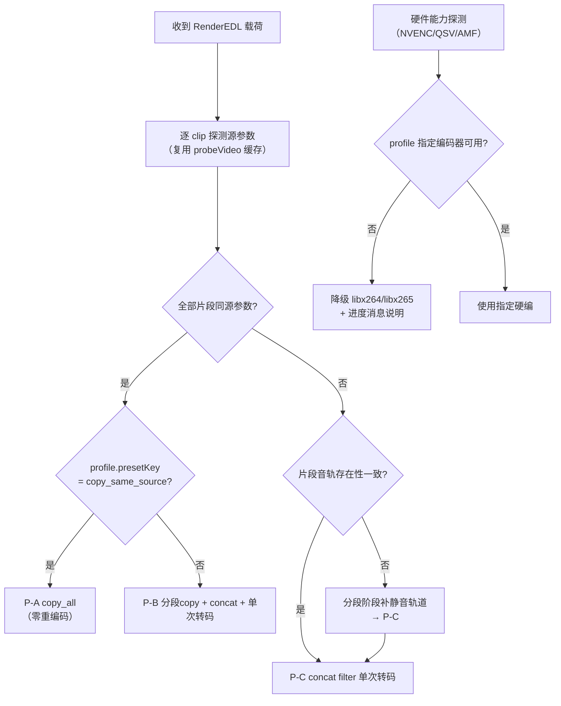

# 05 · RenderEDL 渲染引擎与 FFmpeg 命令构造器设计

> 归属：上位方案 §3.2（新增 EDL 渲染任务）、§4.3.3（EDL → FFmpeg 渲染语义）、D1（关键帧对齐）
> 对应源码：`FVCS/pkg/task/task.go: CreateSMBTask(L616) / tryStartNext(L370) / executeTranscode(L409)`、`FVCS/pkg/ffmpeg/ffmpeg.go: BuildFFmpegCommand(L160) / optimizeForHardware(L586) / monitorProgress`、`FVCS/pkg/server/server.go: handleCreateSMBTask(L447)`

---

## 1. 范围与非目标

- **范围**：RenderEDL 任务在 FVCS 侧的接收、校验、渲染策略选择、三阶段命令构造、profile 映射、进度模型、失败定位。
- **非目标**：载荷字段定义（见 03）、代理生成（见 04 §3.3，本文件仅给出共用构造骨架）、队列与状态机（见 06）。
- **精度基准（D1）**：**关键帧对齐**，目标偏差 ≤ 0.5s；不做帧级精确剪辑，不引入代理 I 帧精修（P3）。

---

## 2. 与既有源码的挂接点


| 既有函数 | 复用方式 |
|---|---|
| `handleCreateSMBTask`(L447) | 复制其结构：解析请求 → 校验 → 创建任务 → `MarkUploadComplete`；新增 `taskType` 分支 |
| `CreateSMBTask`(L616) | 新增 `CreateRenderTask`：写入 `TaskType/Payload/TotalMs/Stage/SegTotal`，SMB 挂载参数生成逻辑完全一致 |
| `executeTranscode`(L409) | 新增 `executeRenderEDL`：把"单条命令"扩为"多阶段命令序列 + 阶段间产物清理"，Job 托管/优先级/防休眠逻辑不变 |
| `BuildFFmpegCommand`(L160) | 不改其签名与行为；新构造器输出**已经是完整参数数组**，直接交给既有进程启动路径 |
| `optimizeForHardware`(L586) | 被 profile 解析阶段调用（软编→硬编升级/降级判定） |
| `monitorProgress` | 复用 stderr `time=` 解析 + 5min 卡死保护；新增 `-progress pipe:1` 解析（两者取先到者，防重复计数，见 §6.3） |

> **不改既有 Transcode 路径**：`RenderEDL` 为零侵入新增分支；`taskType` 为空时行为与今日完全一致（03 §3.1 兼容策略）。

---

## 3. 渲染策略决策

### 3.1 同源判定条件

只有当**所有片段**满足下表全部条件，才允许走 `copy_all`（零重编码）路径：

| 条件 | 判定数据来源 | 容差 |
|---|---|---|
| 视频编码 | `ffprobe: codec_name`（如 `h264`） | 必须完全相等 |
| 编码 profile/level | `profile`、`level` | 允许 level 不同（mp4 容器可容忍），profile 必须相同 ⚠️见下注 |
| 分辨率 | `width`×`height` | 必须完全相等，且等于 `timeline.width/height` |
| 帧率 | `r_frame_rate` 字符串 | 必须完全相等（如 `30000/1001`） |
| 像素格式 | `pix_fmt` | 必须相等（如 `yuv420p`） |
| 时间基 | `time_base` | 宽松：分段 copy 不要求一致，concat demuxer 要求一致 |
| 音轨编码 | `codec_name ∈ {aac}` 且 `sample_rate`/`channels` 一致 | 必须相等 |
| 音频存在性 | 全有或全无 | 混合时不允许 copy_all |

> §3.1 注：mp4 内 H.264 的 `profile` 不一致（如 High 与 Main 混用）会导致部分播放器异常，因此要求相同；若用户已选 `copy_same_source` 但检查不通过，服务端**自动降级**为 `segment_copy_final_encode`（转码输出）并在进度消息中说明降级原因（上位方案 D4：编码/分辨率/帧率不一致时自动降级全转码路径，防花屏）。

### 3.2 三条渲染路径

| 路径 | 触发条件 | 阶段序列 | 编码次数 | 相对耗时（3 段 5 分钟素材） |
|---|---|---|---|---|
| **P-A `copy_all`** | §3.1 全满足 且 `presetKey=copy_same_source` | ①分段 `-c copy` → ②concat demuxer `-c copy` → ③无（直接改名落盘） | 0 | ≈ 5~15s |
| **P-B `segment_copy_final_encode`（默认）** | §3.1 全满足（除 profile 要求变更时） | ①分段 `-c copy` → ②concat demuxer `-c copy` → ③按 profile 单次转码 | 1 | ≈ 1~1.6× 实时（NVENC） |
| **P-C `segment_copy_concat_filter`** | §3.1 不满足（混源） | ①分段 `-c copy`（各自保留原编码，音频统一 AAC）→ ②`filter_complex concat` 单次转码 | 1 | ≈ 1.2~2× 实时（NVENC） |

**P0 默认路径为 P-B**：与上位方案 §4.3.3 第 3 条"EDL → concat demuxer + `-ss/-to` → 按 profile 转码输出"一致；`copy_all` 作为用户在方案下拉中显式选择"不重编码（快速导出）"时的加速通道。

### 3.3 决策流程



---

## 4. 命令构造器设计

### 4.1 Go 接口

```go
// FVCS/pkg/ffmpeg/edl.go（新增）

// 单个片段的渲染计划
type SegmentPlan struct {
    Index    int
    SrcUNC   string        // 源文件 UNC 路径（由 pkg/smb.BuildSMBPath 生成）
    In       time.Duration
    Out      time.Duration
    HasAudio bool
    SegPath  string        // 中间片段落盘路径
    Args     []string      // 分段截取参数（不含可执行文件）
}

type RenderPlan struct {
    Mode        string         // "copy_all" | "segment_copy_final_encode" | "segment_copy_concat_filter"
    WorkDir     string
    Segments    []SegmentPlan
    ConcatList  string         // concat 清单文件内容（\n 分隔）
    ConcatArgs  []string       // concat 阶段参数
    FinalArgs   []string       // 最终导出参数；Mode=copy_all 时为 nil
    EstOutputBytes int64
}

// 主入口：构造三阶段命令
func BuildRenderEDLCommands(
    p    *protocol.RenderTaskPayload,   // 见 03 §2.2
    srcUNC func(relFile string) (string, error), // pkg/smb.BuildSMBPath 包装
    outUNC  string,                     // 成品 UNC
    workDir string,                     // 中间产物目录（§4.5）
    caps    *HardwareCaps,              // optimizeForHardware 的探测结果
    probes  map[string]*MediaInfo,      // 已缓存的 ffprobe 结果
) (*RenderPlan, error)                  // 出错即返回 E_EDL_INVALID / E_PROFILE_INVALID

// 代理专用（04 §3.3），复用同一三分类骨架
func BuildProxyCommand(srcUNC, outUNC string, t protocol.ProxyTemplate, caps *HardwareCaps) ([]string, error)
```

**构造器硬约束**

1. 函数**只接收结构化载荷**，不接受任何原始字符串参数拼接进命令行；`file`/`output` 已由 07 §3.3 白名单校验。
2. 输出为 `[]string` 参数数组，**禁止**返回 shell 字符串（避免引号/注入问题）；既有进程启动路径按数组传参。
3. 所有路径参数经 `filepath.Clean` + 前缀校验后才进入数组。
4. 构造器内对每个 clip 做断言（`Out > In`、段数 ≤ 200），失败返回带 `index` 的错误（不进入执行阶段）。

### 4.2 阶段一：分段截取

```bash
# 有音轨（音频编码为 aac，或已决定转 AAC）
ffmpeg -hide_banner -nostdin -y -loglevel warning -progress pipe:1 \
  -ss 00:01:22.400 -t 00:02:22.600 -i "\\NAS\media\videos\demo\a_01.mp4" \
  -map 0:v:0 -map 0:a:0 \
  -c:v copy -c:a copy \
  -avoid_negative_ts make_zero -fflags +genpts \
  -movflags +faststart \
  "<workdir>\seg_000.mp4"
```

```bash
# 无音轨（源无音频）→ 用 lavfi 补静音，保证后续 concat 可拼接
ffmpeg -hide_banner -nostdin -y -loglevel warning -progress pipe:1 \
  -ss 00:00:12.000 -t 00:00:28.200 -i "\\NAS\media\videos\demo\a_03.mp4" \
  -f lavfi -i anullsrc=channel_layout=stereo:sample_rate=48000 \
  -map 0:v:0 -map 1:a:0 \
  -c:v copy -c:a aac -b:a 192k -ar 48000 -ac 2 \
  -shortest -avoid_negative_ts make_zero -fflags +genpts \
  -movflags +faststart \
  "<workdir>\seg_002.mp4"
```

| 要点 | 说明 |
|---|---|
| `-ss` 放在 `-i` **之前** | 输入级 seek = fast seek，定位到最近关键帧（D1 精度来源）；段起点因此可能比 EDL 入点**略早**，偏差由 §4.6 归一化处理 |
| `-t` 而非 `-to` | 时长表达与"开区间"语义（03 §2.4）一致，避免 `-ss/-to` 混用时的语义歧义 |
| `-c:v copy` | 分段阶段绝不重编码，保留原始画质并近乎零耗时 |
| `-c:a copy` 仅在源音频为 `aac`/`mp3` 时使用 | 其他编码（AC3/DTS/PCM）在 mp4 容器中不兼容，此时改为 `-c:a aac -b:a 192k`（单次转码，损失可接受） |
| `-avoid_negative_ts make_zero` | 消除 seek 造成的负时间戳，保证片段可拼接 |
| `-fflags +genpts` | 修复部分源缺失 PTS 导致的时长异常 |
| `-movflags +faststart` | 中间片段也 faststart，便于失败时人工抽查 |

### 4.3 阶段二：拼接

**P-A / P-B（同源参数）：concat demuxer（零重编码）**

```text
# <workdir>\concat.txt
file '<workdir>/seg_000.mp4'
file '<workdir>/seg_001.mp4'
file '<workdir>/seg_002.mp4'
```

```bash
ffmpeg -hide_banner -nostdin -y -loglevel warning -progress pipe:1 \
  -f concat -safe 0 -i "<workdir>\concat.txt" \
  -c copy -movflags +faststart \
  "<workdir>\merged.mp4"
```

- 清单中的路径使用 `/` 分隔且做单引号转义（`'` → `'\''`），清单文件内容由构造器生成并做 §4.1 约束 4 的路径校验。
- `-safe 0` 允许绝对路径（Windows UNC/盘符路径在 `-safe 1` 下会被拒绝）。

**P-C（混源）：`filter_complex concat`（单次转码）**

```bash
ffmpeg -hide_banner -nostdin -y -loglevel warning -progress pipe:1 \
  -i "<workdir>\seg_000.mp4" -i "<workdir>\seg_001.mp4" -i "<workdir>\seg_002.mp4" \
  -filter_complex "\
    [0:v]scale=1920:1080:force_original_aspect_ratio=decrease,pad=1920:1080:(ow-iw)/2:(oh-ih)/2,setsar=1,fps=30[v0];\
    [1:v]scale=1920:1080:force_original_aspect_ratio=decrease,pad=1920:1080:(ow-iw)/2:(oh-ih)/2,setsar=1,fps=30[v1];\
    [2:v]scale=1920:1080:force_original_aspect_ratio=decrease,pad=1920:1080:(ow-iw)/2:(oh-ih)/2,setsar=1,fps=30[v2];\
    [0:a]aformat=sample_fmts=fltp:sample_rates=48000:channel_layouts=stereo[a0];\
    [1:a]aformat=sample_fmts=fltp:sample_rates=48000:channel_layouts=stereo[a1];\
    [2:a]aformat=sample_fmts=fltp:sample_rates=48000:channel_layouts=stereo[a2];\
    [v0][a0][v1][a1][v2][a2]concat=n=3:v=1:a=1[v][a]" \
  -map "[v]" -map "[a]" \
  <输出编码参数见 §4.4> \
  "<workdir>\merged.mp4"
```

- 滤镜图**由构造器按片段数组逐条生成**，不接受外部传入的滤镜字符串（filter 注入防线，见 07 §3.4）。
- 片段数 > 32 时，分段批次执行（每 32 个一批，批间 concat 长链），避免滤镜图过大导致 ffmpeg 解析变慢：`concatA(n=32)` + `concatB(n=32)` → `concat(n=2)`。

### 4.4 阶段三：最终导出（按 profile）

```bash
ffmpeg -hide_banner -nostdin -y -loglevel warning -progress pipe:1 \
  -i "<workdir>\merged.mp4" \
  <video 参数> <audio 参数> \
  -t 00:05:41.300 \
  -movflags +faststart -max_muxing_queue_size 2048 \
  "\\NAS\media\exports\demo_cujian_20260910.mp4"
```

| 参数组 | 取值来源 | 示例 |
|---|---|---|
| video 编码 | `profile.video.codec`（经 `optimizeForHardware` 校验/降级后的值） | `h264_nvenc` |
| 码率控制 | `profile.video.crf` + `preset` | `-rc vbr -cq 18 -preset p5`（NVENC）/ `-crf 18 -preset medium`（libx264） |
| 像素格式 | `profile.video.pixFmt` | `-pix_fmt yuv420p` |
| 帧率 | `timeline.fps` | `-fps_mode cfr -r 30` |
| 分辨率 | `timeline.width/height` | 若需缩放：`-vf scale=1920:1080:force_original_aspect_ratio=decrease,pad=...,setsar=1`（P-B 路径下仅在源分辨率≠目标时附加） |
| audio 编码 | `profile.audio` | `-c:a aac -b:a 192k -ar 48000 -ac 2` |
| 时长上限 | `payload.totalMs` | `-t 00:05:41.300`（防 concat 尾部溢出） |
| 元数据 | 固定 | `-map_metadata -1 -movflags +faststart`（剔除源残留元数据，利于后续去重/校验） |

**P-A（copy_all）无阶段三**：阶段二产物经完整性校验（时长偏差 ≤ 1 帧）后直接 `os.Rename` 到 `outUNC`（跨盘则 `io.Copy`）。若 `output` 已存在，先写 `.tmp` 再原子改名，避免半成品可见。

### 4.5 中间产物目录（关键决策）

| 策略 | 条件 | 路径 | 说明 |
|---|---|---|---|
| **首选：渲染机本地** | 本地盘可用空间 ≥ `2.2 × EstOutputBytes` | `%TEMP%\fvcs_render\<taskId>\` | 规避 NAS 写入抖动与带宽占用；任务结束（成功/失败）后整目录删除 |
| 降级：NAS 侧 | 本地空间不足 或 `Settings.forceNasWorkdir=true` | `<ProxyRoot>/../_wve_cache/render/<taskId>/` | 同共享可见，便于人工排查；任务结束后删除，**保留最近 3 个失败任务目录**供复盘 |
| 清理时机 | 任务终态（Success/Failed/Canceled）后 `defer os.RemoveAll(workDir)` | — | 清理失败仅记 WARN 日志，不改变任务状态 |

- 空间预检：`EstOutputBytes ≈ Σ(段时长) × 源平均码率 / 8 × 1.6`（转码路径额外乘以 0.6，因目标码率通常更低）。
- 中间片段命名：`seg_%03d.mp4`（3 位左补零，保证 `concat.txt` 顺序稳定，避免字典序错乱）。

### 4.6 精度归一化

fast seek 会前移到关键帧，导致段起点略早于 EDL 入点。P0 处理方式：

| 方案 | 处理 | 采纳 |
|---|---|---|
| A. 忽略（仅前移，不后移） | 实际输出比预期长 0~0.5s（每段），累计偏差可达数秒 | ❌ |
| B. 段头裁切 + 段尾补齐 | 分段时先 `-c copy` 截取 `[keyframe, out]`，再在**阶段三**用 `-ss` 精确裁掉段头多余部分（重编码路径下 `-ss` 精度为帧级） | ✅ 采纳（仅 P-B/P-C 生效） |
| C. P-A（copy_all） | 不做归一化，容差记为 ≤0.5s × 段数，导出前在 UI 明确提示 | ✅ 采纳 |

具体实现（P-B/P-C）：阶段一保留 `segStartOffsetMs = inMs - actualKeyframeMs`（由探测数据与 seek 结果推导，允许 ±40ms 误差）；阶段三前若有 `Σ segStartOffsetMs > 100ms`，则在 `merged.mp4` 上做一次**裁切预处理**：对每个段边界用 `select`/`trim` 滤镜裁切（仅当总偏差 > 100ms 才执行，避免过度工程）。

> 与 D1 的一致性：该处理把误差从"每段 0~0.5s"压缩到整体 ≤0.5s，符合"目标 ≤0.5s"的验收口径。

---

## 5. 渲染方案（Profile）映射

### 5.1 枚举表（服务端权威，前端仅展示）

| presetKey | 编码器 | 关键参数 | 适用 |
|---|---|---|---|
| `copy_same_source` | 无（copy） | — | 同源快速导出（P-A） |
| `h264_nvenc_p5` | `h264_nvenc` | `-rc vbr -cq 18 -preset p5 -pix_fmt yuv420p` | 默认（NVIDIA） |
| `h264_nvenc_p7` | `h264_nvenc` | `-rc vbr -cq 16 -preset p7` | 高质量（NVIDIA） |
| `hevc_nvenc_p5` | `hevc_nvenc` | `-rc vbr -cq 20 -preset p5 -tag:v hvc1` | 体积优先（NVIDIA） |
| `h264_qsv_balanced` | `h264_qsv` | `-global_quality 20 -preset medium` | Intel 核显 |
| `hevc_qsv_balanced` | `hevc_qsv` | `-global_quality 22 -preset medium -tag:v hvc1` | Intel 核显 |
| `h264_amf_balanced` | `h264_amf` | `-quality balanced -rc cqp -qp_i 20 -qp_p 22` | AMD |
| `libx264_medium` | `libx264` | `-crf 18 -preset medium` | 兜底 / 无硬编 |
| `libx264_slow` | `libx264` | `-crf 16 -preset slow` | 高质量兜底 |
| `libx265_medium` | `libx265` | `-crf 20 -preset medium -tag:v hvc1` | 体积优先兜底 |
| `proxy_720p_h264` | `libx264` | `-crf 23 -preset veryfast -vf scale=-2:720` | 代理（04 §3.3） |
| `proxy_720p_nvenc` | `h264_nvenc` | `-cq 23 -preset p5 -vf scale=-2:720` | 代理（节点空闲时） |

音频统一：`-c:a aac -b:a 192k -ar 48000 -ac 2`（代理为 `128k`）。

### 5.2 硬编能力协商

```go
// 复用 optimizeForHardware(L586) 的能力探测结果
func resolveEncoder(presetKey string, caps *HardwareCaps) (codec string, fallback bool)
```

| 情况 | 行为 |
|---|---|
| 指定编码器可用 | 原样使用，`fallback=false` |
| 指定硬编不可用 | 降级到 `libx264_medium`（或 `libx265_medium`），`fallback=true`，进度/结果消息说明"未检测到 NVENC，已使用软件编码" |
| 编码器存在但探测失败 | 同上降级，并记 WARN（不中断任务） |
| 用户显式选择 `copy_same_source` 但不满足 §3.1 | 降级为 `h264_nvenc_p5`（若可用）否则 `libx264_medium`，**不报错**，进度消息说明（D4 降级原则） |

---

## 6. 进度模型

### 6.1 阶段权重

| 阶段 | 权重（P-B/P-C） | 权重（P-A copy_all） |
|---|---|---|
| `prepare`（挂载/SMB stat/空间预检/探测） | 2% | 5% |
| `segment`（逐段截取，段内按**时长加权**） | 8% | 60% |
| `concat`（拼接） | 5% | 30% |
| `mux`（最终转码导出，含归一化裁切） | 83% | — |
| `finalize`（完整性校验 + 原子改名） | 2% | 5% |

- `progress = Σ(已完成阶段权重) + 当前阶段权重 × 阶段内进度`，向上取整，**只在数值变化时上报**（≥1% 变化或状态变化），避免 WS 风暴。
- 权重表可由 `Settings.progressWeights` 覆盖（配置化，便于后续调优）。

### 6.2 上报载荷

```json
{ "cmd": "Progress", "taskId": "task_1757980000123456789",
  "progress": 62, "stage": "mux", "seg": { "index": 3, "total": 3 },
  "msg": "正在编码导出", "outTimeMs": 187400, "totalMs": 341300, "speed": "1.34x" }
```

- `stage`/`seg` 为新增字段（03 §6、06 §6），旧 FVCC 忽略即可。
- `speed` 取自 ffmpeg 输出 `speed=1.34x`，用于前端展示"剩余时间预估"（`remain = (totalMs - outTimeMs) / speed`）。

### 6.3 进度源去重

| 源 | 解析方式 | 用途 |
|---|---|---|
| `-progress pipe:1` | 键值对 `out_time_ms=` / `progress=end` | 主进度源（更平滑） |
| stderr `time=` | 既有 `monitorProgress` 正则 | 兜底 + 保留 5min 卡死保护 |

去重规则：取**较大值**作为当前阶段进度；两源均无更新超过 5 分钟 → 判定卡死（复用既有保护逻辑，错误码 `E_TIMEOUT_STALL`）。

### 6.4 卡死保护与超时

| 项 | 规则 |
|---|---|
| 无进度阈值 | 5 分钟（沿用既有实现） |
| 全局超时 | `max(10min, 4 × totalMs)`，超出强杀并置 `E_RENDER_FAILED` |
| 取消 | `CancelTask` 命令触达后发送 `Job` 终止信号，删除 workDir，状态置 `Canceled` |

---

## 7. 失败定位与错误上报

```json
{ "cmd": "TaskResult", "taskId": "task_...", "ok": false,
  "code": "E_RENDER_FAILED", "stage": "segment", "seg": { "index": 1, "total": 3 },
  "msg": "seg_001 截取失败：源文件不可读",
  "source": "demo/a_02.mp4",
  "stderrTail": ["[concat @ ...] ...", "..."],   // 最后 20 行，路径脱敏为相对路径
  "durationMs": 12400 }
```

| 失败原因 | 判定依据 | 处理 |
|---|---|---|
| 源文件缺失 | 执行前 `OsStat` 失败 | `E_ASSET_MISSING`，不进重试 |
| SMB 挂载失败 | 挂载步骤返回错误 | `E_SMB_MOUNT_FAILED`，冷却重试 ≤2 次 |
| ffmpeg 不存在 | `LookPath` 失败 | `E_FFMPEG_MISSING`，不进重试 |
| 分段失败 | 阶段一非 0 退出 | `E_RENDER_FAILED`，可重试（`MaxRetry`） |
| 拼接失败（copy） | concat 阶段非 0 退出 | **自动降级为 P-C** 重跑一次（D4），仍失败则报错 |
| 最终转码失败 | 阶段三非 0 退出 | `E_RENDER_FAILED`，可重试（≤2 次） |
| 输出时长异常 | 成品时长与 `totalMs` 偏差 > 2s | 标记失败并保留成品供排查（不删除，日志给出路径） |
| 磁盘写满 | ffmpeg stderr 含 `No space left` | `E_DISK_FULL`，不进重试 |

---

## 8. 性能预估（1080p30 / H.264 源，5 分钟成品）

| 路径 | 分段 | 拼接 | 导出（NVENC / libx264） | 合计 |
|---|---|---|---|---|
| P-A copy_all | ≈1s | ≈1s | — | **≈3~8s** |
| P-B | ≈2s | ≈2s | ≈80s / ≈300s | **≈85s / ≈305s** |
| P-C | ≈2s | — | ≈100s / ≈360s | **≈105s / ≈365s** |

- 主要耗时集中在阶段三（编码），与上位方案 §7 P0 "3 段粗剪 → 渲染"的演示目标一致：同源 3 段短素材可在 1 分钟内出片。

---

## 9. 测试与验收要点

| 用例 | 输入 | 期望 |
|---|---|---|
| T1 同源 copy_all | 3 段同源 h264 1080p30，`copy_same_source` | 输出时长误差 ≤ 0.5s×3，画质无二次压缩 |
| T2 同源转码 | 同 T1，`h264_nvenc_p5` | 输出分辨率/帧率 = timeline，编码器为 nvenc（或降级并说明） |
| T3 混源 | 1080p30 + 720p25 混合 | 走 P-C，输出统一 1920×1080@30，无花屏/音画不同步 |
| T4 无音轨素材 | 1 段无音频 + 1 段有音频 | 补静音成功，总时长正确 |
| T5 越界入点 | `out` > 源时长 | 提交阶段即拒绝（`E_EDL_INVALID`），不产生任务 |
| T6 可播性 | 成品 mp4 | 浏览器与 PotPlayer 均可播放，`moov` 前置 |
| T7 失败定位 | 故意删除源文件 | 返回 `E_ASSET_MISSING` + 具体 `file`，无 workDir 残留 |
| T8 卡死保护 | 构造挂起 ffmpeg | 5 分钟内判定 `E_TIMEOUT_STALL` 并回收进程 |
| T9 并发 | 2 个 RenderEDL 任务 | 按节点并发上限排队，进度互不干扰 |

---

## 10. 源码改动点索引

| 文件 | 改动 | 关联 |
|---|---|---|
| `FVCS/pkg/ffmpeg/edl.go` | **新增**：`BuildRenderEDLCommands` / `BuildProxyCommand` / `resolveEncoder` / `buildFilterGraph` | §4、§5 |
| `FVCS/pkg/ffmpeg/ffmpeg.go` | 复用不改；新增导出 `HardwareCaps` 访问器供 `edl.go` 使用 | §5.2 |
| `FVCS/pkg/protocol/protocol.go` | 新增 `CmdCreateRenderEDL`/`CmdCreateGenProxy`、`RenderTaskPayload` 引用、`ValidateRenderEDLPayload` | 03 §3.1、07 §3.3 |
| `FVCS/pkg/task/task.go` | 新增 `CreateRenderTask`（仿 L616）、`executeRenderEDL`（仿 L409）、`Task.TaskType/Stage/SegTotal/SegDone/TotalMs`、阶段权重推进 | §2、§6.1 |
| `FVCS/pkg/server/server.go` | `handleWebSocket` 新增 `CreateRenderEDL`/`CreateGenProxy` 分支；新增 `handleCreateRenderEDL`（仿 L447） | §2 |
| `FVCS/pkg/server/security.go` | 载荷白名单接入点（见 07 §3.3） | 07 |
| `FVCS/pkg/smb/smb.go` | 复用 `MountSMBShare`/`BuildSMBPath`；新增 `EnsureDirUNC`（代理目录/中间目录创建） | §4.5 |

