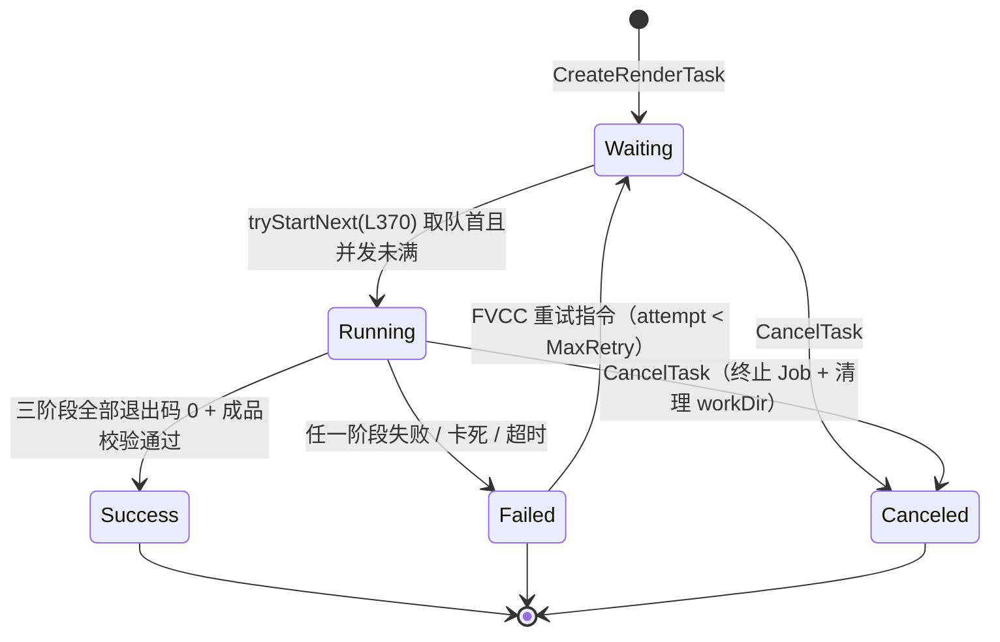
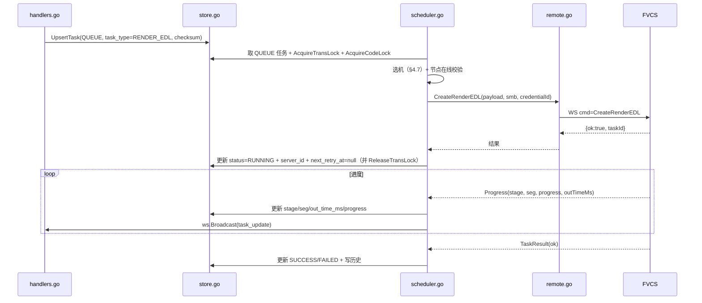

# 06 · 调度持久化与渲染节点管理设计

> 归属：上位方案 §5（任务生命周期与数据流）、§5.3（渲染机选择策略）
> 对应源码：`FVCC/server/store.go`、`FVCC/server/scheduler.go`、`FVCC/server/remote.go`、`FVCC/server/ws.go`、`FVCS/pkg/task/task.go`（`tryStartNext` L370 / `executeTranscode` L409 / `CreateSMBTask` L616）

---

## 1. 范围与非目标

- **范围**：项目与任务的持久化模型、FVCC 侧调度（分流/入队/选机/冷却重试/幂等/锁）、FVCS 侧任务状态机与重启恢复、节点注册与健康管理、进度事件聚合。
- **非目标**：命令构造（见 05）、预览与代理业务逻辑（见 04）、安全校验细则（见 07）。
- **原则**：**能复用既有调度骨架的绝不另起一套**。存量 `Transcode` 与新增 `RenderEDL/GenProxy` 共用同一张任务表、同一把锁、同一套冷却重试。

---

## 2. 持久化模型（FVCC SQLite）

### 2.1 新增表

```sql
-- 项目（EDL 宿主）
CREATE TABLE IF NOT EXISTS projects (
  id          TEXT PRIMARY KEY,          -- 'p_<8hex>'
  name        TEXT NOT NULL,
  rev         INTEGER NOT NULL DEFAULT 1,-- 乐观锁
  schema_ver  INTEGER NOT NULL DEFAULT 1,
  edl_json    TEXT NOT NULL,             -- {timeline, clips} 序列化（03 §2.1 内存态，毫秒）
  clip_count  INTEGER NOT NULL DEFAULT 0,
  total_ms    INTEGER NOT NULL DEFAULT 0,
  created_at  TEXT NOT NULL,
  updated_at  TEXT NOT NULL,
  last_render_task_id TEXT,
  UNIQUE(name)
);
CREATE INDEX IF NOT EXISTS idx_projects_updated ON projects(updated_at DESC);

-- 节点能力快照（服务端权威）
CREATE TABLE IF NOT EXISTS node_caps (
  server_id     TEXT PRIMARY KEY,
  agent_version TEXT,
  os            TEXT,
  cpu_cores     INTEGER,
  gpu_json      TEXT,          -- [{vendor:'nvidia',name:'RTX 4070',encoders:['h264_nvenc',...]}]
  encoders_json TEXT,          -- 可用编码器列表（ffmpeg -encoders 探测结果）
  max_concurrent INTEGER,
  ffmpeg_path   TEXT,
  updated_at    TEXT NOT NULL
);

-- 节点健康采样（保留最近 N 条，用于失败率计算）
CREATE TABLE IF NOT EXISTS node_health_samples (
  id         INTEGER PRIMARY KEY AUTOINCREMENT,
  server_id  TEXT NOT NULL,
  sampled_at TEXT NOT NULL,
  online     INTEGER NOT NULL,
  running    INTEGER NOT NULL,
  cpu_pct    REAL,
  mem_pct    REAL,
  fail_count INTEGER NOT NULL DEFAULT 0
);
CREATE INDEX IF NOT EXISTS idx_node_health_server_time ON node_health_samples(server_id, sampled_at DESC);
```

### 2.2 `tasks` 表扩展（既有表增加列，全部可空/带默认值，保证旧库可迁移）

```sql
ALTER TABLE tasks ADD COLUMN task_type      TEXT NOT NULL DEFAULT 'TRANSCODE'; -- TRANSCODE|RENDER_EDL|GEN_PROXY
ALTER TABLE tasks ADD COLUMN project_id     TEXT;                              -- RenderEDL 关联项目
ALTER TABLE tasks ADD COLUMN project_rev    INTEGER;                           -- 提交时的项目版本
ALTER TABLE tasks ADD COLUMN payload_json   TEXT;                              -- 载荷快照（审计与重试依据）
ALTER TABLE tasks ADD COLUMN checksum       TEXT;                              -- 幂等键（05 载荷 checksum）
ALTER TABLE tasks ADD COLUMN credential_id  TEXT;                              -- 节点凭据档案键（README A6）
ALTER TABLE tasks ADD COLUMN server_id      TEXT;                              -- 目标渲染节点
ALTER TABLE tasks ADD COLUMN stage          TEXT;                              -- prepare|segment|concat|mux|finalize
ALTER TABLE tasks ADD COLUMN seg_index      INTEGER DEFAULT 0;
ALTER TABLE tasks ADD COLUMN seg_total      INTEGER DEFAULT 0;
ALTER TABLE tasks ADD COLUMN total_ms       INTEGER DEFAULT 0;
ALTER TABLE tasks ADD COLUMN out_time_ms    INTEGER DEFAULT 0;
ALTER TABLE tasks ADD COLUMN speed          TEXT;
ALTER TABLE tasks ADD COLUMN attempt        INTEGER NOT NULL DEFAULT 0;        -- 已重试次数
ALTER TABLE tasks ADD COLUMN next_retry_at  TEXT;                              -- 冷却到期时间
ALTER TABLE tasks ADD COLUMN cooldown_reason TEXT;
CREATE INDEX IF NOT EXISTS idx_tasks_checksum ON tasks(checksum);
CREATE INDEX IF NOT EXISTS idx_tasks_project  ON tasks(project_id, created_at DESC);
CREATE UNIQUE INDEX IF NOT EXISTS idx_tasks_orderid ON tasks(order_id);
```

迁移策略：`store.go` 启动时执行 `PRAGMA table_info(tasks)` 检测缺列并逐列 `ALTER TABLE`（幂等），失败即拒绝启动并给出可读错误（禁止静默降级）。

### 2.3 状态取值

| 层 | 取值 | 说明 |
|---|---|---|
| FVCC（任务表） | `QUEUE` / `RUNNING` / `SUCCESS` / `FAILED` / `CANCELED` / `COOLDOWN` | `COOLDOWN` 为新增（冷却等待中，可被 `next_retry_at` 到点后转 `QUEUE`） |
| FVCS（内存态） | `Waiting` / `Running` / `Success` / `Failed` | 既有实现不变 |

映射：`Waiting↔QUEUE`、`Running↔RUNNING`、其余同名直通；FVCC 以自身表为权威，FVCS 上报仅作状态推进依据。

---

## 3. FVCS 侧任务状态机

### 3.1 Task 结构扩展

```go
// FVCS/pkg/task/task.go 追加字段（不改动既有字段）
type Task struct {
    // ...既有字段不变...

    TaskType   string                 `json:"taskType"`              // ""(兼容旧)=TRANSCODE | "RENDER_EDL" | "GEN_PROXY"
    Payload    *protocol.RenderTaskPayload `json:"payload,omitempty"`// 仅 RenderEDL 使用
    ProxyTpl   *protocol.ProxyTemplate     `json:"proxyTemplate,omitempty"`

    Stage      string `json:"stage,omitempty"`
    SegTotal   int    `json:"segTotal,omitempty"`
    SegDone    int    `json:"segDone,omitempty"`
    TotalMs    int64  `json:"totalMs,omitempty"`
    OutTimeMs  int64  `json:"outTimeMs,omitempty"`
    Speed      string `json:"speed,omitempty"`

    Plan       *ffmpeg.RenderPlan `json:"-"`
    WorkDir    string             `json:"-"`
}
```

### 3.2 状态流转



### 3.3 执行主流程

```go
// FVCS/pkg/task/task.go 新增（仿 executeTranscode L409）
func (m *Manager) executeRenderEDL(t *Task) error {
    defer cleanupWorkDir(t)                 // 终态清理（05 §4.5）
    if err := ensureSMBMounted(t); err != nil { return errStage("prepare", err) }
    if err := preflightSpace(t); err != nil { return errStage("prepare", err) }

    plan, err := ffmpeg.BuildRenderEDLCommands(t.Payload, srcUNC(t), outUNC(t), t.WorkDir, m.caps, m.probes)
    if err != nil { return err }            // 构造失败 = 载荷问题，直接失败不重试
    t.Plan, t.SegTotal = plan, len(plan.Segments)

    t.setStage("segment")
    for i, seg := range plan.Segments {
        if err := m.runFFmpeg(t, seg.Args, progressFor(seg)); err != nil {
            return errSeg("segment", i, seg.SrcUNC, err)
        }
        t.SegDone = i + 1
    }
    t.setStage("concat")
    if err := m.runFFmpeg(t, plan.ConcatArgs, progressForConcat()); err != nil {
        if plan.Mode == modeSegmentCopyFinalEncode {
            // D4：copy 拼接失败 → 自动降级 P-C 重跑一次
            plan, err = ffmpeg.RebuildAsConcatFilter(t.Payload, srcUNC(t), t.WorkDir, m.caps, m.probes)
            if err != nil { return err }
            if err = m.runFFmpeg(t, plan.FinalArgs, progressForMux()); err != nil { return err }
        } else {
            return err
        }
    }
    if plan.FinalArgs != nil {
        t.setStage("mux")
        if err := m.runFFmpeg(t, plan.FinalArgs, progressForMux()); err != nil { return err }
    }
    t.setStage("finalize")
    if err := verifyAndMove(plan, outUNC(t), t.Payload.TotalMs); err != nil { return err }
    return nil
}
```

要点：

1. **阶段间不重试**：重试粒度是整个任务（避免中间产物状态不一致）；`segment` 阶段失败可**从断点段继续**（`SegDone > 0` 且 workDir 存在时跳过已完成段），此优化仅在同一节点内重试时生效。
2. **降级一次**：concat copy 失败自动走 P-C，只降级一次（防止无限循环）。
3. **workDir 复用**：重试时若 workDir 已存在且片段完整（时长校验通过）则复用，否则清理重建。
4. **取消响应**：`CancelTask` 通过 context 传播，`runFFmpeg` 收到后 kill 进程树（复用既有 Job 托管能力）。

### 3.4 启动恢复

| 恢复场景 | 行为 |
|---|---|
| FVCS 重启，任务表存在 `Waiting` | 重新入队（与既有实现一致） |
| FVCS 重启，`Running` 且 workDir 存在且片段完整 | 从 `SegDone` 续跑 |
| FVCS 重启，`Running` 但 workDir 不存在 | 整任务重跑（清理后重建） |
| FVCS 重启，存在"孤儿 workDir"（无对应任务） | 启动时扫描 `%TEMP%\fvcs_render\`，删除 7 天前的目录（失败任务保留 3 个，见 05 §4.5） |

---

## 4. FVCC 侧调度

### 4.1 任务分流

```go
// FVCC/server/scheduler.go 分发
switch t.TaskType {
case "", "TRANSCODE":   return s.handleQueue(t)          // 既有路径，零改动
case "RENDER_EDL":      return s.handleRenderEDL(t)
case "GEN_PROXY":       return s.handleGenProxy(t)
}
```

- 三种类型**共用**同一 `tasks` 表、同一 tick（1s）、同一 `OrderID` 排序、同一锁。
- 优先级：`GEN_PROXY` 强制 `low`（`tryStartNext` 中的插队逻辑需按"优先级 + OrderID"排序，代理任务不得插到 RenderEDL 之前）。

### 4.2 下发流程



### 4.3 冷却重试（复用既有语义）

| 触发 | 行为 |
|---|---|
| 节点离线 / 挂载失败 / 提交超时 | `failTaskWithCooldown(taskId, reason, cooldownSec)`（既有函数）：状态置 `COOLDOWN`，`next_retry_at = now + cooldown`，`attempt += 1` |
| 冷却到期 | tick 扫描 `status=COOLDOWN AND next_retry_at <= now` → 置 `QUEUE`（保留原 `OrderID`，不改变用户可见顺序） |
| 重试次数上限 | `MaxRetry`（默认 5；`E_ASSET_MISSING`/`E_EDL_INVALID` 类错误**不计入**重试，直接 `FAILED`） |
| 退避策略 | `cooldownSec = min(30 × 2^attempt, 600)`：30s / 60s / 120s / 240s / 480s | |
| 可重试错误码白名单 | `E_NODE_OFFLINE` / `E_SMB_MOUNT_FAILED` / `E_TIMEOUT_STALL` / `E_RENDER_FAILED`（但 `E_DISK_FULL`、`E_FFMPEG_MISSING` 不可重试） |

### 4.4 幂等

```go
// 提交入口（handlers.go: renderEDLProject）
key := payload.Checksum           // 03 §2.2：clips+profile 规范化后的 sha256 前 16 位
if t, ok := store.FindActiveTaskByChecksum(key); ok {   // 状态 ∈ {QUEUE, RUNNING, COOLDOWN}
    return reuse(t)               // HTTP 200 返回既有 taskId，前端只提示"任务已在进行中"
}
if t, ok := store.FindSuccessTaskByChecksum(key); ok && fileExists(t.OutputPath) {
    return reuse(t)               // 相同内容且成品仍在 → 直接复用，不重复渲染
}
```

- `checksum` 计算输入：`projectRev` **不参与**，`output`/`profile`/`clips`（规范化：毫秒转时间码、字段排序、去除空值）参与；保证"改了输出名或方案"视为新任务，"仅改名项目"视为不同任务（因 name 影响 `output`）。
- 前端展示：重复提交返回既有 `taskId` 时提示"已存在相同内容的渲染任务"，并提供"强制重渲染"（携带 `force:true` 跳过幂等检查）。

### 4.5 分布式锁

| 锁 | 既有函数 | 在 RenderEDL 中的用途 |
|---|---|---|
| 转码锁 | `AcquireTransLock` | 保证同一节点同时只有一个任务在"派发中"状态，避免重复下发 |
| 编码锁 | `AcquireCodeLock` | 保证同一 `checksum` 不会被两台 NAS 实例/两个请求同时发起 |
| 释放时机 | `ReleaseTransLock` | 任务进入 `RUNNING` 或派发失败后立即释放（沿用既有实现） |

> 多 NAS 实例场景（P2 可能）：锁确保跨实例唯一；P0 单实例下为幂等冗余，保留不删。

### 4.6 历史归档与产物回收

| 项 | 规则 |
|---|---|
| 成功任务 | 写 `task_history`（既有），新增 `task_type/project_id/output_path/stage/attempt/duration_ms` 字段 |
| 失败任务 | 同上，保留 `payload_json` 与 `stderr_tail`（脱敏），供复盘 |
| 中间产物 | FVCS 侧清理（05 §4.5）；FVCC 侧不涉及 |
| 历史保留 | 默认保留 500 条或 90 天（先到为准），沿用既有清理策略配置 |

---

## 5. 渲染节点管理

### 5.1 注册与心跳

| 项 | 值 | 说明 |
|---|---|---|
| 注册 | 节点主动 WS 连接 + `Hello{agentVersion, os, cpuCores, encoders, maxConcurrent, ffmpegPath}` | 复用既有连接建立流程，扩展 `Hello` 字段 |
| 心跳 | 既有 WS ping/pong，周期 15s | 不下发额外 HTTP 心跳 |
| 离线判定 | 30s 无心跳 | 置 `offline`，其 `RUNNING/COOLDOWN` 任务按 §4.3 冷却重试 |
| 上线补报 | 重连后立即上报当前任务列表 | 用于 FVCC 与节点状态对账（节点有、NAS 无 → 记录 WARN 并请求取消；NAS 有、节点无 → 按 §4.3 重试） |
| 能力刷新 | 每 30 分钟或 `Hello` 时刷新 `node_caps` | 编码器/驱动变更后自动生效 |

`Hello` 扩展示例：

```json
{ "cmd": "Hello", "agentVersion": "1.2.0", "os": "Windows 11 26100",
  "cpuCores": 16, "maxConcurrent": 2, "ffmpegPath": "C:/ffmpeg/bin/ffmpeg.exe",
  "gpu": [{ "vendor": "nvidia", "name": "RTX 4070", "encoders": ["h264_nvenc", "hevc_nvenc"] }],
  "encoders": ["h264_nvenc", "hevc_nvenc", "h264_qsv", "libx264", "libx265"],
  "running": [{ "taskId": "task_...", "progress": 42, "stage": "mux" }] }
```

### 5.2 健康分

```
healthScore = 100
            − 40 × min(recentFailRate_1h, 1)          // 近 1 小时失败率
            − 15 × (recentStallCount_24h ≥ 1 ? 1 : 0) // 24h 内出现过卡死
            − 10 × (recentMountFail_1h ≥ 2 ? 1 : 0)   // SMB 挂载连续失败
            − 20 × (offline ? 1 : 0)
healthScore = clamp(healthScore, 0, 100)
```

### 5.3 选机算法（P0：手工优先 + 打分降级）

```go
func (s *Scheduler) pickNode(t *Task) (*Server, error) {
    if t.ServerID != "" {                       // 用户显式指定
        n := s.get(t.ServerID)
        if n.Offline { return nil, ErrNodeOffline }
        if n.FreeSlots() == 0 { return n, nil } // 排队等待，不换机（尊重用户选择）
        return n, nil
    }
    cands := s.onlineNodes()
    if len(cands) == 0 { return nil, ErrNodeOffline }
    best, bestScore := nil, -1.0
    for _, n := range cands {
        if n.FreeSlots() == 0 { continue }
        sc := 0.5*float64(n.FreeSlots())/float64(n.MaxConcurrent)*100 +
              0.3*float64(n.HealthScore) +
              0.2*capabilityMatch(n, t)          // 命中所需编码器=100，否则=20（可软编兜底）
        if sc > bestScore { best, bestScore = n, sc }
    }
    if best == nil {                             // 全部忙 → 选最早可能空闲的节点排队
        return s.earliestFreeNode(cands), nil
    }
    return best, nil
}
```

| 规则 | 说明 |
|---|---|
| P0 默认 | 用户在渲染对话框选择节点；不选则自动（本节算法） |
| 同节点并发 | `freeSlots = maxConcurrent − running`；代理任务再减 1（04 §3.5） |
| 版本不匹配 | 节点 `agentVersion` 低于支持 `RENDER_EDL` 的最低版本 → 排在选择结果之外并给出原因 |
| 维护模式 | 节点可被置 `maintenance`（不接新任务，跑完存量），P0 通过配置文件/接口手工设置 |

### 5.4 节点级降级与熔断

| 情况 | 行为 |
|---|---|
| 同一节点 5 分钟内连续 3 次失败 | 熔断 10 分钟（不再被选机命中），并在节点列表标注"近期不稳定" |
| 熔断期结束 | 允许接 1 个"探测任务"（低优先级小任务），成功则恢复 |
| 节点自身重启 | 上线补报对账（§5.1） |

---

## 6. 进度与事件聚合（WS）

```go
// FVCC/server/ws.go 扩展（保持既有 BroadcastTaskUpdate 可用）
func (h *Hub) BroadcastTaskUpdateFull(taskID, status string, progress int,
    stage string, seg *SegInfo, msg string, outTimeMs, totalMs int64, speed string)
```

| 事件 | 频率控制 |
|---|---|
| `task_update` | 服务端聚合：同一任务 500ms 内最多广播一次（取最新值），进度未变不广播 |
| `proxy_ready` | 生成即广播（去重：同一 assetId 10s 内只广播一次） |
| `node_status` | 状态变化时广播（online↔offline、healthScore 跨 20 分档） |
| 断线补偿 | 浏览器重连后调用 `GET /api/tasks?active=1` 全量拉取，避免丢事件 |

---

## 7. 可观测性

| 项 | 内容 |
|---|---|
| 结构化日志（FVCC） | `task_id, task_type, project_id, server_id, from_status, to_status, attempt, stage, duration_ms, error_code` |
| 结构化日志（FVCS） | `task_id, task_type, stage, seg_index, ffmpeg_exit_code, duration_ms, work_dir_mode(local/nas)` |
| 指标（可选，P1） | 队列长度、平均等待时长、成功/失败率、每节点利用率、编码阶段耗时分布 |
| 审计 | 凭据相关、权限相关操作单独落审计日志（见 07 §5.4） |
| 脱敏 | 日志中一律使用相对路径；SMB/UNC 前缀统一替换为 `<share>` |

---

## 8. 一致性保障清单

| 风险 | 措施 |
|---|---|
| 双写不一致（任务表 vs 节点内存） | FVCC 为权威；节点上报仅推进，冲突以上线补报对账（§5.1） |
| 重复下发 | `checksum` 幂等 + `AcquireCodeLock` |
| 任务悬挂（NAS 认为 RUNNING，节点已死） | 30s 心跳超时 → 冷却重试 |
| 半成品可见 | 成品先写 `.tmp` 再原子改名（05 §4.4） |
| 项目被编辑后渲染结果过期 | `project_rev` 冻结；任务详情提示"项目已更新"（03 §4.3） |
| 并发任务写同一输出 | 提交时重名检测（03 §4.4）+ 输出名含时间戳/序号 |
| 状态回退（SUCCESS → RUNNING） | 状态推进只允许沿状态机正向；检测到回退则记 ERROR 并忽略 |

---

## 9. 源码改动点索引

| 文件 | 改动 | 关联 |
|---|---|---|
| `FVCC/server/store.go` | `tasks` 列迁移（§2.2）；新增 `projects`/`node_caps`/`node_health_samples` 表与 CRUD；`FindActiveTaskByChecksum`/`FindSuccessTaskByChecksum`/`ListCooldownDue` | §2、§4.4 |
| `FVCC/server/scheduler.go` | 新增 `handleRenderEDL` / `handleGenProxy`；tick 增加冷却到期扫描；选机 `pickNode`；熔断状态维护 | §4.1、§4.3、§5.3 |
| `FVCC/server/remote.go` | 新增 `CreateRenderEDL` / `CreateGenProxy`（仿既有 `CreateSMBTask`，删去 `SMBUser/SMBPassword`，改用 `credentialId`）；`wsCmd` 扩展 `taskType/payload/credentialId` | §4.2 |
| `FVCC/server/handlers.go` | 新增 `renderEDLProject`（幂等检查）、`listActiveTasks`、节点管理接口 | §4.4、§6 |
| `FVCC/server/ws.go` | `BroadcastTaskUpdateFull` + 频率聚合；`node_status`/`proxy_ready` | §6 |
| `FVCC/server/store.go` | 历史归档字段扩展（`task_history`） | §4.6 |
| `FVCS/pkg/task/task.go` | `Task` 扩展（§3.1）；`executeRenderEDL`；`setStage`/段级进度；续跑与 workDir 复用；孤儿目录清理 | §3 |
| `FVCS/pkg/server/server.go` | `Hello` 载荷扩展（`gpu/encoders/running`）；`Progress` 载荷扩展（`stage/seg/outTimeMs/speed`） | §5.1、§6 |

