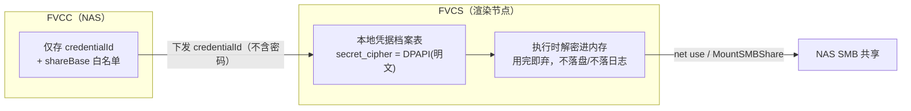

---
AIGC:
    Label: "1"
    ContentProducer: 001191440300708461136T1XGW3
    ProduceID: 839b5d1d4fff15220193598838e6072d_3ed93900acff11f1af37525400826444
    ReservedCode1: wClEUBHRQQcWNN7ufCQoFaFtwiRCQSIy8HM/gazfF/rkDexVSSaOpyHlmzR6Rz5yXPihdWYUyNdQ7oXCW1wf1CjYo9yvMAA9M1jg7of3edtA2lg257Svue1Oiv3UW3pApw0Q79y7Pb35/dov6nAzds3cpkaT6xnXS8m8c9KotJNYWTkQS+2bZt0K1Ss=
    ContentPropagator: 001191440300708461136T1XGW3
    PropagateID: 839b5d1d4fff15220193598838e6072d_3ed93900acff11f1af37525400826444
    ReservedCode2: wClEUBHRQQcWNN7ufCQoFaFtwiRCQSIy8HM/gazfF/rkDexVSSaOpyHlmzR6Rz5yXPihdWYUyNdQ7oXCW1wf1CjYo9yvMAA9M1jg7of3edtA2lg257Svue1Oiv3UW3pApw0Q79y7Pb35/dov6nAzds3cpkaT6xnXS8m8c9KotJNYWTkQS+2bZt0K1Ss=
---

# 07 · 安全校验与凭据管理细则

> 归属：上位方案 §6（安全设计）
> 对应源码：`FVCS/pkg/protocol/protocol.go: ValidateExtraFFmpegArgs`（黑名单，需替换）、`FVCS/pkg/config/config.go`（AES-GCM 硬编码 `encryptKey`，R1）、`FVCC/server/security.go: PathValidator`、`FVCC/server/gateway.go: requireAdmin`、`FVCS/pkg/smb/smb.go`

---

## 1. 范围与威胁模型

### 1.1 范围

EDL 载荷校验、路径校验、filter 约束、鉴权与会话、凭据存储与流转、命令执行防线、审计。

### 1.2 威胁模型（P0 场景）

| 前提 | 说明 |
|---|---|
| 网络 | 可信局域网；NAS 页面仅监听局域网/127.0.0.1（上位方案 §6） |
| 攻击者 | 局域网内的非授权设备；已获得普通（非 admin）账号的用户；被篡改的前端请求 |
| 非目标威胁 | 物理接触 NAS、内核级攻击、公网暴露（默认不做） |

| # | 威胁 | 影响 | 对应措施 |
|---|---|---|---|
| T1 | 越权读取任意文件（`../` 穿越、绝对路径、符号链接） | 敏感文件泄露 | §3.2 路径四层校验 + 三根白名单 |
| T2 | ffmpeg 参数注入（自由字符串拼进命令行） | 任意命令执行/文件覆盖 | §3.3 结构化白名单 + §6 数组传参 |
| T3 | filter_complex 注入（P2） | 读任意文件（`movie=` 滤镜可读文件） | §3.4 滤镜图由构造器生成，禁用户串 |
| T4 | 输出文件覆盖系统/他人文件 | 数据破坏 | §3.5 输出名约束 + 重名规则 + 前缀校验 |
| T5 | 凭据泄露（明文落库、日志、下发） | NAS 账号泄露 | §5 DPAPI 档案 + 禁下发 + 脱敏 |
| T6 | 票据滥用/枚举 | 素材遍历 | §4.3 票据绑定 + 限流 |
| T7 | 非 admin 发起渲染/删项目 | 越权操作 | §4.2 写操作强制 admin |
| T8 | 恶意大 JSON / 深嵌套 | 拒绝服务 | §3.6 体积/深度/长度上限 |
| T9 | 重放提交（重复渲染抢占资源） | 资源耗尽 | 03 §4.3 幂等 + 06 §4.4 |

---

## 2. 风险台账（对齐整体方案，逐项收敛）

| 编号 | 整体方案中的风险 | 本细则的处理 | 状态 |
|---|---|---|---|
| R1 | 配置加密密钥硬编码 | `config.go` 的 `encryptKey` 常量替换为系统凭据源：Windows 用 DPAPI 保护一个随机主密钥（首次启动生成并落 `%ProgramData%\FVCS\master.key.dpapi`），敏感字段用主密钥 AES-GCM 加密 | 本文件 §5.5 |
| R3 | SMB 凭证明文落 SQLite | FVCS 侧改为 DPAPI 加密档案（`secret_cipher`），且 FVCC **不再下发**密码字段（`credentialId` 取代） | §5.2~§5.5 |
| R4 | 黑名单注入过滤可被绕过 | `ValidateExtraFFmpegArgs`（黑名单）在 RenderEDL 路径上**弃用**，改为 `ValidateRenderEDLPayload`（结构化白名单）；`filter_complex` 一律不由外部提供 | §3.3、§3.4 |
| R6 | 预览网关越权 | 票据 + 三根白名单 + `PathValidator` 四层 + 只读 | §3.2、§4.3 |

> 处理原则：**存量 Transcode 路径的黑名单暂不删除**（避免影响既有功能），但 RenderEDL/GenProxy 路径必须走白名单；R4 的彻底清理排在 P1（存量路径迁移完成后）。

---

## 3. 输入校验细则

### 3.1 分层总览


**纵深防御要求**：任一层的通过都不构成对下一层的信任；每层独立实现（FVCC 与 FVCS 不共享代码，规则以本文件为唯一来源，靠同一组测试向量保证一致，见 §8）。

### 3.2 路径校验

**四层校验（沿用并扩展 `FVCC/server/security.go: PathValidator`）**

| 层 | 检查 | 失败错误码 |
|---|---|---|
| L1 语法 | 非空、长度 ≤ 255、无 NUL/控制字符、无 `\`（协议统一 `/`）、不以 `/` 开头 | `E_EDL_INVALID` |
| L2 结构 | 按 `/` 切分后，每段非空且不为 `.` / `..`；段数 ≤ 8；单段长度 ≤ 100 | `E_ASSET_NOT_IN_ROOT` |
| L3 语义 | `path.Clean` 后与原文相等（发现 `a//b`、`a/./b` 一律拒绝）；扩展名 ∈ 白名单 | `E_EDL_INVALID` |
| L4 落地 | 拼接根后 `filepath.Clean` → `EvalSymlinks`（文件不存在时对父目录求值）→ 校验结果以根为前缀（含分隔符边界，防 `/media/videos2` 误判为 `/media/videos` 子路径） | `E_ASSET_NOT_IN_ROOT` |

```go
// FVCC/server/edl_validate.go / FVCS/pkg/protocol/edl_validate.go（同规则、双实现）
var allowedExt = map[string]bool{".mp4": true, ".mov": true, ".mkv": true, ".m4v": true, ".avi": true, ".mxf": true}

func ValidateRelPath(rel string, allowExt map[string]bool) error {
    if rel == "" || len(rel) > 255 { return ErrEDLInvalid }
    if strings.HasPrefix(rel, "/") || strings.Contains(rel, `\`) { return ErrEDLInvalid }
    segs := strings.Split(rel, "/")
    if len(segs) > 8 { return ErrNotInRoot }
    for _, s := range segs {
        if s == "" || s == "." || s == ".." { return ErrNotInRoot }
        if len([]rune(s)) > 100 { return ErrEDLInvalid }
        for _, r := range s {
            if r < 0x20 || r == 0x7f || strings.ContainsRune(`:*?"<>|`, r) { return ErrEDLInvalid }
        }
    }
    if path.Clean(rel) != rel { return ErrEDLInvalid }
    if allowExt != nil && !allowExt[strings.ToLower(path.Ext(rel))] { return ErrEDLInvalid }
    return nil
}

// 前缀校验必须带分隔符边界
func withinRoot(root, abs string) bool {
    r := filepath.Clean(root)
    return abs == r || strings.HasPrefix(abs, r+string(os.PathSeparator))
}
```

**根的来源**：`src`/`proxy`/`dest` 三根只从配置读取（03 §2.3、04 §2.6），**禁止**从请求参数传入任意根。

### 3.3 EDL 载荷结构化白名单（替代黑名单）

```go
// FVCS/pkg/protocol/protocol.go 新增
var reTimecode = regexp.MustCompile(`^\d{2,}:[0-5]\d:[0-5]\d\.\d{3}$`)

const (
    maxPayloadBytes = 256 * 1024
    maxClips        = 200
    minClipMs       = 100
    maxTotalMs      = 6 * 3600 * 1000
)

func ValidateRenderEDLPayload(raw []byte) (*RenderTaskPayload, error) {
    if len(raw) > maxPayloadBytes { return nil, ErrEDLTooLarge }
    dec := json.NewDecoder(bytes.NewReader(raw))
    dec.DisallowUnknownFields()            // 未知字段直接拒绝：防"静默忽略"式绕过
    var p RenderTaskPayload
    if err := dec.Decode(&p); err != nil { return nil, ErrPayloadInvalid }
    if dec.More() { return nil, ErrPayloadInvalid }   // 尾部多余数据

    if p.Type != "RenderEDL" { return nil, ErrPayloadInvalid }
    if err := ValidateRelPath(p.SourceRoot, nil); err != nil { return nil, err }   // 相对根，无扩展名要求
    if err := ValidateRelPath(p.DestRoot, nil); err != nil { return nil, err }
    if err := ValidateOutputName(p.Output); err != nil { return nil, err }         // 单段 + 强制 .mp4
    if err := validateTimeline(p.Timeline); err != nil { return nil, err }
    if len(p.Clips) == 0 || len(p.Clips) > maxClips { return nil, ErrEDLInvalid }

    var total int64
    for i, c := range p.Clips {
        if err := ValidateRelPath(c.File, allowedExt); err != nil { return nil, wrapIdx(err, i) }
        if !reTimecode.MatchString(c.In) || !reTimecode.MatchString(c.Out) {
            return nil, wrapIdx(ErrEDLInvalid, i)      // 时间码格式不合规（含换行/URL 编码注入一律不匹配）
        }
        in, out := timecodeToMs(c.In), timecodeToMs(c.Out)
        if out <= in || out-in < minClipMs { return nil, wrapIdx(ErrEDLInvalid, i) }
        if math.Abs(c.Speed-1.0) > 1e-6 { return nil, wrapIdx(ErrEDLInvalid, i) }  // P0 不支持变速
        total += out - in
    }
    if total > maxTotalMs { return nil, ErrEDLInvalid }
    if _, ok := profilePresets[p.Profile.PresetKey]; !ok { return nil, ErrProfileInvalid }
    if p.Profile.Container != "mp4" { return nil, ErrProfileInvalid }
    return &p, nil
}
```

**必须遵守的 5 条红线**

1. **不使用黑名单**：时间码用"必须匹配正则"，路径用"字符集允许 + 结构禁止"，杜绝"过滤掉 `\n` 就安全"的思路（R4 教训）。
2. **未知字段即拒绝**：`DisallowUnknownFields`；P0 不认识的字段（如 `transition`、`filters`）出现即报错，避免被下游静默忽略。
3. **数值白名单**：`presetKey` 必须在服务端枚举表内，不接受自造编解码器名。
4. **时间码格式与数值双重校验**：正则通过后仍需换算为毫秒做关系校验（`out > in`、时长下限、总量上限）。
5. **错误信息可定位但不泄露**：返回 `index`/`field`，**不回显完整载荷**（防反射型注入进前端）。

### 3.4 filter_complex 约束（P2 预留，P0 禁用）

| 规则 | 说明 |
|---|---|
| P0 | `filter`/`filters`/`transition` 字段出现即拒绝（§3.3 红线 2） |
| P2 启用条件 | 仅允许**枚举化的效果**：`transition: {type:'fade'|'dissolve', durationMs:100..2000}`、`filter: {type:'brightness'|'contrast'|'saturation', value:-1..1}` |
| 生成方式 | 滤镜图字符串**只在 `ffmpeg/edl.go` 内由枚举值拼接**，数值经范围钳制后格式化（`%.3f`），禁止外部串进入 |
| 显式禁止 | 任何携带 `=`/`:`/`,`/`[`/`]`/`;` 的用户字符串；禁止 `movie=`、`amovie=`、`concat=n=?` 等可由用户控制的复合语法 |
| 层数上限 | 单片段效果数 ≤ 3，滤镜图总长度 ≤ 4 KB |

### 3.5 输出文件名与重名

```go
var reOutputBase = regexp.MustCompile(`^[\p{Han}\p{L}\p{N} ._\-（）()\[\]]{1,80}$`)

func ValidateOutputName(name string) error {
    if !strings.HasSuffix(strings.ToLower(name), ".mp4") { return ErrEDLInvalid }
    if strings.Count(name, ".") != 1 { return ErrEDLInvalid }        // 禁 'a.b.mp4' 之类多重扩展
    if !reOutputBase.MatchString(strings.TrimSuffix(name, ".mp4")) { return ErrEDLInvalid }
    return nil
}
```

| 规则 | 说明 |
|---|---|
| 不允许子目录 | `output` 必须是单段文件名（P0） |
| 重名处理 | 服务端检测 `DestRoot` 下同名 → 追加 `_1`/`_2`…（最多 99 次），并把最终名返回前端（03 §4.4） |
| 保留名 | 拒绝 `CON/PRN/AUX/NUL/COM1..9/LPT1..9`（Windows 保留设备名，大小写不敏感） |
| 禁止覆盖 | 一律不覆盖既有文件（防 R6 类越权写入掩盖） |
| 写入方式 | 先写 `<name>.tmp`，校验通过后原子改名（05 §4.4） |

### 3.6 JSON 解析约束

| 项 | 上限 | 超限 |
|---|---|---|
| 请求体体积 | 256 KB（RenderEDL）/ 4 KB（其他写接口） | `413 E_EDL_TOO_LARGE` |
| 嵌套深度 | 8 | 解码前用 `json.Decoder` 流式扫描统计，超限 `400 E_PAYLOAD_INVALID` |
| 单字符串长度 | 255 | 同上 |
| 数组长度 | `clips ≤ 200`、`gpu ≤ 8` | 同上 |

> 实现：`http.MaxBytesReader` 限制读取体积；深度检查用轻量扫描器（不引入新依赖）。

---

## 4. 鉴权与会话

### 4.1 主体与凭据

| 主体 | 凭据 | 来源 |
|---|---|---|
| 浏览器（用户） | `X-Auth-Key` 头 或 Cookie 会话 | 既有 `authMiddleware`；fnOS 网关身份由 `gateway.go` 解析 |
| 渲染节点 | `X-Auth-Key`（节点级，WS 握手时校验） | 既有实现 |
| 服务内部（FVCC → 本地） | 无（进程内调用） | — |

### 4.2 权限分级

| 操作 | 只读用户 | admin |
|---|---|---|
| 素材扫描/预览/缩略图/`/stream` | ✅ | ✅ |
| 项目读写（`/edl/projects*`） | ✅（P0 简化，团队共用） | ✅ |
| 提交渲染（`/render`） | ❌ | ✅ |
| 生成代理（`/proxy`） | ❌ | ✅ |
| 删除项目/删除任务 | ❌ | ✅ |
| 节点管理与凭据管理 | ❌ | ✅（凭据仅限节点本机，见 §5.3） |

> 实现：复用 `gateway.go: requireAdmin` 中间件，在 `/render`、`/proxy`、`DELETE` 类路由上挂载。P0 若只有单一共享密钥，则视所有登录者为 admin（与现状一致），但**接口权限位必须已就位**，避免后续返工。

### 4.3 预览票据

见 04 §2.3。安全要点复述：

- 票据与 `path` + 来源 IP 绑定，有效期 300s，**非一次性**（`<video>` 会多次 Range 请求）；
- 服务端内存 LRU，容量上限 5000，超出按最久未用淘汰；
- 单 IP 60s 内最多申请 60 个；
- **禁止**在 URL 中透出绝对路径（只传相对路径 + `root` 枚举）。

### 4.4 监听与暴露面

| 项 | 规则 | 依据 |
|---|---|---|
| 监听地址 | 默认 `127.0.0.1` 或局域网网卡；`config.listenAddr` 显式配置才对外 | 既有 `ListenLocalOnly` 思路 |
| 明令禁止 | 不允许 `0.0.0.0` + 公网端口映射的组合；启动时若检测到 `0.0.0.0` 且无 TLS，记 WARN 并在 UI 顶栏提示 | 上位方案 §6 |
| 管理接口 | 节点本机管理接口（凭据）仅 `127.0.0.1` | §5.3 |
| HTTP 安全头 | `X-Content-Type-Options: nosniff`、`Referrer-Policy: no-referrer`、`X-Frame-Options: SAMEORIGIN` | 新增 |

### 4.5 限流

| 目标 | 阈值 | 超限响应 |
|---|---|---|
| 登录/鉴权失败 | 10 次/5min/IP | `429`，冷却 15min |
| `/stream` 票据申请 | 60/min/IP | `429 E_RATE_LIMITED` |
| `/stream` 并发 | 全局 64，单文件 4 | `429 E_STREAM_BUSY` |
| 渲染提交 | 30/min/用户 | `429` |
| WS 连接 | 单节点 ≤ 3 条；浏览器 ≤ 5 条 | `429` |

---

## 5. 凭据管理

### 5.1 现状（问题）

| 现状 | 位置 | 风险 |
|---|---|---|
| AES-GCM 加密密钥硬编码在源码常量 | `FVCS/pkg/config/config.go: encryptKey` | 任何人拿到二进制即可解密所有加密字段（R1） |
| SMB 用户名/密码明文随任务下发并落库 | `FVCC/server/remote.go` 的 `wsCmd.SMBUser/SMBPassword`、`tasks`/`task_history` 表 | 数据库泄露 = NAS 账号泄露（R3） |
| 凭据随每次任务在网络中重复传输 | WS 明文（局域网） | 抓包即得 |

### 5.2 目标模型



**核心原则**：密码**只在渲染节点本机存在**，且以 DPAPI 保护；NAS 侧永远不持有、不传输、不记录密码。

### 5.3 档案存储与接口

```sql
-- FVCS 本地 SQLite（新增）
CREATE TABLE IF NOT EXISTS credentials (
  credential_id TEXT PRIMARY KEY,      -- 'nas-media-default'
  share_base    TEXT NOT NULL,         -- '\\NAS\media'
  username      TEXT NOT NULL,
  domain        TEXT,
  secret_cipher BLOB NOT NULL,         -- CryptProtectData(LocalMachine) 或 AES-GCM(主密钥 DPAPI 保护)
  scope_json    TEXT NOT NULL,         -- 允许访问的 UNC 前缀数组
  created_at    TEXT NOT NULL,
  updated_at    TEXT NOT NULL,
  last_used_at  TEXT,
  rotated_at    TEXT
);
```

```go
// FVCS/pkg/smb/credentials.go（新增）
type Credential struct {
    ID        string
    ShareBase string
    Username  string
    Domain    string
    Scope     []string
    secret    string   // 明文仅存在于内存，带 `no-copy` 注释与 defer 清零
}

// 仅监听 127.0.0.1 的本地管理接口
func (c *CredStore) Put(req PutCredentialRequest) error   // 内部：DPAPI 加密后落库
func (c *CredStore) Resolve(id string, targetUNC string) (*Credential, error) // 校验 targetUNC 属 Scope
func (c *CredStore) Delete(id string) error
func (c *CredStore) List() ([]CredentialMeta, error)      // 不含 secret
```

本地管理接口（`127.0.0.1:port/local/credentials`，`GET/POST/DELETE`）：

```http
POST http://127.0.0.1:17890/local/credentials
{ "credentialId": "nas-media-default", "shareBase": "\\\\NAS\\media",
  "username": "svc_video", "domain": "NAS", "password": "<用户输入>",
  "scope": ["\\\\NAS\\media\\videos", "\\\\NAS\\media\\exports"] }
```
```json
200 OK { "credentialId": "nas-media-default", "updatedAt": "2026-09-10T14:20:00+08:00", "secretStored": "dpapi" }
```

| 规则 | 说明 |
|---|---|
| 传输方式 | **仅本机回环**（119.0.0.1）；UI 为节点托盘界面，不接受来自 NAS 的凭据写入 |
| 响应体 | 永不回显密码；`List` 只返回元数据与 `lastUsedAt` |
| 日志 | 凭据相关操作只记 `credentialId` 与结果，**禁止**记录 `username`/`password`/`secret` |
| 内存处理 | 解密后的明文字符串在使用后 `runtime.KeepAlive` 前显式覆写为零值；不进入 `Task` 结构体持久化字段 |
| 范围校验 | `Resolve` 时必须校验目标 UNC 落在 `Scope` 内，否则 `E_CREDENTIAL_SCOPE_DENIED` |

### 5.4 生命周期

| 阶段 | 操作 | 责任方 |
|---|---|---|
| 创建 | 用户在渲染节点托盘输入 NAS 账号 → 本机加密入库 | 用户 + FVCS |
| 使用 | FVCC 下发 `credentialId` → FVCS `Resolve` → 挂载 → 用完清理 | FVCC/FVCS |
| 更新（轮换） | 本机管理接口覆盖写；`rotated_at` 更新；正在运行的任务不受影响（使用已解密副本），新任务使用新凭据 | 用户 + FVCS |
| 删除 | 校验无 `RUNNING` 任务引用 → 删除；若被任务引用则拒绝 | FVCS |
| 失效检测 | 挂载返回"拒绝访问" → 节点上报 `E_CREDENTIAL_INVALID`，前端提示"请在渲染节点更新 NAS 凭据" | FVCS → FVCC → UI |
| 审计 | 创建/更新/删除/使用失败均写本地审计（`audit_log`），保留 180 天 | FVCS |

### 5.5 迁移与存量清理（R1/R3 收敛路径）

| 步骤 | 动作 | 兼容性 |
|---|---|---|
| M1（本次改造内） | FVCS 新增 `credentialId` 接收支路；档案表落库；**保留** `SMBUser/SMBPassword` 接收（记 WARN 审计） | 旧 FVCC 仍可用 |
| M2 | FVCC 改为只下发 `credentialId`；停止写入 `task_history` 中的凭据列（改为 `credential_id`） | 需 FVCS ≥ M1 版本 |
| M3 | `config.go` 硬编码 `encryptKey` 替换为"主密钥由 DPAPI 保护"；提供 `fvcs-cli reencrypt` 一次性迁移工具（读取旧密文 → 用新密钥重写） | 需人工执行一次 |
| M4（P1） | 删除 `SMBUser/SMBPassword` 接收支路与所有明文列（`ALTER TABLE ... DROP COLUMN` 或建新表迁移） | 不兼容旧 FVCC，版本门禁 |

**门禁**：`node_caps.agent_version` 参与选机（06 §5.3）；FVCC 在 M2 之后仅向满足最低版本的节点下发 `credentialId`。

### 5.6 禁止事项（硬约束）

1. **禁止编造凭据**：任何情况下不得用默认值/猜测值填充 `username`/`password`；缺失时必须向用户索取（弹出节点本机凭据录入界面）。
2. **禁止凭据回传**：FVCS 不得将 secret 回传给 FVCC 或浏览器（包括"为了诊断"等理由）。
3. **禁止凭据进日志/错误消息/进度消息**。
4. **禁止在 URL/查询串中携带凭据**。
5. **禁止将 secret 写入任务载荷**（`payload_json` 必须显式剔除凭据字段，落库前做一次断言检查）。

---

## 6. 命令执行安全

| 防线 | 规则 |
|---|---|
| 参数传递 | 一律 `exec.CommandContext(ctx, ffmpegPath, args...)`；**禁止** `cmd /c`、`sh -c`、字符串拼接、`eval` |
| 可执行文件 | `ffmpegPath` 来自节点配置，启动时校验：存在、可执行、位于允许目录（默认允许 `C:\ffmpeg`、`%ProgramFiles%`、配置指定目录）；路径含空格时不做引号处理（数组传参天然安全） |
| 环境变量 | 子进程 `Env` 白名单（`PATH`、`TEMP`、`SystemRoot` 等），不透传用户可控变量 |
| 工作目录 | 显式设置为 `workDir`（避免相对路径解析到意外位置） |
| 超时与终止 | 统一 `context` 超时（05 §6.4）；终止时 kill 进程树（复用既有 Job 托管） |
| 输出解析 | 只解析 `-progress` 键值对与 stderr 的 `time=`/`speed=` 字段，**禁止**将 ffmpeg 输出用于任何命令拼接 |
| 中间清单文件 | `concat.txt` 由构造器生成，路径来自已校验的相对路径；写入前对 `'` 做转义（05 §4.3） |

---

## 7. 审计与告警

```sql
CREATE TABLE IF NOT EXISTS audit_log (
  id         INTEGER PRIMARY KEY AUTOINCREMENT,
  ts         TEXT NOT NULL,
  actor      TEXT NOT NULL,       -- 密钥前 8 位哈希 / IP / 'local'
  action     TEXT NOT NULL,       -- 'render.submit' | 'credential.put' | 'proxy.request' | 'stream.ticket' ...
  target     TEXT,                -- taskId / projectId / credentialId
  result     TEXT NOT NULL,       -- 'ok' | 错误码
  detail     TEXT                 -- 脱敏后的补充信息（<share> 前缀替换）
);
CREATE INDEX IF NOT EXISTS idx_audit_ts ON audit_log(ts DESC);
```

| 告警条件 | 级别 | 动作 |
|---|---|---|
| 同一 IP 鉴权失败 ≥ 10 次/5min | WARN | 限流 + 审计 |
| 5min 内 `E_ASSET_NOT_IN_ROOT` ≥ 3 次 | **ERROR** | 疑似越权扫描，记 IP 并提示管理员（P0 仅日志） |
| `E_PAYLOAD_INVALID`/`E_EDL_INVALID` 突增（>50/5min） | WARN | 疑似注入试探，记审计 |
| 凭据挂载连续失败 ≥ 2 | WARN | 前端提示更新凭据 |
| 节点被熔断 | INFO | 节点列表标注 |

---

## 8. 安全自测清单（必须全部通过，作为 P0 验收前置）

| # | 用例 | 期望 |
|---|---|---|
| S1 | `path=../../etc/passwd` | `403 E_ASSET_NOT_IN_ROOT` |
| S2 | `path=/media/videos/../exports/x.mp4`（绝对 + 穿越） | `403` |
| S3 | `path=a%2F..%2F..%2Fsecret.mp4`（URL 编码穿越） | `403`（先解码再校验） |
| S4 | `file` 含换行：`"a.mp4\n-rf"` | 正则不匹配 → `400 E_EDL_INVALID` |
| S5 | `in="00:00:10.000"`, `out="00:00:09.000"` | `400` |
| S6 | 载荷含未知字段 `"filters": {...}` | `400 E_PAYLOAD_INVALID` |
| S7 | `presetKey="libx264 -y /etc/x"` | `400 E_PROFILE_INVALID` |
| S8 | `output="../../windows/system32/x.mp4"` | `400` |
| S9 | 载荷 300 KB | `413 E_EDL_TOO_LARGE` |
| S10 | 无 admin 权限调用 `/render` | `403` |
| S11 | 票据过期后请求 `/stream` | `403 E_TICKET_INVALID` |
| S12 | 提交含凭据字段的载荷 | 落库前被剔除；日志中无密码 |
| S13 | 检查日志与 DB | 无明文 `password`/`secret`；无绝对路径 |
| S14 | 输出重名 | 生成 `_1` 后缀，不覆盖原文件 |
| S15 | 符号链接指向根外 | `403 E_ASSET_NOT_IN_ROOT` |

> 测试实现位置建议：`FVCC/server/edl_validate_test.go`、`FVCS/pkg/protocol/edl_validate_test.go`，两侧使用**同一组测试向量 JSON**（存放于 `testdata/edl_vectors.json`）以保证规则一致。

---

## 9. 源码改动点索引

| 文件 | 改动 | 关联 |
|---|---|---|
| `FVCS/pkg/protocol/protocol.go` | 新增 `ValidateRenderEDLPayload`/`ValidateRelPath`/`ValidateOutputName`/`validateTimeline`；RenderEDL/GenProxy 路径不再调用 `ValidateExtraFFmpegArgs` | §3.2、§3.3 |
| `FVCS/pkg/protocol/edl_validate_test.go` | 新增：§8 全部用例 | §8 |
| `FVCS/pkg/config/config.go` | `encryptKey` 硬编码替换为 DPAPI 保护的主密钥（M3）；新增 `listenAddr` 与安全头配置 | §5.5、§4.4 |
| `FVCS/pkg/smb/credentials.go` | **新增**：`CredStore`、DPAPI 加解密、Scope 校验 | §5.3 |
| `FVCS/pkg/server/local_admin.go` | **新增**：127.0.0.1 凭据管理接口 | §5.3 |
| `FVCS/pkg/server/security.go` | 新增安全响应头中间件、限流器（令牌桶） | §4.4、§4.5 |
| `FVCS/pkg/smb/smb.go` | `MountSMBShare` 改为接收 `*Credential`，不再直接吃 user/password 字符串 | §5.2 |
| `FVCS/pkg/task/task.go` | 任务序列化时断言剔除凭据字段；`Task` 不持有明文 secret | §5.6 |
| `FVCC/server/security.go` | `PathValidator` 扩展为 L1~L4 全套 + `ResolveRoot` | §3.2 |
| `FVCC/server/edl_validate.go` | **新增**：与 FVCS 同规则的校验实现（fw 侧先拒，减少无效 RPC） | §3.1 |
| `FVCC/server/remote.go` | 删除凭据字段下发（M2）；仅传 `credentialId` | §5.5 |
| `FVCC/server/store.go` | `tasks`/`task_history` 去除凭据列；新增 `audit_log` | §2.2、§7 |
| `FVCC/server/handlers.go` | `/render`、`/proxy`、`DELETE` 挂 `requireAdmin`；新增审计埋点 | §4.2、§7 |
| `FVCC/server/stream.go` | 票据限流、安全头、只读方法校验 | §4.3、§4.4 |
*（内容由AI生成，仅供参考）*
