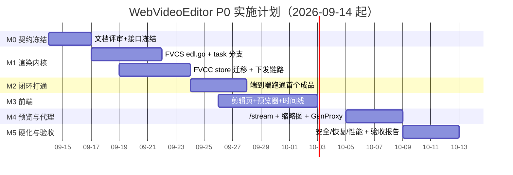
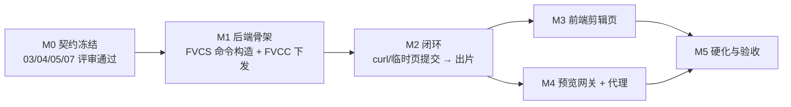

---
AIGC:
    Label: "1"
    ContentProducer: 001191440300708461136T1XGW3
    ProduceID: 839b5d1d4fff15220193598838e6072d_41c099e4acff11f188ac525400dcc5b3
    ReservedCode1: O/IagyXehtXa5cq4ULYGnu6b00pvG+ICoSi0/kp611Pyq8CVTHfwK4Vi/Um/gADv2oa5kT1el5hx55if5w91m/4keQkrXV1DkwYBXgBEefgrZ22WiChYnfU1j5fx9nwGbO2Hv5Hf15WnRYHyA3xq/zgx+utfKHV427zzRh6QtiMW8ajdiP3oudvMG/g=
    ContentPropagator: 001191440300708461136T1XGW3
    PropagateID: 839b5d1d4fff15220193598838e6072d_41c099e4acff11f188ac525400dcc5b3
    ReservedCode2: O/IagyXehtXa5cq4ULYGnu6b00pvG+ICoSi0/kp611Pyq8CVTHfwK4Vi/Um/gADv2oa5kT1el5hx55if5w91m/4keQkrXV1DkwYBXgBEefgrZ22WiChYnfU1j5fx9nwGbO2Hv5Hf15WnRYHyA3xq/zgx+utfKHV427zzRh6QtiMW8ajdiP3oudvMG/g=
---

# 08 · P0 实施计划与验收清单

> 实际进度以 `10-实施进度与下一步.md`（进度台账）为准；本文件只定义计划与验收口径。

> 归属：上位方案 §7（分阶段实施路线 · P0）
> 配套：01 §8（用户级验收口径）、05 §9（渲染测试用例）、06 §8（一致性清单）、07 §8（安全自测清单）

---

## 1. 目标与范围

### 1.1 P0 目标（唯一判据）

> **在 FNOS 局域网页面完成 3 段素材粗剪 → 提交渲染 → 局域网高算力 Windows 机执行 → 成品回写 NAS → 浏览器可播放。**

达成即 P0 完成；其余均不属于 P0 验收范围。

### 1.2 MVP 边界（可交付的最小集）

| 必做（MVP） | 可选（有余力再做，不做不阻塞） |
|---|---|
| 素材浏览 + 元数据 | 缩略图网格视图 |
| `/stream` 预览（Direct 路径） | 缩略图预生成队列 |
| 入/出点打点 + 单轨时间线 | 时间线缩放/滚轮交互 |
| 项目自动保存与恢复 | 项目列表页（P0 可用 `localStorage` 记忆最近项目） |
| RenderEDL 全链路（P-A/P-B 路径） | P-C 混源路径（**建议做**，风险项） |
| 任务进度 WS 实时展示 | 剩余时间预估 |
| 成品回看/下载 | 批量删除历史 |
| 幂等、冷却重试、重启恢复 | 节点自动选机（P0 手工指定即可） |
| GenProxy 代理链路 | 代理预生成（入库即生成） |

### 1.3 明确 descope（P0 不做，写入验收"不通过即不算缺陷"清单）

多轨、字幕、音频混流、变速、转场滤镜、帧级精确剪辑、多用户权限分级、公网访问、移动端适配、节点自动负载均衡。

---

## 2. 交付物清单

| # | 交付物 | 形态 | 位置 |
|---|---|---|---|
| D-01 | 文档包（本目录 9 份文档） | Markdown | `D:\Fnos.VideoConversion\WebVideoEditor_Design\` |
| D-02 | FVCS 渲染内核（EDL 构造器 + 任务分支） | Go 代码 | `FVCS/pkg/ffmpeg/edl.go`、`FVCS/pkg/task/task.go`、`FVCS/pkg/server/server.go` |
| D-03 | FVCS 安全与凭据模块 | Go 代码 | `FVCS/pkg/protocol/edl_validate.go`、`FVCS/pkg/smb/credentials.go`、`FVCS/pkg/server/local_admin.go` |
| D-04 | FVCC 调度与持久化 | Go 代码 | `FVCC/server/{handlers,scheduler,store,remote,ws,router,stream,edl_validate}.go` |
| D-05 | 前端剪辑页 | TS/CSS | `FVCC/ui-src/src/pages/editor/*`、`api.ts`、`types.ts`、`main.ts` |
| D-06 | 测试向量与用例 | JSON + Go test | `testdata/edl_vectors.json`、`*_test.go` |
| D-07 | 部署与运维说明 | Markdown | `WebVideoEditor_Design/09-附录-部署与迁移说明.md` |
| D-08 | 验收报告（含 E2E 执行记录） | Markdown | 项目根或 `docs/` |

---

## 3. 里程碑与依赖

**依赖关系**

**关键路径**：`M0 → M1(FVCS 构造器) → M2(闭环) → M3(前端) → M5`。M4 可与 M3 并行（不同人）。

---

## 4. 工作分解（WBS）

> 人日为估算值（1 人日 = 6 小时有效编码），总计 **50 人日**。

### 4.1 A 组：FVCS 渲染内核（12 人日）

| ID | 任务 | 交付 | 依赖 | 人日 | 完成判据 |
|---|---|---|---|---|---|
| A-01 | `ffmpeg/edl.go` 骨架：`RenderPlan`/`SegmentPlan`/`BuildRenderEDLCommands` | 代码 | M0 | 3 | 单测：3 段同源输入 → 生成 3+1 条命令数组，参数顺序符合 05 §4 |
| A-02 | 分段命令构造（含无音轨补静音、非 AAC 音频转码） | 代码 | A-01 | 1.5 | 单测覆盖 05 §4.2 两张表 |
| A-03 | 拼接构造（concat demuxer + filter_complex 两条路径，含 `'` 转义、>32 段批次） | 代码 | A-01 | 2 | 单测 + 手工跑 40 段拼接 |
| A-04 | 最终导出构造 + 归一化裁切（05 §4.6） | 代码 | A-03 | 2 | 输出时长误差 ≤ 0.5s（05 T1/T2） |
| A-05 | `resolveEncoder` 硬编协商与降级 + `Settings.progressWeights` | 代码 | A-01 | 1 | 无 NVENC 环境下降级 libx264 并上报说明 |
| A-06 | `task.go`：`CreateRenderTask`/`executeRenderEDL`/阶段进度/续跑/workDir 复用与清理 | 代码 | A-01 | 2 | 断点续跑单测；workDir 终态清理 |
| A-07 | `server.go`：`CreateRenderEDL`/`CreateGenProxy` 分支 + `Hello`/`Progress` 载荷扩展 | 代码 | A-06 | 1 | WS 手工调用可入队并收到分段进度 |
| A-08 | `pkg/ffmpeg/edl_test.go` 覆盖 05 §9 T1~T4、T7 | 测试 | A-04 | 1.5 | 用例全绿 |

### 4.2 B 组：FVCC 调度与持久化（13 人日）

| ID | 任务 | 交付 | 依赖 | 人日 | 完成判据 |
|---|---|---|---|---|---|
| B-01 | `store.go`：`tasks` 列迁移 + `projects`/`node_caps`/`node_health_samples`/`audit_log` 建表 | 代码 | M0 | 2 | 旧库升级成功、重启幂等、迁移失败拒绝启动 |
| B-02 | 项目 CRUD（`projects` 表 + rev 乐观锁） | 代码 | B-01 | 1.5 | 并发保存冲突返回 409（03 §4.3） |
| B-03 | `handlers.go`：`/api/edl/projects*`（列表/详情/保存/删除） | 代码 | B-02 | 2 | 与 03 §4 签名、示例一致 |
| B-04 | `handlers.go`：`renderProject`（幂等键、重名检测、`totalMs` 计算） | 代码 | B-02 | 2 | 两次相同提交返回同一 `taskId` |
| B-05 | `scheduler.go`：`handleRenderEDL`/`handleGenProxy` 分流 + 冷却到期扫描 + 优先级（代理低优） | 代码 | B-04、A-07 | 2.5 | 06 §4.3 退避序列 30/60/120/240/480s 验证通过 |
| B-06 | `remote.go`：`CreateRenderEDL`/`CreateGenProxy` 下发（仅 `credentialId`） | 代码 | A-07 | 1.5 | 抓包确认无密码字段 |
| B-07 | `ws.go`：`BroadcastTaskUpdateFull` + 500ms 聚合 + `node_status`/`proxy_ready` | 代码 | B-05 | 1 | 断线重连后 `GET /api/tasks?active=1` 补偿一致 |
| B-08 | 选机 `pickNode` + 健康分 + 熔断 + `Hello` 能力落库 | 代码 | B-01 | 2 | 0 节点在线返回 `E_NODE_OFFLINE`；忙节点排队 |
| B-09 | `router.go` 路由注册 + 权限中间件挂载 | 代码 | B-03 | 0.5 | 未授权调用 `/render` 返回 403 |

### 4.3 C 组：前端剪辑页（15 人日）

| ID | 任务 | 交付 | 依赖 | 人日 | 完成判据 |
|---|---|---|---|---|---|
| C-01 | `types.ts`/`api.ts` 扩展（EDL、Project、RenderTask、stream ticket） | 代码 | M0 | 1 | 类型与 03 §2 字段一一对应（含毫秒约定） |
| C-02 | 路由与页面骨架（`#/editor/:projectId`，三段布局 + 拖拽持久化） | 代码 | C-01 | 2 | 01 §4.1 布局；`wve.layout.v1` 持久化 |
| C-03 | `editorStore.ts`：EDL 状态机 + 撤销栈（≤50 步）+ 防抖自动保存（2s） | 代码 | C-01 | 3 | 撤销/重做覆盖增删片段/改点/排序；刷新恢复毫秒级一致 |
| C-04 | 素材面板（目录树 + 列表 + "需代理"角标） | 代码 | C-02 | 2 | US-01 验收口径 |
| C-05 | 预览器（`<video>` + Range 播放 + 逐帧 + 时间码显示） | 代码 | C-04 | 2.5 | 拖拽 seek ≤300ms 起播（局域网） |
| C-06 | 打点（`I`/`O`、微调、帧换算、片段条生成） | 代码 | C-05 | 2 | US-02；按键到 UI ≤100ms |
| C-07 | 时间线（片段条渲染、拖拽排序、删除、选中态、50 片段 ≥30fps） | 代码 | C-06 | 2.5 | 01 §7 时间线重绘指标 |
| C-08 | 渲染弹窗（profile 下拉 + 输出名 + 节点选择）+ 提交 | 代码 | C-07、B-04 | 1.5 | 3s 内提交成功并跳转任务中心 |
| C-09 | 任务中心分支（进度条 + `第 x/y 段 · stage` 文案 + 失败原因 + 成品回看/下载） | 代码 | C-08、B-07 | 1.5 | US-04；刷新后进度不丢 |
| C-10 | 快捷键注册表（01 §6 全表） | 代码 | C-07 | 1 | 表格逐条手工验证 |

### 4.4 D 组：安全与凭据（6 人日）

| ID | 任务 | 交付 | 依赖 | 人日 | 完成判据 |
|---|---|---|---|---|---|
| D-01 | `protocol/edl_validate.go`（FVCS 侧白名单全套） | 代码 | M0 | 1.5 | 07 §8 S1~S15 全绿 |
| D-02 | `FVCC/server/edl_validate.go`（同规则）+ `PathValidator` L1~L4 扩展 | 代码 | M0 | 1.5 | 两侧共用 `testdata/edl_vectors.json` 通过 |
| D-03 | `smb/credentials.go` + `local_admin.go`（DPAPI 档案、Scope 校验、本机接口） | 代码 | M0 | 2 | 落库为密文；`Resolve` 越 Scope 被拒 |
| D-04 | 安全头 + 限流 + 审计埋点；`remote.go` 停止下发凭据（M2 迁移） | 代码 | B-06 | 1 | 07 §4.4/§4.5/§7 生效 |

### 4.5 E 组：部署、联调与验收（4 人日）

| ID | 任务 | 交付 | 依赖 | 人日 | 完成判据 |
|---|---|---|---|---|---|
| E-01 | 打包与部署（FVCS 新版本安装、FNOS 侧 FVCC 升级、静态资源构建落盘） | 部署 | A~D | 1 | 干净环境按 09 文档一次部署成功 |
| E-02 | E2E 场景执行（§6 全部 8 条） | 记录 | E-01 | 1.5 | 全部 P0 场景通过 |
| E-03 | 稳定性与恢复演练（§7.3） | 记录 | E-01 | 1 | 重启/断网/卡死三类场景符合预期 |
| E-04 | 验收报告 + 回归清单执行（§9） | 报告 | E-02、E-03 | 0.5 | 报告含逐条结论与证据（截图/日志/命令） |

---

## 5. 验收矩阵（跨文档汇总）

| 来源 | 验收点 | 对应任务 | 验证方式 |
|---|---|---|---|
| 01 §8-1 | 同源 3 段导出可播、无花屏、时长 ±1s | A-04、C-08、E-02 | E2E-01 |
| 01 §8-2 | 刷新后片段顺序与入出点毫秒级一致 | C-03、B-02 | E2E-02 |
| 01 §8-3 | 杀 FVCS 重启：不丢任务、不重复渲染 | A-06、B-05、B-04 | E2E-05 |
| 01 §8-4 | HEVC 高码率生成代理后可流畅预览、打点仍在源时间轴 | A-07、B-05、M4 | E2E-04 |
| 01 §8-5 | 非法 EDL 被拒且不产生任务 | D-01、D-02 | E2E-08 |
| 03 §4 | 接口签名/示例/错误码一致 | B-03、B-04、C-01 | 接口自测 + 文档比对 |
| 04 §2 | `/stream` 206、票据、缩略图 | M4 任务 | E2E-03 |
| 05 §9 | T1~T9 渲染用例 | A-08、E-02 | 单测 + E2E-01 |
| 06 §8 | 一致性 7 项 | A-06、B-05、B-07 | E2E-05、E2E-06 |
| 07 §8 | S1~S15 安全用例 | D-01、D-02、D-03 | E2E-08 + 单测 |
| 01 §7 | 首屏/打点/重绘/进度延迟 | C-02、C-06、C-07、C-09 | §7.2 性能测量 |

---

## 6. P0 端到端验收场景

| ID | 场景 | 步骤 | 期望 |
|---|---|---|---|
| E2E-01 | 同源闭环出片 | 新建项目 → 添加 3 段同源 1080p30 素材（各 ≈2 分钟）→ 打点 → 选 `h264_nvenc_p5` → 渲染 | 任务出现在任务中心；进度含 `第 x/3 段`；成品落 `exports/`；下载后播放正常；时长误差 ≤1s |
| E2E-02 | 编辑持久化 | 打点后等 3s（防抖保存）→ 刷新浏览器 | 项目 id 从 URL 恢复；片段顺序、入出点完全一致（0ms 误差）；无"未保存"提示 |
| E2E-03 | 预览链路 | 直接预览 A 类素材；再预览 HEVC 高码率素材 | A 类：`206 Partial Content`、拖动 seek 可用；B 类：显示"需代理"角标且提示可生成代理 |
| E2E-04 | 代理工作流 | 对 HEVC 素材点"生成代理" → 等待完成 → 预览 | 任务低优先级（不抢占 RenderEDL）；代理落 `proxy/`；预览流畅；打点提交的 `in/out` 与源一致 |
| E2E-05 | 渲染机重启恢复 | 渲染进行中 kill FVCS 进程 → 重启服务 | NAS 侧任务不消失；≤30s 后状态回到 `QUEUE/RUNNING`；**不产生重复任务**；`attempt` 计数可见 |
| E2E-06 | 渲染机离线冷却 | 关闭渲染机（或断网）→ 提交渲染 | 任务进入冷却（`COOLDOWN`），退避 30s→60s→…；恢复连线后自动完成；失败原因文案准确 |
| E2E-07 | 幂等与重名 | 相同项目连续点两次"渲染导出"；再改输出名渲染一次 | 第二次点击提示"已存在相同内容的渲染任务"并返回同一 `taskId`；改输出名后生成新任务；同名不覆盖，自动 `_1` |
| E2E-08 | 非法载荷拦截 | 用 curl 提交：①`file` 含 `../`；②非法时间码；③未声明额外字段；④非法 `presetKey`；⑤规范化后逃逸根目录的路径（软链/绝对路径） | 分别返回 `E_EDL_INVALID`（①，字段白名单）/ `E_EDL_INVALID`（②）/ `E_PAYLOAD_INVALID`（③）/ `E_PROFILE_INVALID`（④）/ `E_ASSET_NOT_IN_ROOT`（⑤）；任务表无新增记录；日志无异常堆栈 |

---

## 7. 非功能与稳定性验收

### 7.1 兼容性（不得回归）

| 项 | 期望 |
|---|---|
| 存量 Transcode 任务 | 功能、界面、进度与改造前完全一致（回归 §9） |
| 旧版 FVCS 节点接入 | 仅 `Hello` 缺少新字段 → FVCC 视为"不支持 RenderEDL"，不允许选为 EDL 渲染目标（其他任务仍可用） |
| 旧版 FVCC 下发含凭据的任务 | FVCS 兼容接收并记 WARN 审计（07 §5.5 M1 阶段） |
| 旧任务表升级 | 迁移后历史任务可正常查看；`task_type` 默认 `TRANSCODE` |

### 7.2 性能（对齐 01 §7）

| 指标 | 目标 | 测量方式 |
|---|---|---|
| 剪辑页首屏可交互 | ≤ 2.5s | 局域网 + 静态缓存命中，DevTools 计时 |
| 打点响应 | ≤ 100ms | 手工计时（按下 `I` → 片段条更新） |
| 时间线重绘 | 50 片段拖拽 ≥30fps | Chrome Performance 录制 |
| 进度端到端延迟 | ≤ 1.5s | FVCS 日志时间戳 ↔ 浏览器 UI 时间戳 |
| 素材列表 | ≤200 文件 ≤5s（首次含 ffprobe，缓存命中 ≤500ms） | 手工/日志 |
| 同源 3 段导出（copy_all） | ≤ 15s | 05 §8 预估 |
| 同源 3 段导出（NVENC 转码） | ≤ 2 分钟 | 05 §8 预估 |

### 7.3 稳定性演练

| 场景 | 期望 |
|---|---|
| FVCS 进程被杀（渲染中/空闲） | 任务不丢；重启后按 06 §3.4 恢复（续跑或重跑） |
| FVCC 重启 | 队列从 SQLite 恢复；`COOLDOWN` 计时不失效 |
| SMB 共享临时不可用 | 任务进冷却；恢复后自动重试；中途不产生"半个成品"文件 |
| ffmpeg 卡死（构造挂起进程） | 5min 内判定 `E_TIMEOUT_STALL` 并回收进程树 |
| 磁盘写满 | 返回 `E_DISK_FULL` 并**不重试**；workDir 清理不阻断状态更新 |
| 浏览器断网重连 | 任务进度经 `GET /api/tasks?active=1` 补齐，无"卡在 42%"现象 |

---

## 8. 安全验收

直接执行 07 §8 的 S1~S15，另加：

| # | 用例 | 期望 |
|---|---|---|
| S16 | 检查 `tasks.payload_json`、`task_history`、日志文件 | 无 `password`/`secret`/明文 UNC 前缀 |
| S17 | 渲染节点 `credentials` 表直接读取 | `secret_cipher` 为密文；无明文列 |
| S18 | NAS 尝试下发含 password 字段的任务（模拟旧客户端） | FVCS 接收但记 WARN + 审计，密码**不落库**；节点内无明文残留文件 |
| S19 | 尝试从 NAS 侧调用节点本机凭据接口 | 连接被拒（仅 127.0.0.1） |
| S20 | 重复提交同一 EDL（10 次并发） | 只有 1 个任务被创建（锁 + 幂等） |

---

## 9. 回归测试清单（存量功能）

| # | 项 | 期望 |
|---|---|---|
| R-01 | 创建 Transcode 任务（本地上传模式） | 与改造前行为一致 |
| R-02 | 创建 Transcode 任务（SMB 模式，含凭据） | 兼容路径可用（M1 阶段），进度正常 |
| R-03 | 任务列表排序（上移/下移/置顶） | `OrderID` 行为不变 |
| R-04 | 服务器管理页（新增/编辑/删除节点、测试连接） | 功能不回归；新增字段不破坏旧配置 |
| R-05 | 任务历史（分页/详情/日志查看） | 旧记录可见；新字段可空 |
| R-06 | 素材扫描与浏览页 | `scanDirectory/probeVideo` 行为与缓存策略不变 |
| R-07 | WS 断线重连与鉴权失败提示 | 与改造前一致 |
| R-08 | FVCS 托盘/服务启动、配置读写、防休眠 | 与改造前一致 |

---

## 10. 风险与应对

| # | 风险 | 概率/影响 | 应对 | 触发信号 |
|---|---|---|---|---|
| RK-1 | concat demuxer `-c copy` 在部分源上失败（容器/时基不兼容） | 中/中 | 自动降级 P-C（05 §3.3）；单测覆盖 MKV/MOV 混源 | 拼接阶段退出码非 0 |
| RK-2 | fast seek 精度不足导致段边界跳变 | 高/低 | P-B/P-C 走 05 §4.6 归一化；P-A 在 UI 明确提示 | 成品时长累计偏差 > 1s |
| RK-3 | 前端时间线工程量超预期 | 高/高 | C 组任务拆分到人日粒度；先交付"列表式片段编辑"（可拖拽排序最简版）再升级视觉；**可放弃项**：时间线缩放、缩略图条 |
| RK-4 | 无 NVENC 环境导致演示耗时长 | 中/中 | 演示机准备 `copy_all` 快速路径；验收用 P-A 展示闭环，用 P-B 展示质量 | 导出耗时 > 5min |
| RK-5 | 浏览器对 HEVC 支持碎片化 | 中/中 | 代理链路 M4 提前到 M2 之后立刻做（不等到 M4 末期）；"需代理"角标先行 | 预览黑屏/无画面 |
| RK-6 | 凭据迁移影响既有部署 | 中/中 | 按 07 §5.5 分 M1~M4 步迁移，每步可独立上线；M1 保留旧支路 | 节点挂载失败率上升 |
| RK-7 | 任务重复下发（网络抖动导致重试） | 中/中 | 幂等键 + `AcquireCodeLock`（06 §4.4/§4.5） | 同一 `checksum` 出现两条 `QUEUE` |
| RK-8 | 中间产物占满节点本地盘 | 低/高 | 空间预检 + 降级 NAS workDir + 终态清理 + 孤儿目录 7 天清理 | 出现 `No space left` 或预检失败 |

---

## 11. 上线与回滚

### 11.1 上线顺序

1. 升级 FVCS（渲染节点）：新版本**向后兼容**（保留 Transcode、保留凭据接收支路）→ 灰度单节点验证 `CreateRenderEDL`。
2. 升级 FVCC（NAS）：先部署带 `edl_validate` 的版本（只读校验，不开放 UI 入口）→ 验证接口 → 打开剪辑页路由。
3. 前端静态资源随 FVCC 包一起发布（构建产物落 `FVCC/app/ui`）。
4. 全节点升级完成后执行 07 §5.5 的 M3（主密钥迁移）与 M4（清明文列，P1）。

### 11.2 回滚

| 层级 | 回滚动作 | 数据影响 |
|---|---|---|
| 前端 | 回滚静态资源到上一版本；剪辑页路由隐藏 | 无（EDL 数据保留在 `projects` 表） |
| FVCC | 回滚二进制；`tasks` 新增列保留（旧版本忽略未知列） | 无；新增表不影响旧逻辑 |
| FVCS | 回滚二进制；`credentials` 表保留 | 已用 `credentialId` 的任务需回滚到旧凭据下发（保持 M1 兼容期内可行） |
| 数据 | **禁止**回滚时删表；如需清理请单独评审 | — |

**回滚前置条件**：M1~M2 阶段必须保持"字段可空 + 支路可回退"，一旦执行 M4（删列）即失去回滚能力，因此 M4 排在 P1。

---

## 12. 工作量汇总与人力建议

| 组 | 人日 | 建议人力 |
|---|---|---|
| A FVCS 渲染内核 | 12 | 1 名 Go 后端（熟悉 ffmpeg） |
| B FVCC 调度与持久化 | 13 | 1 名 Go 后端 |
| C 前端剪辑页 | 15 | 1 名前端（TS/Vite，可 1.5 人加速） |
| D 安全与凭据 | 6 | 由 A/B 组后端兼职（D-01/D-02 需独立评审人） |
| E 部署/联调/验收 | 4 | 1 人（可与前端兼） |
| **合计** | **50** | 2.5~3 人 × 5 周（含缓冲） |

> 缓冲建议：在 M3/M5 各留 1.5 人日；RK-3 若触发，优先砍"时间线视觉细化"而非"打点正确性"。

---

## 13. 源码改动点总表（跨文档索引）

| 文件 | 类型 | 涉及文档 |
|---|---|---|
| `FVCS/pkg/ffmpeg/edl.go` | 新增（含 `BuildRenderEDLCommands`/`BuildProxyCommand`/`resolveEncoder`） | 05 |
| `FVCS/pkg/ffmpeg/edl_test.go` | 新增（05 §9 T1~T4/T7 用例） | 05 |
| `FVCS/pkg/ffmpeg/ffmpeg.go` | 少量修改（导出 `HardwareCaps`） | 05 |
| `FVCS/pkg/task/task.go` | 修改（Task 字段 + `executeRenderEDL` + 阶段进度 + 恢复） | 05、06 |
| `FVCS/pkg/server/server.go` | 修改（命令分支、`handleCreateRenderEDL`、`Hello`/`Progress` 载荷） | 05、06 |
| `FVCS/pkg/protocol/protocol.go` | 修改（命令常量、`ValidateRenderEDLPayload`） | 03、07 |
| `FVCS/pkg/protocol/edl_validate.go` + `_test.go` | 新增 | 07 |
| `FVCS/pkg/smb/smb.go` | 修改（`MountSMBShare` 接 `*Credential`） | 07 |
| `FVCS/pkg/smb/credentials.go` | 新增 | 07 |
| `FVCS/pkg/server/local_admin.go` | 新增 | 07 |
| `FVCS/pkg/server/security.go` | 修改（安全头、限流） | 07 |
| `FVCS/pkg/config/config.go` | 修改（主密钥 DPAPI 化、listen 配置） | 07 |
| `FVCC/server/store.go` | 修改（列迁移、新表、幂等查询、审计、`asset_proxies`） | 04、06、07 |
| `FVCC/server/scheduler.go` | 修改（分流、冷却扫描、选机、熔断、代理低优先级通道） | 04、06 |
| `FVCC/server/remote.go` | 修改（新任务下发、去凭据） | 06、07 |
| `FVCC/server/handlers.go` | 修改（项目 CRUD、渲染提交、节点接口、审计、`handleProxyRequest`） | 03、04、06 |
| `FVCC/server/router.go` | 修改（路由与权限） | 03、04、06 |
| `FVCC/server/models.go` | 修改（新模型） | 03 |
| `FVCC/server/ws.go` | 修改（聚合广播、新事件、`proxy_ready`） | 04、06 |
| `FVCC/server/edl_validate.go` | 新增 | 07 |
| `FVCC/server/security.go` | 修改（`PathValidator` L1~L4、`ResolveRoot`） | 04、07 |
| `FVCC/server/stream.go` | 新增（`/stream`、票据、缩略图） | 04 |
| `FVCC/ui-src/src/pages/editor/*` | 新增 | 01、02 |
| `FVCC/ui-src/src/{types,api,store,main,ui}.ts` | 修改 | 01、02、03 |
| `testdata/edl_vectors.json` | 新增 | 07、08 |
*（内容由AI生成，仅供参考）*
