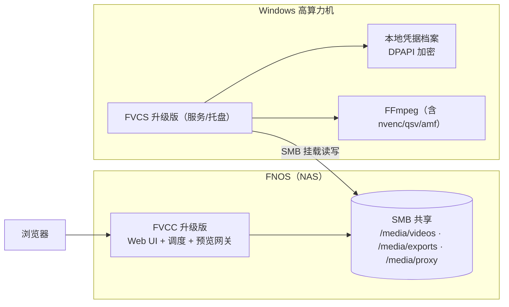

---
AIGC:
    Label: "1"
    ContentProducer: 001191440300708461136T1XGW3
    ProduceID: 839b5d1d4fff15220193598838e6072d_44adb4d6acff11f1af37525400826444
    ReservedCode1: xYrsMcimNJppWXRSH/+QsG9ymQ9FCHXLdZnXHVzLe9zqzoNr1I9oc35HqV5Y//Bj1mf6gVGNXw616bPW0WxrtcHUXuerDuMevumo7ClBlZ7mq2CRYQaAoFtBFhpOryfincXCsOQgvFOrHTfetjzSl+UBB9vWldg/SjUkaCOdg0E26DlrSyseQX7XY+Q=
    ContentPropagator: 001191440300708461136T1XGW3
    PropagateID: 839b5d1d4fff15220193598838e6072d_44adb4d6acff11f1af37525400826444
    ReservedCode2: xYrsMcimNJppWXRSH/+QsG9ymQ9FCHXLdZnXHVzLe9zqzoNr1I9oc35HqV5Y//Bj1mf6gVGNXw616bPW0WxrtcHUXuerDuMevumo7ClBlZ7mq2CRYQaAoFtBFhpOryfincXCsOQgvFOrHTfetjzSl+UBB9vWldg/SjUkaCOdg0E26DlrSyseQX7XY+Q=
---

# 09 · 附录：部署与迁移说明

> 性质：P0 落地配套手册（部署、配置、数据迁移、回滚、巡检）
> 关联：08 §11（上线与回滚）、07 §5.5（凭据迁移 M1~M4）、04 §2（/stream 网关）

---

## 1. 部署拓扑与前置条件



| 组件 | 前置条件 |
|---|---|
| NAS | FNOS 已启用 SMB 共享；有可写共享目录；可用管理员账号创建服务账号 |
| 渲染节点 | Windows 10/11 或 Server 2019+；FVCS 已安装并可启动；FFmpeg 已安装且 `ffmpeg -encoders` 能列出目标硬编；显卡驱动为支持 NVENC/QSV/AMF 的版本 |
| 网络 | NAS 与节点互通（SMB 445/TCP 可达）；节点可访问 NAS Web 端口；NAS 侧页面默认仅监听局域网 |
| 浏览器 | Chrome/Edge 最新版（`<video>` + Range 播放） |

---

## 2. 共享目录结构（约定）

```text
/media/                          ← SMB 共享根（UNC: \\NAS\media）
├── videos/                      ← sourceRoot（素材库，只读优先）
│   └── <项目子目录>/*.mp4
├── exports/                     ← destRoot（成品输出）
├── proxy/                       ← proxyRoot（代理文件，与源同名 + _proxy.mp4）
└── _wve_cache/                  ← 中间产物（仅 NAS workDir 降级模式使用）
    └── render/<taskId>/
```

| 规则 | 说明 |
|---|---|
| 三根均由 FVCC/FVCS 配置指定 | 禁止通过请求参数传根（07 §3.2） |
| 权限 | `videos` 可只读；`exports`/`proxy`/`_wve_cache` 需读写 |
| 命名 | 代理 `a_01.mp4` → `a_01_proxy.mp4`（同目录，便于映射） |
| 清理 | `_wve_cache/render/<taskId>` 终态即删；孤儿目录保留 7 天后清理（05 §4.5、06 §3.4） |

---

## 3. FVCS（渲染节点）安装与初始化

### 3.1 安装步骤

```powershell
# 1) 安装/升级 FVCS（沿用既有安装包与 fnpack 流程，版本号递增）
# 2) 校验 ffmpeg 与编码器
ffmpeg -hide_banner -encoders | Select-String "nvenc|qsv|amf|libx264|libx265"

# 3) 校验 SMB 可达性（使用凭据档案中的账号）
Test-NetConnection -ComputerName NAS -Port 445
```

### 3.2 配置项（`config.json`，新增项加粗说明）

| 键 | 默认 | 说明 |
|---|---|---|
| `listenPort` | `17890` | WS 控制面端口（沿用既有） |
| `authKey` | — | 节点鉴权密钥（沿用既有，建议按 R1 迁移为系统凭据源） |
| `ffmpegPath` | `C:/ffmpeg/bin/ffmpeg.exe` | 启动时校验存在且位于允许目录（07 §6） |
| `maxConcurrent` | `2` | 并发任务上限（EDL 与代理共用） |
| `workdirMode` | `auto` | `auto`（优先本地，空间不足降级 NAS）/ `local` / `nas` |
| `shareBase` | `\\NAS\media` | 默认共享根（凭据档案默认值） |
| `defaultCredentialId` | `nas-media-default` | 未指定时使用的凭据档案 |
| `progressWeights` | 见 05 §6.1 | 阶段权重覆盖（可选） |

### 3.3 凭据初始化（本机操作，仅 127.0.0.1）

```powershell
# 通过托盘「NAS 凭据」界面，或本机管理接口录入
curl.exe -X POST http://127.0.0.1:17890/local/credentials `
  -H "Content-Type: application/json" `
  -d '{\"credentialId\":\"nas-media-default\",\"shareBase\":\"\\\\\\\\NAS\\\\media\",\"username\":\"svc_video\",\"domain\":\"NAS\",\"password\":\"<用户输入>\",\"scope\":[\"\\\\\\\\NAS\\\\media\\\\videos\",\"\\\\\\\\NAS\\\\media\\\\exports\",\"\\\\\\\\NAS\\\\media\\\\proxy\"]}'

# 校验：列表只返回元数据（无明文）
curl.exe http://127.0.0.1:17890/local/credentials
```

> 凭据录入**必须由用户在本机完成**；任何来自 NAS 的凭据写入请求一律拒绝（07 §5.3、§5.6）。

### 3.4 节点自检清单

| 检查 | 命令/方式 | 期望 |
|---|---|---|
| 服务在线 | 查看托盘状态 / WS 连接 | 已连接 NAS，`Hello` 已被 FVCC 记录 |
| 编码器上报 | `node_caps.encoders_json` | 含目标硬编（如 `h264_nvenc`） |
| 挂载能力 | 托盘"测试挂载" | 成功挂载 `shareBase` |
| 目录可写 | 尝试在 `exports` 建临时文件 | 成功后可删除 |
| 磁盘空间 | 本地临时盘剩余 ≥ 20 GB | 否则自动走 NAS workDir |

---

## 4. FVCC（NAS 侧）部署

### 4.1 构建与落盘

```bash
# 1) 前端构建（产物落 FVCC/app/ui）
cd FVCC/ui-src && npm ci && npm run build

# 2) 后端构建
cd FVCC && go build -o fvcc ./cmd/main

# 3) fnOS 打包（沿用既有 fnpack 流程）
./fnpack-1.2.1.exe build
```

### 4.2 配置项

| 键 | 默认 | 说明 |
|---|---|---|
| `listenAddr` | `127.0.0.1` | 建议改为局域网网卡 IP；禁止 `0.0.0.0` + 公网映射（07 §4.4） |
| `httpPort` | 沿用现有 | Web 与 REST 端口 |
| `sourceRoot` | `/media/videos` | 素材根（相对共享根） |
| `destRoot` | `/media/exports` | 成品根 |
| `proxyRoot` | `/media/proxy` | 代理根 |
| `maxClips` | `200` | 项目片段上限（01 §7） |
| `maxTotalMs` | `21600000` | 6 小时总时长上限（07 §3.3） |
| `MaxRetry` | `5` | 冷却重试上限（06 §4.3） |
| `ticketTtlSec` | `300` | 预览票据有效期（04 §2.3） |
| `streamRateLimit` | `60/min/IP` | 票据申请限流（07 §4.5） |

### 4.3 部署校验

```bash
# 接口存活
curl -H "X-Auth-Key: <key>" http://<nas>:<port>/app/fvcc/api/edl/projects

# 预览网关（需先申请票据）
curl -I "http://<nas>:<port>/app/fvcc/api/stream?path=videos/demo/a_01.mp4&ticket=<t>" -H "Range: bytes=0-1023"
# 期望：206 Partial Content + Content-Range
```

| 检查 | 期望 |
|---|---|
| 数据库迁移 | 启动日志出现 `migrate tasks: +12 columns`；重复启动不再执行 |
| 剪辑页路由 | 浏览器打开 `#/editor/<projectId>` 正常渲染（静态资源 200） |
| 权限 | 无 `X-Auth-Key` 调用 `/render` → 401/403 |
| 节点列表 | 已升级节点显示"支持 RenderEDL"；未升级节点标注"不支持" |

---

## 5. 版本兼容与升级顺序

| 组件 | 版本要求 | 兼容策略 |
|---|---|---|
| FVCS | ≥ 引入 `CreateRenderEDL` 的版本 | 先升级（向后兼容：旧 FVCC 仍可下发 Transcode） |
| FVCC | ≥ 引入 `/api/edl` 的版本 | 后升级 |
| 前端静态资源 | 随 FVCC 包发布 | 与 FVCC 版本一致，避免接口错配 |

**升级顺序**：渲染节点（全部）→ NAS FVCC → 打开剪辑页入口。

| 混搭场景 | 行为 |
|---|---|
| 新 FVCC + 旧 FVCS | 该节点不可被选为 EDL 渲染目标（06 §5.3 版本门禁）；其 Transcode 能力正常 |
| 旧 FVCC + 新 FVCS | 全部功能与升级前一致；新能力静默闲置 |
| 新 FVCC + 新 FVCS（M1 阶段） | 凭据字段仍可下发（记 WARN 审计） |

---

## 6. 数据迁移手册（凭据相关，对齐 07 §5.5）


| 步骤 | 执行方 | 命令/操作 | 校验 |
|---|---|---|---|
| M1 | 节点 | 录入凭据档案（§3.3） | `GET /local/credentials` 返回元数据；`secret_cipher` 非空 |
| M1 校验 | NAS | 提交一次 RenderEDL | 成功且任务表无 `password` 字段 |
| M2 | NAS | 升级 FVCC（不再下发 `SMBUser/SMBPassword`） | 抓包无密码字段；旧节点 Transcode 仍可用（凭据档案已就绪） |
| M2 清理 | NAS | 清理历史表明文列 | 见下方 SQL |
| M3 | 节点 | `fvcs-cli reencrypt --old-key <hex>` | 迁移后重启服务，凭据解密成功；工具报告 0 失败 |
| M4 | 节点+NAS | 删除明文列与接收支路（P1） | `PRAGMA table_info` 无凭据列；版本门禁生效 |

**M2 清理 SQL（FVCC）**

```sql
-- 1) 确认待清理数据量
SELECT COUNT(*) FROM tasks WHERE payload_json LIKE '%"password"%';

-- 2) 清除载荷中的凭据字段（JSON 重建，非字符串替换）
UPDATE tasks
   SET payload_json = json_remove(payload_json, '$.smbPassword', '$.smbUser')
 WHERE payload_json LIKE '%"smbPassword"%';

-- 3) 历史表同上（表名按实际库调整）
UPDATE task_history
   SET payload_json = json_remove(payload_json, '$.smbPassword', '$.smbUser')
 WHERE payload_json LIKE '%"smbPassword"%';

-- 4) 复核：应为 0
SELECT COUNT(*) FROM tasks WHERE payload_json LIKE '%"smbPassword"%';
```

> 执行前**必须备份数据库**（`cp fvcc.db fvcc.db.bak_<yyyymmdd>`）；`UPDATE` 属 🟡 中风险操作，须在维护窗口执行并逐条确认影响行数。

---

## 7. 回滚手册

| 步骤 | 动作 | 说明 |
|---|---|---|
| 1 | 回滚 FVCC 二进制与前端静态资源到上一版本 | `tasks` 新增列被旧版本忽略；新增表不做删除 |
| 2 | 回滚 FVCS 二进制（如需要） | `credentials` 表保留；若已执行 M4 则无法回滚到"明文下发"模式（因此 M4 排在 P1） |
| 3 | 验证存量子任务 | 执行 08 §9 回归清单 R-01~R-08 |
| 4 | 禁止动作 | **不得**删除 `projects`/`credentials`/新增列（数据丢失不可逆） |

**回滚判据**：出现以下任一情况触发回滚评估——存量 Transcode 成功率下降 >10%、渲染节点挂载失败率上升、数据库迁移报错且无法修复。

---

## 8. 常见问题排查

| 现象 | 可能原因 | 排查/处理 |
|---|---|---|
| 节点显示离线 | 防火墙拦截 17890；FVCS 未启动 | `Test-NetConnection -Port 17890`；查节点日志 |
| 挂载失败 `E_SMB_MOUNT_FAILED` | 凭据错误/账号被锁/共享权限不足 | 本机 `net use \\NAS\media /user:NAS\svc_video` 手工验证；更新凭据档案 |
| `E_CREDENTIAL_SCOPE_DENIED` | 目标 UNC 不在凭据 `scope` 内 | 扩展 scope 或调整 `destRoot` 配置 |
| 硬编不可用（自动降级） | 驱动过旧/ffmpeg 未编译 nvenc | 升级驱动；确认 `ffmpeg -encoders` 列出 `h264_nvenc` |
| 无画面/黑屏预览 | 浏览器不支持该编码（HEVC/ProRes） | 生成代理后预览（04 §3.3） |
| 播放卡顿/无 Range | 反代未透传 `Range` 头 | 检查反向代理配置；`/stream` 需支持 206 |
| `E_DISK_FULL` | 节点本地盘或 NAS 共享满 | 清理 `%TEMP%\fvcs_render` 与 `_wve_cache`；释放空间后重跑 |
| 任务卡在 `COOLDOWN` | 节点持续离线 | 恢复节点；冷却到期自动重试（06 §4.3） |
| 任务一直 `QUEUE` | 并发已满/无可用节点 | 查看节点 `freeSlots`；提高 `maxConcurrent` 或增加节点 |
| 成品时长偏短/偏长 | a) 段边界关键帧前移 b) `-t` 上限截断 | 检查 05 §4.6 归一化是否生效；核对 `totalMs` |
| 项目保存冲突 409 | 多标签页同时编辑 | 前端提示重新加载（03 §4.3） |

---

## 9. 运维巡检项（建议每日/每周）

| 周期 | 项 | 判据 |
|---|---|---|
| 每日 | 任务成功率 | ≥ 95%（近 24h） |
| 每日 | 节点在线率 | 100%（预期值守场景） |
| 每日 | 磁盘空间 | 本地临时盘 ≥ 20 GB；NAS 共享 ≥ 50 GB |
| 每周 | 失败任务复盘 | 查看 `task_history` 失败原因分布，处理 Top 原因 |
| 每周 | 孤儿目录清理 | `_wve_cache/render` 与 `%TEMP%\fvcs_render` 无超 7 天目录 |
| 每周 | 审计日志抽查 | 越权类错误码（`E_ASSET_NOT_IN_ROOT` 等）为 0 或已处置 |
| 每月 | 凭据轮换评估 | 按安全策略轮换 NAS 服务账号密码并更新档案 |

---

## 10. 备份与恢复

| 数据 | 位置 | 备份策略 | 恢复 |
|---|---|---|---|
| `projects`（EDL 工程） | FVCC SQLite | 每日自动备份（保留 14 天）+ 变更前手工备份 | 停止 FVCC → 替换 DB 文件 → 启动 |
| `tasks`/`task_history` | 同上 | 同上 | 同上（不影响成品文件） |
| `credentials` | FVCS 本地 SQLite | 加密导出（DPAPI 绑定机器，跨机不可直接复用） | 在目标机重新录入凭据（**推荐**） |
| 成品文件 | NAS `exports/` | 由用户/存储快照负责 | — |

> 凭据备份**不做跨机还原**：DPAPI 密文绑定机器/用户，跨机还原必然失败；统一以"目标机重新录入"为恢复路径。
*（内容由AI生成，仅供参考）*
