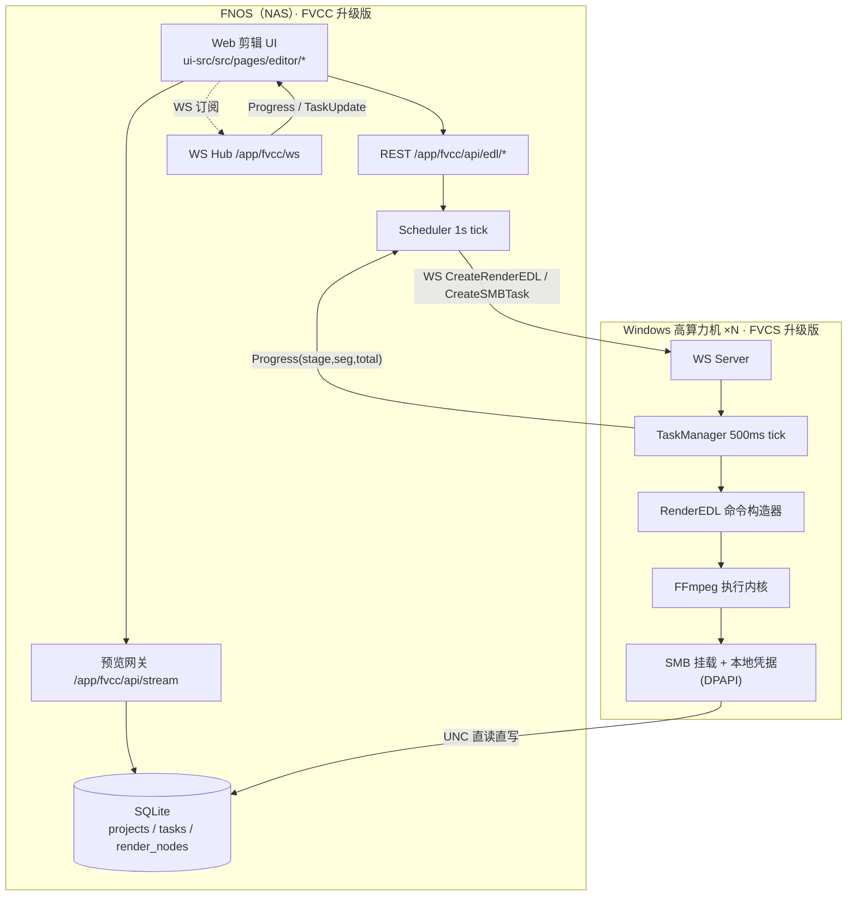

# WebVideoEditor 细化设计文档包 · 索引

> 上位文档：`D:\Fnos.VideoConversion\WebVideoEditor_整体架构设计方案.md`（下称"上位方案"）
> 源码基线：`D:\Fnos.VideoConversion` 工作区快照（2026-09-10），FVCC（NAS 调度端）+ FVCS（Windows 渲染端）
> 本文档包性质：**上位方案的落地细化**，不改变上位方案的分阶段边界与总体决策；凡细化过程中对上位方案做工程化取舍的，均在本文档包内以"决策对齐"小节显式记录。

---

## 1. 文档清单与阅读路径

| # | 文档 | 解决什么问题 | 主要读者 | 核心交付物 |
|---|---|---|---|---|
| 00 | 本文件（README） | 如何读、如何维护、与上位方案如何对齐 | 全体 | 索引 + 术语表 + 决策台账 |
| 01 | 产品需求与交互规格 | P0 到底做什么、界面长什么样、如何验收 | 产品/前端/测试 | 用户故事、交互规格、状态机、快捷键、验收口径 |
| 02 | 前端架构与时间线编辑器设计 | UI 代码怎么组织、时间线怎么渲染与打点 | 前端 | 目录结构、Store 契约、组件树、性能预算 |
| 03 | EDL 数据模型与接口契约 | 数据结构长什么样、前后端如何交互 | 前端 + 调度端 | TS 类型 + Go 结构体 + REST/WS 签名 + 样例 |
| 04 | 预览网关与代理工作流设计 | 素材如何在浏览器里播、代理如何生成与对齐 | 调度端 + 渲染端 | `/stream` 规格、GenProxy 流程、时间轴映射 |
| 05 | RenderEDL 渲染引擎与 FFmpeg 命令构造器设计 | 剪辑结果如何变成 ffmpeg 命令、如何保证不花屏 | 渲染端 | 命令构造算法、分段/拼接策略、错误码 |
| 06 | 调度持久化与渲染节点管理设计 | 任务怎么排队、重启怎么恢复、多机怎么选 | 调度端 + 渲染端 | 表结构、状态机、选机算法、恢复流程 |
| 07 | 安全校验与凭据管理细则 | 注入面怎么封死、凭据怎么存 | 调度端 + 渲染端 | 结构化白名单、路径校验、DPAPI 方案 |
| 08 | P0 实施计划与验收清单 | 谁在什么时候做什么、怎么算做完 | 全体 | 里程碑、任务表、验收清单、风险预案 |
| 09 | 附录：部署与迁移说明 | 怎么装、怎么配、怎么迁、怎么回滚 | 部署/运维 | 部署步骤、配置项表、迁移 SQL、回滚与巡检手册 |

**推荐阅读顺序**

- 首次通读：00 → 01 → 03 → 05 → 04 → 06 → 02 → 07 → 08。
  理由：先锁定"做什么（01）"与"数据与命令契约（03/05）"，再看预览与调度实现（04/06），最后落到前端实现（02）与安全加固（07）。
- 按角色择读：
  - 前端：01 → 02 → 03（4 章接口） → 04（2 章代理与打点对齐）
  - FVCC 调度端：03 → 06 → 04（3 章网关） → 07 → 08
  - FVCS 渲染端：03（3 章） → 05 → 06（4 章） → 07
  - 测试：01（5 章） → 08（3 章） → 07（4 章校验用例）
  - 部署/运维：09 → 08（§11 上线与回滚） → 07（§5.5 凭据迁移）
- 附录（09）性质：落地操作手册，**不引入新的设计决策**；若与 01~08 表述冲突，以 01~08 为准并回写 09。

---

## 2. 与上位方案的映射关系

本文档包是上位方案第 3 章"复用/新增映射"、第 4 章"核心组件设计"、第 6 章"安全设计"、第 7 章"实施路线"的落地展开，对应关系如下：

| 上位方案章节 | 展开为本文档 | 细化程度 |
|---|---|---|
| 3.1 直接复用清单 | 05 §2、06 §4、04 §2 | 精确到函数名与调用位置 |
| 3.2 需新增模块 | 01、02、03、04 §3、05 §3 | 给出类型定义、接口签名、文件落点 |
| 4.1 Web 剪辑 UI | 01 §3、02 | 页面/组件/Store/交互逐条规格化 |
| 4.2 预览链路 | 04 | 网关参数、缓存、代理任务、映射表齐全 |
| 4.3 EDL 数据结构与协议 | 03 | 字段级定义 + 校验规则 + 传递链 |
| 5 任务生命周期与数据流 | 06 §3、06 §4 | 状态机 + 持久化表 + 恢复流程 |
| 6 安全设计 | 07 | 白名单正则、路径校验、DPAPI 落地方案 |
| 7 P0 实施路线 | 08 | 里程碑、任务分解、验收用例 |

### 2.1 决策对齐说明（细化过程中做过的工程化收敛）

以下 6 条是本文档包相对上位方案的**细化取舍**，均为"同一目标下的实现选择"，不改变上位方案的目标与边界：

| # | 上位方案表述 | 本文档包细化结论 | 理由 |
|---|---|---|---|
| A1 | 前端"推荐 Vue3/React"（4.1） | P0 **不引入框架**，沿用 `FVCC/ui-src` 既有 Vite + TypeScript + Tailwind 自研轻量模式；Vue3 迁移留待 P2 | 现有 `ui-src/src` 为无框架 TS 工程（`store.ts`/`ui.ts`/`pages/*.ts`），引入框架会形成双栈维护并重写全部既有页面，P0 成本不可接受 |
| A2 | 接口写作 `/api/edl`、`/api/stream`（4.2、7） | 实际挂载前缀为 **`/app/fvcc/api/...`**，WS 为 `/app/fvcc/ws` | 与 `FVCC/server/router.go` 的 `gwPrefix` 分组一致；上位方案的 `/api/...` 视为前缀简写 |
| A3 | EDL 示例中 `in/out` 用秒（浮点，如 `82.4`）（4.3.1） | UI 内存态统一用**毫秒整数**；线协议统一用 `HH:MM:SS.mmm` 字符串 | 浮点秒在长时长时间线累加会产生偏差；毫秒整数可精确表示帧时间，字符串可读且便于正则白名单校验 |
| A4 | "同源快速路径"未说明失败判定（4.3.3） | 新增**源参数一致性指纹**（编码/宽高/帧率/时基/pix_fmt/音频编码/采样率/声道）与不满足时的降级判定表 | 上位方案 D4 只说"不一致时自动降级"，本文补可判定的字段集合，避免花屏 |
| A5 | FVCS 新增 `RenderEDL` TaskType（7 P0） | FVCS 侧**不新增 TaskStatus**，改为新增 `Stage` 字段；（TaskType 仅新增于 FVCC 任务模型） | 状态枚举同时被 FVCS、FVCC `TaskStatus` 与前端 `STATUS_LABEL/STATUS_CLASS` 三处消费，新增状态将连锁改动 4 个文件；`Stage` 变更面最小 |
| A6 | 凭据"SMB 凭据渲染机侧 DPAPI 加密"（6） | 明确为：**FVCC 不再持有 SMB 明文**，请求中原 `SMBUser/SMBPassword` 字段置空并标记 `deprecated`，改由 FVCS 本地凭据档案提供 | 渲染节点才是挂载方，凭据留在挂载侧既消除 NAS 侧明文落库（R3），又减少凭据经网络传输的暴露面 |

> ⚠️ 冲突处理约定：若后续对本文档包某条细化结论做出修改，须同步检查上位方案对应章节是否需要回写；**以本文档包为最新实现依据**，上位方案保持"目标与边界"层面有效。

---

## 3. 架构总览（细化版）

---

## 4. 术语表

| 术语 | 含义 | 首次定义位置 |
|---|---|---|
| Asset | NAS 素材库中的一个源视频文件，前端以 `assetId` 引用 | 01 §3.2 |
| Clip | 时间线上的一个片段：一个 Asset 的一段时间区间 | 01 §3.3 |
| EDL | Edit Decision List，剪辑决策表；本项目为 JSON 形态 | 03 §2 |
| RenderEDL | 渲染任务类型：按 EDL 截取 + 拼接 + 转码 | 03 §3.2 |
| GenProxy | 代理生成任务类型：生成低码率 H.264 预览副本 | 04 §3 |
| sourceRoot / destRoot | NAS 共享根下的素材根与成品根（相对路径基准） | 03 §2.3 |
| 快速路径 / 通用路径 | 同源 `-c copy` 拼接 / 混源重编码拼接 | 05 §3 |
| 源参数指纹 | 用于判定素材间能否无损拼接的字段集合 | 05 §3.2 |
| Stage | 渲染任务内部阶段（准备/分段/拼接/封装） | 06 §3.3 |
| 代理映射 | 源素材与代理文件的对应关系（同起点、同时长、同帧率） | 04 §4.3 |
| 节点健康分 | 用于多机选机的综合评分 | 06 §5.3 |

---

## 5. 全局约定（全文档包通用，避免逐篇重复）

1. **时间**：UI 内存态 ms 整数；REST/WS 传输 `HH:MM:SS.mmm`；ffmpeg 命令 `HH:MM:SS.mmm`。换算见 03 §2.4。
2. **路径**：前端与协议内一律使用 **POSIX 风格相对路径**（`/` 分隔，相对 `sourceRoot`）；只有 FVCS 侧在调用 ffmpeg 前才通过 `smb.BuildSMBPath` 转为 UNC 绝对路径。
3. **接口前缀**：REST `/app/fvcc/api`，WS `ws://<host>/app/fvcc/ws`。
4. **任务 ID**：FVCC 侧 `t_<orderId>_<random6>`；渲染节点侧仍由 `FVCS/pkg/server/server.go:generateTaskID()` 生成 `task_<unixnano>`，两者通过 `remoteTaskId` 关联。
5. **错误码**：统一 `{ok:false, code:"E_XXX", msg:"...", detail:{...}}`，错误码表见 03 §5.4 与 05 §6。
6. **阶段边界**：本包只覆盖上位方案 P0 与 P1 的必要设计；P2/P3 特性仅在与 P0 数据结构预留相关处提及，并明确标注"P0 不实现"。

---

## 6. 维护约定

- 每份文档第 1 节固定为"范围与非目标"，第 2 节固定为"与源码/上位方案的对应关系"，便于交叉校验。
- 文中引用源码一律采用 `相对路径:行号（函数名）` 形式；行号基于 2026-09-10 快照，若源码变动需在文档头部追加"快照漂移说明"。
- 对 P0 之外的设计，一律以 `[P1+]` 前缀标注，禁止混入 P0 任务分解。

---

*本文档包为工程落地设计，所有结论以 `D:\Fnos.VideoConversion` 现有源码与上位方案为依据；未在源码中验证的推断均已显式标注。*

