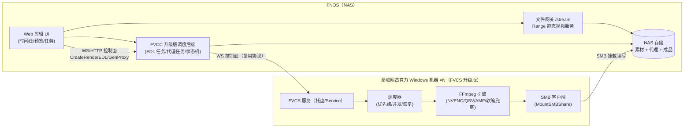

# 基于 Fnos.VideoConversion 架构的 Web 剪辑软件设计方案

> **文档快照漂移说明（P3-2）**：本文档为设计规格快照，描述的目标架构（含事件契约、模块边界）以 `FVCC/server` 与 `FVCS` 源码实际实现为准；"规格已声明但源码未消费"的接口/事件视为未落地，详见《项目分析与改进方向.md》的落实记录。

> 方案性质：整体架构设计（P0-P3 演进基线）
> 关联源码：`D:\Fnos.VideoConversion`（FVCS 服务端 / FVCC 客户端）
> 场景定界：FNOS（NAS）提供局域网 Web 剪辑 UI，视频素材存放于 NAS；
> 渲染任务下发至局域网内其他高算力 Windows 机器（复用 FVCS），成品回写 NAS。

---

## 1. 背景与目标

### 1.1 目标

在既有 Fnos.VideoConversion 双端架构（NAS 侧 FVCC 调度前端 + Windows 侧 FVCS 渲染服务）基础上，将其从"批量转码任务系统"升级为"**Web 粗剪软件**"：

- 用户在 FNOS 打开局域网 Web 页面，完成视频素材浏览、预览、入出点打点、多片段拼接等**简单/粗略剪辑**；
- 渲染（截取、拼接、转码、代理生成）全部交由**局域网高算力机器**执行，NAS 只承担 Web UI、调度与文件静态服务；
- 素材不离开 NAS：高算力机器通过 SMB 直挂 NAS 共享目录读写素材与成品，免分片上传/下载链路。

### 1.2 非目标（P0 阶段）

- 不做帧级精确剪辑（以关键帧对齐的粗略剪辑为准）；
- 不做多轨/字幕/音频混流（P3 后再评估）；
- 不做跨局域网/公网场景（默认可信局域网）。

### 1.3 与既有项目的定位差异

| 维度 | Fnos.VideoConversion（现状） | 本方案（升级后） |
|---|---|---|
| 用户操作 | 选模板、批量下发转码 | 时间线打点、拼片、渲染 |
| 任务语义 | Transcode（整文件转码） | RenderEDL（按 EDL 剪辑渲染）/ GenProxy（代理生成） |
| 前端核心 | 任务列表 + 参数表单 | 时间线编辑器 + 预览器 + 任务面板 |
| 素材位置 | 可能上传分片 | 恒在 NAS，SMB 直读 |
| 算力分配 | 渲染机全包 | 渲染机负责 EDL 渲染与代理生成；NAS 只做 Web 与静态流 |

核心复用判断：**跨机任务下发、SMB 免上传渲染、FFmpeg 封装、任务调度与持久化，是源码中可直接继承的资产；需新增的是"时间线 UI + 预览链路 + EDL 渲染命令构造器"三块**。

---

## 2. 总体架构



### 2.1 角色划分

| 角色 | 载体 | 职责 |
|---|---|---|
| Web 剪辑前端 | FNOS 页面（新增） | 素材浏览、预览、时间线打点、任务下发与进度展示 |
| 调度与元数据后端 | FVCC 升级版（NAS） | 素材扫描/ffprobe 缓存、EDL 任务调度、多渲染机管理、代理任务管理 |
| 文件网关 | FVCC/NAS 新增只读服务 | 向浏览器提供视频 Range 流与缩略图，屏蔽本地路径细节 |
| 渲染节点 | FVCS 升级版（Windows 高算力机） | 挂载 NAS SMB、执行 RenderEDL / GenProxy / 兼容存量 Transcode 任务 |
| 存储 | NAS 共享目录 | 源素材、代理文件、成品统一存放 |

### 2.2 网络拓扑前提

- FNOS 与高算力机器处于同一可信局域网；
- 高算力机器已安装并配置 FVCS（含 SMB 挂载能力与共享凭据）；
- NAS 开启 SMB 共享，渲染节点可用固定凭据挂载（原项目 `MountSMBShare` 能力）。

---

## 3. 与既有源码的复用映射

### 3.1 直接复用（改造量≈0）

| 源码资产 | 位置 | 用途 |
|---|---|---|
| FFmpeg 封装层（参数分类构建、硬编检测、软编降级、进程 Job 托管、优先级） | `FVCS/pkg/ffmpeg/` | 渲染/代理/转码统一执行内核 |
| 进度监控（stderr `time=` 解析 + 5min 卡死保护） | `ffmpeg.go: monitorProgress` | 渲染进度上报 |
| 任务状态机与调度器（500ms tick、优先级插队、重启恢复、防休眠） | `FVCS/pkg/task/task.go` | RenderEDL/GenProxy 任务队列 |
| SMB 免上传渲染链路 | `CreateSMBTask` / `MountSMBShare` / `BuildSMBPath` | 素材直读、成品写回 |
| WS 控制面 + HTTP 数据面协议、鉴权、命令注入过滤 | `FVCS/pkg/protocol/`、`server/security.go` | 通信与安全基座 |
| 素材扫描与元数据（ffprobe 解析/缓存） | `FVCC/server/handlers.go: scanDirectory/probeVideo` | NAS 素材库 |
| FVCC 任务调度、多服务器管理、状态持久化、分布式锁 | `FVCC/server/scheduler.go / remote.go / store.go` | NAS 侧任务编排 |
| Range 断点续传 HTTP 服务逻辑 | `handleRangeDownload` | 改造为预览 `/stream` |

### 3.2 需要新增（主要工程量）

| 新增模块 | 归属 | 说明 |
|---|---|---|
| 时间线编辑器 UI | NAS 前端 | 素材列表、预览器、入出点打点、片段顺序拼接、EDL JSON 生成 |
| 文件网关 `/stream` | NAS 后端 | 视频 Range 流、缩略图/封面；目录白名单 + 只读鉴权 |
| 代理工作流 | NAS 后端 + FVCS | 入素材库/预览不可播时下发 GenProxy 任务，代理回写 NAS |
| EDL 渲染任务 | FVCS 新增 TaskType | 解析 EDL JSON → 生成 concat/`filter_complex` FFmpeg 命令 |
| EDL 白名单校验 | FVCS `protocol.go` 扩展 | 对剪辑字段做结构化白名单，杜绝黑名单绕过 |

### 3.3 明确不需要的资产（P0 剪除）

- 分片上传/乱序 Seek/断点续传下载：素材恒在 NAS，渲染节点 SMB 直读直写，HTTP 上传下载链路休眠；
- FVCC 存量 HTTP 传输模式的本地文件管理（rename/move/delete）仅服务于素材库整理场景，按需保留。

---

## 4. 核心组件设计

### 4.1 Web 剪辑 UI（新增）

采用单页应用（推荐 Vue3/React），与 FVCC 后端通过 REST + WS 通信。页面结构：

```
┌──────────────────────────────────────────────────────────┐
│ 顶栏：素材库 / 渲染节点状态 / 任务中心                     │
├───────────────┬──────────────────────────────────────────┤
│ 素材库(左)     │ 预览器（代理或直读 Range 流）             │
│ ·目录树/搜索   │ ·播放/逐帧/快捷键                         │
│ ·元数据表格    │ ·当前片段 入点/出点 标记                  │
├───────────────┴──────────────────────────────────────────┤
│ 时间线(下)：片段缩略条(素材/入点/出点) + 顺序 + 模板       │
│ 操作：添加片段 / 调整入出点 / 排序 / 移除 / 渲染导出       │
└──────────────────────────────────────────────────────────┘
```

前端职责：
- 维护 **EDL 状态**（见 4.3），渲染时序列化为 JSON 提交；
- 打点交互基于预览流的 currentTime，换算为源素材时间戳（预览走代理时按代理时间轴对齐，见 4.4）；
- 通过 WS 订阅渲染任务进度（复用 `ws.go` Hub 推送）。

### 4.2 预览链路（P0 关键决策）

浏览器不能直读 NAS 文件路径，所有视频内容必须经 HTTP 网关。

#### 4.2.1 分级预览策略

| 素材类型 | 预览方式 | 说明 |
|---|---|---|
| 浏览器可播且码率适中（H.264/H.265 MP4，moov 前置） | 网关 `/stream?path=` 以 HTTP Range 直读源文件 | 零成本，支持拖拽 |
| 高码率 / HEVC 部分环境 / ProRes / RAW / 其他浏览器不可播 | 代理文件（低码率 H.264）| GenProxy 任务由高算力机生成，回写 NAS |
| 快速浏览 | 缩略图/封面（ffprobe 抽帧，异步生成） | 素材库展示 |

#### 4.2.2 `/stream` 网关设计（改造自 `handleRangeDownload`）

- 接口：`GET /api/stream?path=<相对共享根路径>`，仅支持 `Range` 语义（206），供 `<video>` 渐进播放；
- 只读白名单：解析后的绝对路径必须落在素材根目录内，禁止 `../` 越界；
- 鉴权：复用 X-Auth-Key / Cookie 会话；只读、不暴露真实路径结构；
- 不转码：网关只做静态文件流，转码一律走渲染队列（NAS 不承担转码算力）。

#### 4.2.3 代理工作流（GenProxy）

```
素材入库（浏览器不可播/需预览加速）
  → NAS 下发 GenProxy {src, proxyDest, 分辨率/码率模板}
  → FVCS 挂 SMB 读取 → ffmpeg 低码率 H.264 代理
  → 写回 NAS 代理目录
  → 元数据记录 src↔proxy 映射（ffprobe 时间戳对齐）
```

- 代理参数模板：建议 720p / H.264 / CRF 23 / 同帧率；仅抽关键帧流可进一步提速（预览粗剪够用）；
- 时间对齐：EDL 记录的入出点基于源素材时间轴，渲染时直接作用于源文件；预览打点基于代理时间轴，因二者同帧率同起点可直接换算。

### 4.3 EDL 数据结构与协议

#### 4.3.1 前端 EDL 状态模型

```json
{
  "projectId": "p_001",
  "name": "demo_粗剪",
  "timeline": {
    "width": 1920,
    "height": 1080,
    "fps": 30,
    "audio": true
  },
  "tracks": [
    {
      "id": "v1",
      "type": "video",
      "clips": [
        { "clipId": "c1", "assetId": "a_01", "in": 82.4, "out": 225.0, "speed": 1.0 },
        { "clipId": "c2", "assetId": "a_02", "in": 0.0,  "out": 130.5, "speed": 1.0 }
      ]
    }
  ]
}
```

#### 4.3.2 提交渲染的 EDL JSON（clips 展开、扁平化）

```json
{
  "type": "RenderEDL",
  "projectId": "p_001",
  "sourceRoot": "/media/videos",
  "destRoot": "/media/exports",
  "output": "/media/exports/demo_粗剪.mp4",
  "timeline": { "width": 1920, "height": 1080, "fps": 30 },
  "clips": [
    { "file": "a_01.mp4", "in": "00:01:22.400", "out": "00:03:45.000" },
    { "file": "a_02.mp4", "in": "00:00:00.000", "out": "00:02:10.500" }
  ],
  "profile": {
    "video": { "codec": "h264_nvenc", "crf": 18, "preset": "p5" },
    "audio": { "codec": "aac", "bitrate": "192k" }
  }
}
```

#### 4.3.3 EDL → FFmpeg 渲染语义（P0）

1. **同源快速路径**：所有片段来自同一编码/分辨率/帧率的素材 → 逐段 `-ss/-to -c copy` 截取中间文件（或 concat filter 内 seek），再 concat demuxer 无损拼接；最后按需转封装/转码导出。
2. **混源通用路径**：逐段解码截取为中间格式，或直接构造 concat filter（`[0:v][0:a]...`），统一编码导出。
3. **推荐实现（P0 通用）**：EDL → concat demuxer + `-ss/-to`（seek 前移、关键帧对齐，粗剪精度目标 0.5s 内）→ 按 profile 转码输出；同源时通过 profile 选项跳过重编码，沿用硬编检测/软编兜底。
4. 后续扩展：转场/滤镜/变速 → clips 增加 `transition` / `filter` 字段，翻译为 `filter_complex`（见 6.4 安全约束）。

### 4.4 时间戳对齐约定（打点基准）

| 场景 | 打点基准 | 渲染基准 | 对齐规则 |
|---|---|---|---|
| 直读源文件预览 | 源素材时间轴 | 源素材时间轴 | 同一时间轴，无换算 |
| 代理预览 | 代理文件时间轴 | 源素材时间轴 | 代理与源同起点同帧率 → `t_src = t_proxy`；若代理抽关键帧或变帧率，需记录代理时间戳映射表 |

P0 约束：代理生成固定为"同起点、同帧率、完整时长"，从根上规避换算问题。

---

## 5. 任务生命周期与数据流

### 5.1 渲染任务（RenderEDL）

```
前端提交 EDL → FVCC 调度器
  → 目标渲染机在线校验（离线走 failTaskWithCooldown 冷却重试）
  → WS CreateRenderEDL（经命令/字段白名单校验）
  → FVCS 入队 Waiting（优先级/并发沿用 scheduler.go）
  → 执行：SMB 挂载 → 源文件存在性校验 → ffmpeg（进度 WS Progress 推送）
  → 成功：成品写回 NAS 共享 → FVCC 轮询映射状态 → 历史归档（可选清理中间片段）
  → 失败：错误定位 + 按 MaxRetry 重试（沿用 handleError）
```

### 5.2 代理任务（GenProxy）

```
素材标记需代理 → FVCC 下发 GenProxy（同一队列、较低优先级）
  → FVCS SMB 读取 → 低码率代理 → 写回 NAS → 元数据回填映射
  → UI 自动切换预览源
```

### 5.3 渲染机选择策略（多机）

- FVCC `AcquireTransLock / AcquireCodeLock` 分布式锁继续保障多机不互踩；
- 新增渲染机健康分（在线、并发余量、GPU 状态）辅助选机，P0 可手工指定，P2 再做自动均衡。

---

## 6. 安全设计

| 面 | 措施 | 依据/来源 |
|---|---|---|
| 预览/下载越权 | `/stream` 只读 + 共享根白名单 + 路径规范化（禁 `../`） | 报告 R6 教训 |
| EDL 字段注入 | RenderEDL 的 file/in/out 等字段走**结构化白名单校验**（正则约束时间格式、文件名单字符），不用黑名单 | 报告 R4 教训：黑名单可被换行/URL 编码绕过 |
| FFmpeg 参数 | 沿用 `BuildFFmpegCommand` 三分类构造；profile 只允许预设模板键，禁止自由串 | 现有实现 |
| 凭据 | SMB 凭据：渲染机侧"保存即 DPAPI 加密、使用时解密进内存"，不再明文落 SQLite | 报告 R3 教训 |
| 监听 | NAS 页面服务仅监听局域网/127.0.0.1；默认不开公网 | 现有 ListenLocalOnly 思路 |
| 渲染节点准入 | 复用 X-Auth-Key + 连接限流 + 心跳 | 现有实现 |
| 鉴权密钥 | 原 R1（硬编码加密密钥）建议在改造中一并替换为系统凭据源（DPAPI/Credential Manager） | 报告 R1 教训 |

---

## 7. 分阶段实施路线

### P0 —— 可演示闭环（目标：3 段粗剪 → 渲染 → 成品回 NAS）

- NAS：部署 FVCC 升级版；新增 `/api/edl` 提交接口、时间线 UI（打点+排序+渲染按钮）、任务 WS 推送；
- FVCS：新增 `RenderEDL` TaskType 与 EDL→FFmpeg 构造器（concat + `-ss/-to`）；
- 链路：SMB 直挂渲染，成品写回 NAS，浏览器下载/预览成品；
- 验收：同源 3 段素材完成粗剪导出，进度实时可见，重启任务可恢复。

### P1 —— 预览全兼容

- 代理生成任务化（GenProxy）+ 代理目录与映射管理；
- `/stream` 网关 + 缩略图生成；
- 非浏览器编码素材（ProRes/高码率 HEVC）可流畅预览打点。

### P2 —— 剪辑能力扩展

- 转场/滤镜/变速：EDL 字段扩展 + `filter_complex` 白名单构造器；
- 多渲染机自动选机与负载均衡；
- 素材库增强（标签/收藏/重复检测）。

### P3 —— 专业方向（评估）

- 多轨、字幕（SRT/ASS）、音频混流、音量/淡入淡出；
- 关键帧级精确剪辑（代理 I 帧 + 精修 seek）；
- 项目存档（.json/.xml 工程文件）与历史版本。

---

## 8. 关键技术决策与风险

| # | 决策/风险 | 结论与对策 |
|---|---|---|
| D1 | 粗剪精度基准 | 关键帧对齐（fastseek），目标 ≤0.5s；不做帧级精确，避免代理 I 帧工程拖慢 P0 |
| D2 | 预览成败点 | 代理工作流是唯一可靠解法；NAS 不做实时转码，代理生成也外包给渲染队列 |
| D3 | NAS 侧成本 | NAS 仅承担静态文件服务与调度，CPU 压力极小；渲染/代理任务负载全在 Windows 机 |
| D4 | 同源 copy 拼接条件 | 编码/分辨率/帧率不一致时自动降级全转码路径（沿用软编兜底思想），防花屏 |
| R1 | 前端工程量 | 时间线 UI 是本项目最大新增成本；P0 用简化线性时间线（单视频轨）控制范围 |
| R2 | EDL 注入面 | 结构化白名单 + 三分类命令构造，杜绝字符串拼接进 ffmpeg |
| R3 | 渲染机离线/任务悬挂 | 沿用冷却重试 + 5min 卡死保护 + 重启状态恢复 |
| R4 | 浏览器兼容碎片化 | 预览分级（直读/代理）需在 P0 即预留 `/stream` 抽象，避免后期返工 |

---

## 9. 附录：涉及源码文件定位（改动点索引）

- FVCS 新增 RenderEDL：`pkg/protocol/protocol.go`（命令/字段白名单）、`pkg/task/task.go`（TaskType 分支）、`pkg/server/server.go`（handleCreateRenderEDL）、`pkg/ffmpeg/`（复用）
- FVCS 代理生成 GenProxy：同上调度与执行框架，FFmpeg 参数为低码率模板
- NAS 调度侧：`FVCC/server/handlers.go`（新增 /api/edl、/api/proxy）、`scheduler.go`（任务分流）、`models.go`（EDL/代理任务模型）、`ws.go`（进度推送）
- 预览网关：`handleRangeDownload` 改造为 `/stream` 只读流；`scanDirectory/probeVideo` 支撑素材库
- 前端（新增目录，源码此前未入库）：时间线状态机、EDL 序列化、WS 客户端
- 存量修复项（建议随改造处理）：R1 配置密钥硬编码、R3 SMB 凭证明文落库、R4 黑名单注入过滤

---


