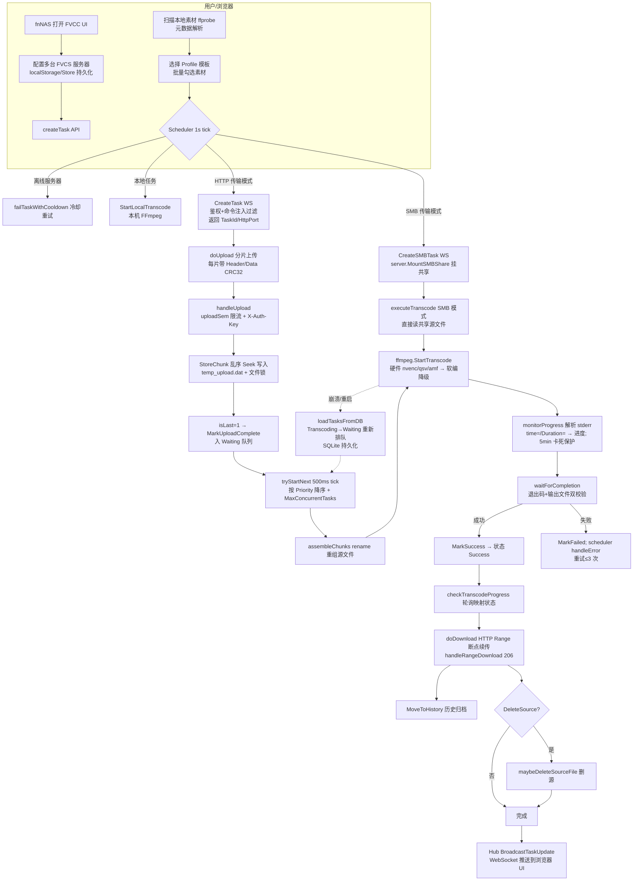

# Fnos.VideoConversion 项目运作模式分析报告

> **文档快照漂移说明（P3-2）**：本文档为历史分析快照，文中版本引用（如 FVCS go 1.22 / FVCC go 1.25）**已过时**。当前代码即真相：FVCC 与 FVCS 的 `go.mod` 均为 `go 1.27.1`，应用版本 `1.4.0`。涉及版本判断时以源码为准，可通过 `.\scripts\check-versions.ps1` 校验。

> 分析对象：`D:\Fnos.VideoConversion`（Git 仓库）
> 分析方法：对 FVCS / FVCC 两个子项目的真实源码逐文件阅读与函数级取证
> 结论均标注来源文件与函数名，无臆测项

---

## 1. 项目总体架构

### 1.1 双端角色划分

| 子项目 | 形态 | 角色 | 部署位置 |
|---|---|---|---|
| **FVCS**（Fnos.VC_Service） | Windows 常驻程序（托盘 + 服务 + 设置 GUI） | **算力核心**：接收远程转码指令，封装 FFmpeg 执行转码，管理任务队列与文件传输 | 有显卡/算力的 Windows 主机，可被 fnNAS/多客户端同时连接 |
| **FVCC**（fvcc） | fnNAS 应用（Go 后端 + 静态 UI + fnpack 打包） | **调度前端**：管理多台 FVCS 服务器、扫描本地素材、组合转码参数、下发任务并跟踪进度 | fnNAS 系统；内置"本机自转码"模式复用 FVCC 所在机器算力 |

### 1.2 技术栈（来自 go.mod 与源码 import）

**FVCS**（`FVCS/go.mod`，module `Fnos.VC_Service`，go 1.22）
- 桌面层：`fyne.io/fyne/v2`（`cmd/ui/main.go`、`cmd/settings/main.go`）+ `fyne.io/systray` 系统托盘
- 网络：`gorilla/websocket`（控制面）+ 标准库 `net/http`（数据面）
- 存储：`mattn/go-sqlite3`（任务持久化）
- 系统调用：`golang.org/x/sys` + 自研 `pkg/winapi`（Job 对象、注册表自启、防休眠等）
- 包结构：`pkg/config`（AES-GCM 加密配置）、`pkg/ffmpeg`（转码引擎）、`pkg/task`（任务调度/分片存储/SQLite）、`pkg/server`（WS+HTTP 服务端）、`pkg/protocol`（协议与命令注入过滤）、`pkg/ipc`（本机 UI↔Service 进程内命令通道）、`pkg/smb`（SMB 挂载）、`pkg/logger`（日志）、`pkg/winapi`

**FVCC**（`FVCC/server/go.mod`，module `fvcc`，go 1.25）
- Web 框架：`gin-gonic/gin`；WebSocket：`gorilla/websocket`
- 入口：`FVCC/server/main.go`——生产环境监听 **Unix Socket**（经 fnNAS 网关心跳网关），开发环境监听 TCP；启动时注入 store/remote/hub/probe 并拉起 Scheduler
- 状态存储：`store.go` 以 JSON 文件持久化（tasks/history/servers/profiles/locks/videoCache/settings），非数据库
- **前端 UI 说明**：README 声称 FVCC 客户端为 TypeScript+Vite+Tailwind，但仓库内 **FVCC 目录不存在任何 .ts/.tsx/.vue/.html 前端源码文件**；实际包含的是 Go 后端源码、预编译 `server/fvcc.exe` 与 fnpack 打包件。UI 资源以 `manifest` 的 `desktop_uidir=ui` 声明在安装期随 fnpack 布置，源码未随仓库发布。本报告对前端交互的描述以 Go 后端暴露的 REST API 为准。

### 1.3 通信协议总览

| 通道 | 承载内容 | 实现 |
|---|---|---|
| **WebSocket**（`ws://host:WsPort/ws`） | 控制面：鉴权 Auth、CreateTask/CreateSMBTask、QueryTask、StopTask、进度 Progress 推送、心跳 | `FVCS/pkg/server/server.go: handleWebSocket`；`FVCC/server/remote.go: Connect` |
| **HTTP**（`http://host:HttpPort/upload`） | 源文件分片上传（multipart + X-Auth-Key 头） | `server.go: handleUpload` |
| **HTTP**（`http://host:HttpPort/download`） | 成品断点续传下载（Range） | `server.go: handleDownload` / `handleRangeDownload` |
| **IPC（Named Pipe）** | FVCS 托盘 UI ↔ Service 的本机命令（启停服务、改配置、查任务/日志/系统状态） | `FVCS/pkg/ipc/ipc.go`（`StartIPCServer`、`SendCommand`） |
| **SMB**（可选传输模式） | 免上传，直接挂载共享目录转码 | `FVCS/pkg/smb/smb.go: MountSMBShare`；FVCC `Settings.TransferMode` 支持 `http/smb` |
| **Unix Socket**（FVCC 内部） | fnNAS 网关反向代理到 fvcc 的入口 | `FVCC/server/main.go` + `gateway.go`（解析 `X-Trim-*` 头做网关心跳鉴权） |
| **浏览器 WS**（FVCC 内部） | fvcc 后端 → 浏览器 UI 的任务更新推送 | `FVCC/server/ws.go` Hub + `BroadcastTaskUpdate` |

关键设计：**WS 管控制、HTTP 管数据**——Auth 成功后由 `handleAuth` 返回 `HttpPort` 与 `ChunkSize`（`GetHttpPortResponseData`），客户端据此才知道数据端口与分片大小。

---

## 2. FVCS 服务端核心运行机制

### 2.1 转码引擎对 FFmpeg 的封装（`FVCS/pkg/ffmpeg/ffmpeg.go`）

- **硬件加速检测**：`DetectHardwareAccel()` 在启动时调用 `ffmpeg -encoders` 探测 `nvenc` / `qsv` / `amf` / `vaapi`，结果缓存于全局（摘要轨迹确认存在 `hardwareAccelCache` 与 `AccelNone` 常量）；`cmd/service/main.go` 与 `cmd/ui/main.go` 均在启动序列中先执行 `ffmpeg.DetectHardwareAccel()`。
- **命令构建**：`BuildFFmpegCommand` 解析 `FFmpegArgs`，把参数分类为 input / stream / output 三类再拼装——而非简单字符串拼接，规避参数段注入（如把输出选项混入输入段）。
- **进程生命周期**：`startTranscodeInternal` 用 `exec.Command` 拉起 ffmpeg，隐藏窗口，按配置 `ProcessPriority` 设置进程优先级；`AssignProcessToJob`（winapi）把 ffmpeg 挂入 Job 对象，确保 Service 退出时子进程不会残留；`StopTranscode` / `StopAll` 负责终止。
- **进度监控**：`monitorProgress` goroutine 每秒读 stderr，先以正则 `Duration:` 提取总时长，再取最后一个 `time=` 计算 `progress=current/duration*100`（`parseTime` 解析 hh:mm:ss）；**5 分钟卡死保护**：运行超 5 分钟且进度 <1% 时主动 `StopTranscode` 标记失败。
- **结果确认**：`waitForCompletion` 校验 `cmd.Wait()` 错误与输出文件是否存在（`os.Stat(outputPath)`），成功才回调 `onSuccess(taskID, outputPath)`；失败时把进度封顶 99。
- **软编降级**：无 GPU 编码器时自动走软件编码路径（`AccelNone` 相关分支），任务不因硬件缺失中断。

### 2.2 任务调度器（`FVCS/pkg/task/task.go`）

- **状态机**（`TaskStatus`，task.go:24）：`Created → Uploading → Waiting → Transcoding → Success/Failed/Cancelled`，另有 Pause/Resume 支撑。
- **调度循环**：`startScheduler` 500ms tick → `tryStartNext`：在 `runningCount < MaxConcurrentTasks`（默认 2，config）且等待队列非空时，按 `Priority` 降序排序取出队首任务启动（**优先级插队**通过每次调度全队列排序实现）。
- **持久化与重启恢复**：`Init` 建表（`createTables`，表 `task_list`），`loadTasksFromDB` 启动时把 DB 中 `Waiting`/`Transcoding` 任务重新入队：Transcoding 因转码进程已死被**重置为 Waiting 重新排队**；SMB 模式 `Created/Uploading` 残留状态直接视为已具备源文件升级为 Waiting。
- **运行期防休眠**：第一个任务开始运行时 `winapi.PreventSleep()`（task.go 注释明确），runningCount 归零后 `maybeAllowSleep` 恢复休眠。
- **清理**：`startGCTimer` 每 30 分钟跑 `cleanupTempFiles`（TTL=`TempFileTTLHour`，默认 24h，删除过期任务临时目录）与 `cleanupFinishedTasks`（终态且超过 1 小时的任务从内存摘除）。

### 2.3 分片上传与断点续传链路

**协议层**（`FVCS/pkg/protocol/protocol.go`）
- `ChunkHeader` 定义二进制分片头：Type/TaskID/ChunkIndex/IsLastChunk/DataLength/**HeaderCRC32**/**DataCRC32**；`SerializeChunk` / `ParseChunk` 负责编解码，解析时对头与数据分别做 CRC32 校验，错配直接报错。
- WS 命令常量覆盖 `CreateTask/CreateSMBTask/QueryTask/StopTask/CancelTask/PauseTask/ResumeTask/UploadFinish/DownloadFinish` 等全生命周期。

**服务端分片落盘**（`task.go: StoreChunk`，`server.go: handleUpload`）
1. HTTP POST 带 `X-Auth-Key` 与 `taskId/index/isLast` 表单；`handleUpload` 先判 Method、校验鉴权、再取 `uploadSem` 信号量（**并发上传限流**，拒绝返回 429）、单分片上限 500MB。
2. `StoreChunk` 只允许 `Created/Uploading` 状态接收分片（拒绝迟到分片写 nil map）；分片按 `chunkIndex * ChunkSize` 计算偏移量，对 `temp_upload.dat` **Seek 乱序写入**，用每任务 `fileMu` 互斥锁保护 Seek+Write 防止并发覆盖；`ReceivedChunks` map 记录已收块。
3. `isLast` 分片到达后 `MarkUploadComplete` 将任务转入队 Waiting。
4. 真正开始转码前 `executeTranscode` 调 `copyChunks` 打快照并清空 `ReceivedChunks`（防迟到分片 panic），`assembleChunks` 将 `temp_upload.dat` **rename** 为源文件路径（乱序缓存天然保证最终一致性，rename 原子化完成重组）。
5. **断连清理**：`HandleClientDisconnect(clientConnID)` 清理该连接名下 Created/Uploading 任务及其临时分片；`cleanupTempFiles` 兜底清残留。

**成品下载**：`handleDownload` 鉴权后仅允许 `Status==Success` 且存在 `OutputFilePath` 的任务；若配置 `EnableRangeDownload` 走 `handleRangeDownload`（解析 `Range: bytes=start-end`，返回 206 Partial Content 与 Content-Range），客户端据此实现断点续传。

### 2.4 鉴权与安全机制

| 机制 | 实现点 |
|---|---|
| 密钥加密存储 | `pkg/config/config.go`：`AuthKeyEncrypt`，鉴权密钥 AES-GCM 加密后存 `config.enc.json`，`DecryptAuthKey/SetAuthKey` 读写；配置加载用原子写（`Load/Save`） |
| WS/HTTP 双通道鉴权 | WS `handleAuth` 比对解密后的 Key；HTTP `/upload`、`/download` 校验 `X-Auth-Key` 请求头；禁止 URL 明文传 Key（`config` 摘要） |
| 命令注入过滤 | `protocol.go: ValidateExtraFFmpegArgs`：正则拦截 `& ; | > < \`.\`` 等危险字符；`handleCreateTask` 在入库前必须通过该校验 |
| 监听范围 | `ListenLocalOnly` 决定绑定 `127.0.0.1` 还是 `0.0.0.0`（server.Init 分支） |
| 连接治理 | 心跳 `heartbeatMonitor`/`pingLoop`、`generateClientID` 隔离连接、上传并发信号量、`uploadSem` 100（server.go 常量见摘要）；config 含 QpsLimit / MaxConnPerClient 限流字段 |
| 端口防护 | `ipc/protocol.go: ValidatePort`；`server.IsPortInUse` 防端口冲突 |

### 2.5 本机三进程协作（cmd 组织）

- `cmd/service/main.go`：纯后台 Service（无 UI），单实例互斥 `FVCS_Service_Mutex`；启动即 `DetectHardwareAccel` → `ipc.StartIPCServer`（Named Pipe），若 `AutoStart=true` 则自动找空闲 HTTP 端口（`winapi.FindFreePort(10000,65535)`）并拉起 task + server；收到 SIGINT/SIGTERM 后按序 `ipc.Stop` → `server.Stop` → `ffmpeg.StopAll` → `task.Stop`。
- `cmd/ui/main.go`：Fyne 托盘主程序（`initSystemTrayMenu`、`showTasksWindow`），内嵌 `FVCS.png/FVCS.ico`（go:embed）；通过 ipc `SendCommand` 驱动 Service 启停/取状态，单实例互斥 `FVCS_UI_Mutex`；含资源监控、日志查看、开机自启（`winapi.SetAutoRunOnBoot`）。
- `cmd/settings/main.go`：独立 Fyne 设置表单，直接读写 `config.enc.json`（WsPort、MaxConcurrentTasks、ProcessPriority、FFmpegPath、TempDir、ListenLocalOnly、AutoStart、AutoRunOnBoot 等），适配深色主题。

---

## 3. FVCC 客户端/桌面端组织与打包

### 3.1 Go 后端（`FVCC/server`，module `fvcc`）

- **REST API 面**（`handlers.go`，gin 路由挂 `/app/fvcc` 前缀）：`scanDirectory/scanDirectoryStream`（本地视频扫描，`videoExts` 过滤 + ffprobe 元数据缓存）、`probeVideo/previewVideo`、`renameVideo/moveVideo/deleteVideo`（本地文件管理）、`listServers/createServer/testServer`（多 FVCS 管理）、`listProfiles/createProfile/updateProfile`（转码模板 CRUD）、`listTasks/createTask/pauseTask/resumeTask/cancelTask/retryTask/deleteTask/reorderTasks`、`listHistory`、`saveSettings`。
- **模型**（`models.go`）：FVCC 侧任务状态粒度更细——`QUEUE→UPLOADING→WAITING_TRANS→TRANSCODING→WAITING_DOWN→DOWNLOADING→COMPLETED/ERROR/PAUSED/CANCELLED`，完整覆盖"上传-转码-回传"三段；`Settings` 含 `TransferMode(http/smb)`、`SMBSharePath`、`ChunkSizeMB`、`MaxRetry`。
- **持久化**（`store.go`）：JSON 文件存储（`TasksFile/HistoryFile/ServersFile/ProfilesFile/LocksFile/VideoCacheFile`），并提供**分布式互斥锁** `AcquireTransLock/AcquireCodeLock`（带过期时间，`SweepExpiredLocks`）——防止多客户端同时向同一台 FVCS 提交冲突任务。
- **任务下发**（`scheduler.go`，1s tick）：
  - `handleQueue` 三路分流：离线任务 `failTaskWithCooldown`；SMB 模式 `BuildSMBURL + CreateSMBTask`；HTTP 模式 `CreateTask` 成功后 `doUpload` 分片上传（本地记录 `UploadChunkIdx` 支持续传）。
  - `checkTranscodeProgress` 轮询 FVCS `QueryTask` 并把状态映射回本地；完成后 `startDownload/doDownload` 用 Range 断点续传拉回成品，`MoveToHistory` 归档；`handleError` 最多重试 3 次；`maybeDeleteSourceFile` 依据 Profile 的 `DeleteSource` 删源。
  - 本地自转码任务走 `handleLocalQueue → StartLocalTranscode`（复用本机 FFmpeg，README 所称"fnNAS 自转码"）。
- **远程协议**（`remote.go`）：`Connect` 拨 WS 并发送 `Auth`（Key），拿回 HttpPort+ChunkSize；`readPump` 消费服务端 `Progress` 推送；`pingLoop` 30s 心跳；`roundTrip` 加锁防并发串台；`buildBinaryChunk` 构造带 CRC32 的二进制分片；`UploadChunk` / `DownloadFileWithProgress` 分别对应服务端 /upload 与 /download。
- **浏览器推送**：`ws.go` Hub 管理浏览器长连接，任务状态变化 `BroadcastTaskUpdate` 实时推送。

### 3.2 fnNAS 打包（manifest / fnpack）

仓库内 `FVCC/` 含：
- `manifest`：定义 `appname=fvcc`、`desktop_uidir=ui`——告诉 fnNAS 应用中心：安装后桌面 UI 目录为应用目录下 `ui/`，由应用中心直接服务。
- `fnpack-1.2.1.exe`：fnNAS 应用打包器，把 Go 后端可执行文件 + ui 静态资源 + manifest 打成 fnNAS 可安装包。
- `cmd/`：生命周期 bash 脚本（`main` 启动 fvcc 二进制并监听 Unix Socket、写 `accessible_paths.env` 声明可访问路径；`config_init` 初始化配置）——作为 fnNAS 应用包入口。
- `config/`（privilege/resource）：声明 fvcc 应用的数据共享与资源权限（`config/resource` 定义数据共享 rw 权限）。
- `server/fvcc.exe`：预编译 Go 后端产物。

即"**fnNAS 应用生态**"路线：FVCC 不是独立安装的桌面软件，而是以 fnpack 打包、由 fnNAS 应用中心管理生命周期（启停脚本、权限、UI 托管、Unix Socket 网关鉴权）的托管应用；远程 FVCS 服务器则走 Windows 原生托盘/服务路线。

---

## 4. 整体运作流程图

**链路总结**：UI 建任务 → FVCC Scheduler 按传输模式分流 → HTTP 分片（CRC32 校验、乱序缓存、断点续传）或 SMB 直挂 → FVCS 队列按优先级调度 → FFmpeg（硬编/软编自动切换）→ 进度经 WS Progress 推送/客户端轮询映射 → 成品 Range 续传回下载 → 历史归档（可选删源）；任何一侧崩溃重启都靠 SQLite（FVCS）与 JSON+锁（FVCC）恢复状态。

---

## 5. 项目亮点与潜在风险/可改进点

### 5.1 亮点（有源码依据）

1. **双通道协议设计成熟**：WS 控制面 + HTTP 数据面分离，Auth 返回 HttpPort/ChunkSize 的动态握手，避免端口写死。
2. **分片传输健壮**：乱序 Seek 写入 + 文件锁 + 双 CRC32 + rename 原子重组 + 迟到分片状态机拒绝，工程细节完整。
3. **任务状态可恢复**：SQLite 持久化 + 重启把 Transcoding 重置 Waiting 重排 + Job 对象防进程残留 + 防休眠/允许休眠精确控制，具备"常驻服务"级可靠性。
4. **FFmpeg 封装克制安全**：args 分段分类构建 + 注入正则过滤 + 退出码与产物双校验 + 卡死检测，兼顾安全与可用。
5. **双端锁设计**（FVCC `AcquireTransLock/AcquireCodeLock`）支持"多客户端共管一台转码机"且避免任务互踩。
6. **部署形态务实**：Windows 侧 Fyne 托盘三进程（UI/Settings/Service 经 IPC 通信），fnNAS 侧 fnpack 托管应用，贴合各自平台习惯。

### 5.2 潜在风险（真实代码弱点）

| # | 风险 | 证据与影响 |
|---|---|---|
| R1 | **配置加密密钥硬编码** | `FVCS/pkg/config/config.go` 的 `encryptKey` 为代码内固定值：`config.enc.json` 中 AuthKey 可被持有本机二进制/源码者直接解密还原，防御仅限"静态文件不被直接读到明文"，达不到密钥管理要求 |
| R2 | **鉴权为单一共享 Key** | WS/HTTP 仅比对同一个 `X-Auth-Key`/Auth Key，无客户端身份维度权限隔离；Key 泄露即获得全部控制权（含 SMB 凭据下发 `SMBPassword` 字段明文经 WS 传输） |
| R3 | **SMB 凭据明文持久化** | FVCS 把 `SMBPassword` 明文存 SQLite（`loadTasksFromDB` 直接 Scan 该列）、FVCC JSON 存 SMB 密码，违背最小暴露原则 |
| R4 | **命令注入过滤依赖黑名单** | `ValidateExtraFFmpegArgs` 只拦截 `& ; | > < \`.\``；ffmpeg 参数仍可通过换行/`\r`、URL 编码、或 `-filter_complex` 内脚本式写法绕过黑名单（未做白名单/参数级约束），黑名单思路存在绕过的理论面 |
| R5 | **进度来源单一** | 只解析 stderr 正则；若 ffmpeg 不输出 `time=`（如特定滤镜/编码早期无帧时间）或日志被静默，进度会停 0 直至 5 分钟卡死保护误杀长耗时冷启动任务 |
| R6 | **REST 数据面无 TLS/无防重放** | `/upload /download` 为明文 HTTP + 静态 Key；局域网嗅探即可窃取分片与 Key；下载无任务所有权绑定，拿到 TaskId 且 Key 泄露者可下载他人成品 |
| R7 | **崩溃窗口的临时文件残留** | 上传中崩溃的任务目录由 30 分钟 GC + TTL（默认 24h）兜底，极端情况下磁盘占用在 TTL 窗口内不可控；且 GC 只删目录级、不核对 DB 中活动任务，理论上存在误删活动任务分片的竞态 |
| R8 | **客户端锁依赖墙钟时间** | `AcquireTransLock(..., expireSec)` 过期锁靠本地时钟/定时 Sweep，时钟跳变或多 FVCC 实例并发时可能失效 |
| R9 | **前端源码缺失** | 仓库内无 UI 源码，UI 与后端 API 契约无法从仓库审计，影响可维护性与安全评审完整性 |

### 5.3 可改进点建议

1. AuthKey 改用系统级凭据源（DPAPI/Windows Credential Manager），消除硬编码加密密钥。
2. 引入按服务器/按用户的 Access Token + 每次任务随机 task token，下载接口绑定 token；数据面启用 HTTPS 或至少支持自签证书。
3. FFmpeg 参数由"黑名单过滤"升级为"模板变量白名单 + 结构化参数数组"（同 `BuildFFmpegCommand` 的分类思路），彻底消除拼接注入面。
4. SMB 凭据改为服务端"保存即加密（DPAPI）+ 使用时解密进内存"，SQLite 列不再存明文。
5. 进度监控增加"stderr 无 time 输出时的兜底超时估算/ffprobe 输入时长 + 输出文件字节增长"双信号。
6. GC 增加"活动任务白名单"判断后再清理临时目录；上传接口增加每任务重传计数上限防恶意占盘。
7. 将 FVCC 前端源码纳入仓库或提供 OpenAPI 契约，保证端到端可审计。

---

## 附录：证据索引（关键文件 → 关键函数）

- `FVCS/pkg/server/server.go`：`Init` / `handleAuth`(378) / `handleCreateTask`(410) / `handleCreateSMBTask`(447) / `handleUpload`(687) / `handleDownload`(766) / `handleRangeDownload`(824) / `handleUploadFinish`(605)
- `FVCS/pkg/task/task.go`：`loadTasksFromDB`(210) / `startGCTimer`(287) / `cleanupFinishedTasks`(302) / `cleanupTempFiles`(325) / `startScheduler`(356) / `tryStartNext`(370) / `executeTranscode`(409) / `assembleChunks`(503) / `StoreChunk`(1048) / `HandleClientDisconnect`(910)
- `FVCS/pkg/ffmpeg/ffmpeg.go`：`DetectHardwareAccel` / `BuildFFmpegCommand` / `StartTranscode` / `monitorProgress` / `waitForCompletion` / `StopTranscode` / `StopAll`
- `FVCS/pkg/protocol/protocol.go`：`ValidateExtraFFmpegArgs` / `SerializeChunk` / `ParseChunk` / `BuildChunkHeader` / `CalculateDataCRC32`
- `FVCS/pkg/config/config.go`：`Load/Save` / `DecryptAuthKey/SetAuthKey` / `ListenLocalOnly` / `MaxConcurrentTasks` / `ChunkSize`
- `FVCS/pkg/smb/smb.go`：`MountSMBShare` / `UnmountSMBShare` / `BuildSMBPath`
- `FVCS/pkg/ipc/ipc.go`：`StartIPCServer` / `handleStartService` / `SendCommand`
- `FVCS/cmd/service/main.go`、`cmd/ui/main.go`、`cmd/settings/main.go`
- `FVCC/server/handlers.go`：`createTask`(1040) / `buildFFmpegArgs`(1380) / `scanDirectory`(146) / `saveSettings`(54) / `probeVideo`(363) / `reorderTasks`(1313)
- `FVCC/server/scheduler.go`：`processTask` / `handleQueue` / `checkTranscodeProgress` / `startDownload/doDownload` / `handleError` / `maybeDeleteSourceFile`
- `FVCC/server/remote.go`：`Connect` / `roundTrip` / `UploadChunk` / `DownloadFileWithProgress` / `buildBinaryChunk`
- `FVCC/server/store.go`：`AcquireTransLock`(448) / `AcquireCodeLock`(473) / `MoveToHistory`(223) / `SweepExpiredLocks`(523)
- `FVCC/server/models.go`：`TaskStatus` 枚举 / `Settings.TransferMode`(259) / `Profile.DeleteSource`(144)
- `FVCC/server/main.go`（Unix Socket 生产监听）、`router.go`、`gateway.go`（X-Trim-* 网关鉴权）、`ws.go`（Hub）
- 打包：`FVCC/manifest`（`desktop_uidir=ui`）、`FVCC/fnpack-1.2.1.exe`、`FVCC/cmd/main`（Unix Socket + accessible_paths.env）、`FVCC/config/privilege|resource`、`FVCC/server/fvcc.exe`

